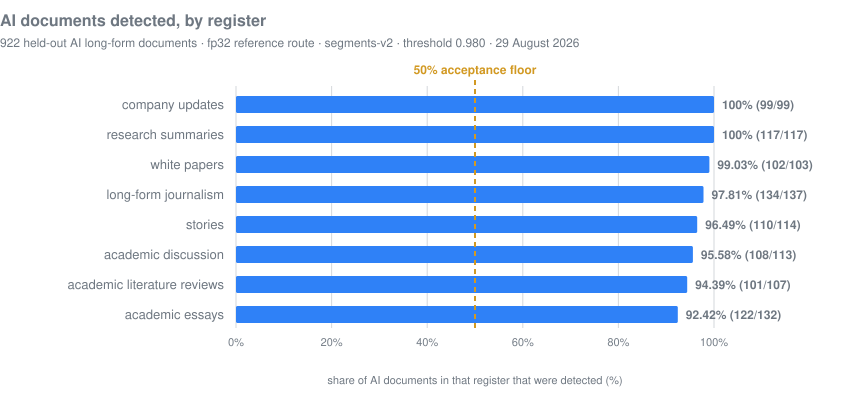
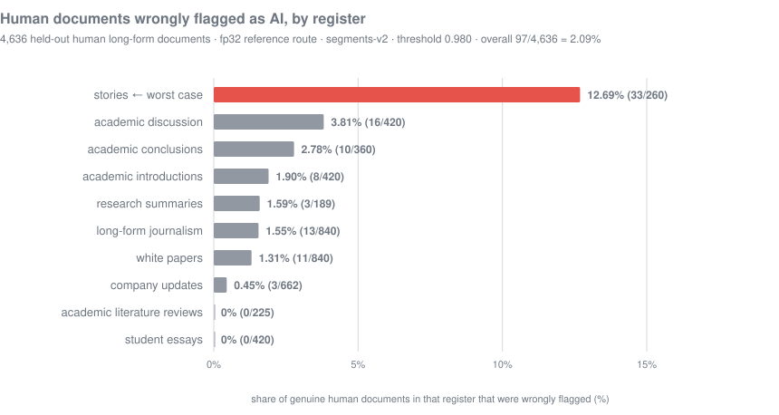
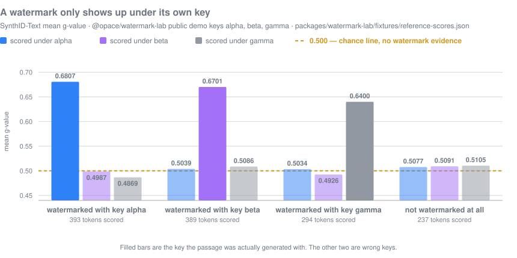
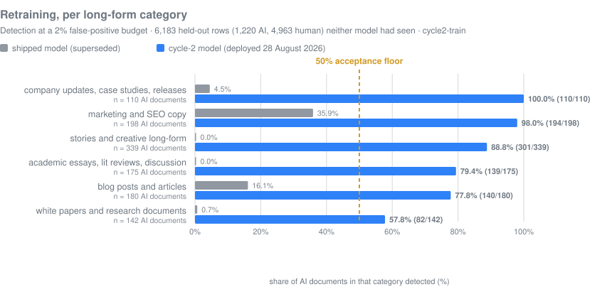
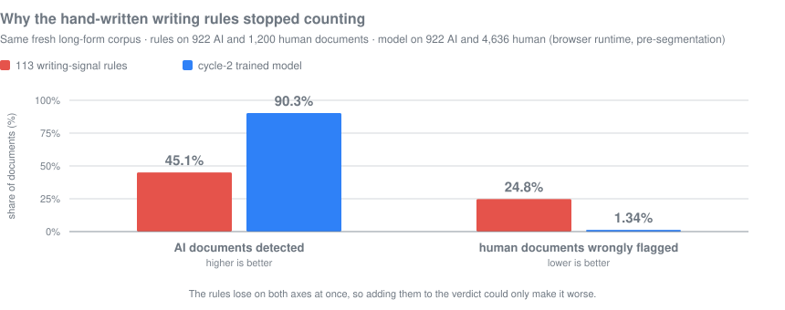
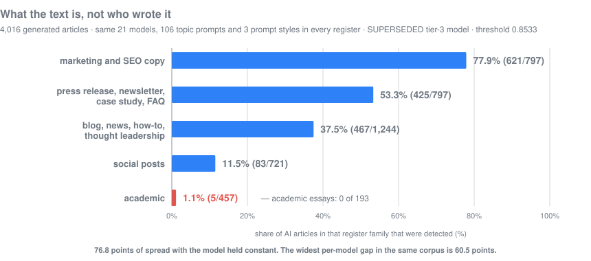
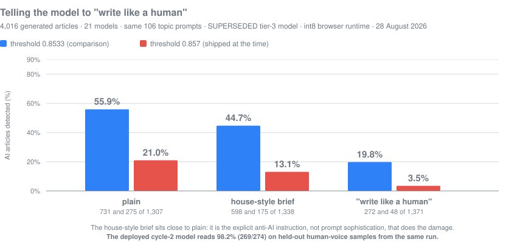
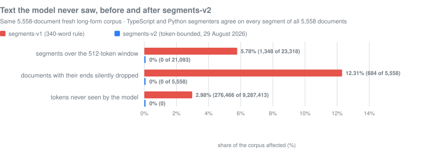

# Opace AI Content Verification, Integrity & Watermark Checker Tools

One local-first engine for explainable content-integrity evidence: hidden-character forensics, writing-signal analysis, protected facts, watermark science and reproducible receipts. The same compiled engine powers every surface (web checker, WordPress plugin, Chrome extension, Astro integration, CLI and local service), so identical input produces identical findings everywhere.


The product never presents an AI score as proof of authorship. Every result names the method that ran, its version, its status and its limitations. A pass applies only to its named check.

[Try the browser checker](https://opace.agency/tools/ai/content-verification-integrity/checker/) · [Product page](https://opace.agency/tools/ai/content-verification-integrity/) · [Privacy notice](https://opace.agency/privacy-policy/) · [Support](https://opace.agency/get-in-touch/)

**Straight to the evidence:** [the evidence, up front](#the-evidence-up-front) · [what it measures and where it fails](#what-it-measures-and-where-it-fails) · [what it will not do](#what-this-tool-will-not-do) · [evidence index](#evidence-index) · [what it is built on](#built-on-other-peoples-work) · [the complete weakness list](#honest-limitations)

## The evidence, up front

**At the operating point that ships today**, measured on 5,558 long-form documents the model had
never seen — 922 written by 13 current AI models, 4,636 written by people, hash-quarantined against
every training split:

| | EU server route (fp32) | in-browser route (int8) |
|---|---|---|
| AI documents flagged | **883 / 922 — 95.8%** | **889 / 922 — 96.4%** |
| human documents wrongly flagged | **45 / 4,636 — 0.97%** | **90 / 4,636 — 1.94%** |

**And the weakest case, which travels with the headline everywhere:**

| where it fails | measured | denominator |
|---|---|---|
| human fiction wrongly flagged | **8.8%** | 23 of 260 stories, server route; 26 of 260 (10.0%) in the browser |
| detection at 100–199 words | **16.9%** | 29 of 172 passages, binned by achieved word count |
| detection on deliberately keyword-repetitive copy | **43.5%** | 188 of 432 passages |
| an AI rewrite of a human original | **30–35%** | HAT-Bench v6–v8 bands |
| human student essays wrongly flagged | 0.0% | 0 of 420 |

Fiction is roughly four and a half times worse than the next worst content type, and it is the only
one anywhere near one document in ten. **Novelists should not rely on this tool.** Student essays,
the case with the most at stake for a real person, are the safest row in the table — that asymmetry
is luck of the training data rather than design, and both halves are published so neither is
mistaken for a general property of the detector.

**The three full tables**, every cell with its denominator, its corpus, its runtime, its operating
point and a 95% confidence interval:

- [Detection by length, by model and by content type](docs/measurements/DETECTION-BY-LENGTH-AND-MODEL.md) — the three tables in one document
- [The same tables as a readable page](https://opace.agency/tools/ai/content-verification-integrity/research/detection-rates/) — for anyone who would rather not read markdown

**The rest of the measurement record:**
[aggregation and the flag rule](docs/measurements/AGGREGATION-AND-RHYTHM.md) ·
[the segmentation token fix](docs/measurements/SEGMENT-TOKEN-FIX.md) ·
[short-form corpus and retrain](docs/measurements/SHORT-FORM-RETRAIN.md) ·
[route parity, server against browser](docs/measurements/ROUTE-PARITY.md) ·
[per-model detection at the earlier flag point](docs/PER-MODEL-DETECTION.md) ·
[measured findings](docs/MEASURED-FINDINGS.md) ·
[the evidence index](docs/EVIDENCE-INDEX.md) ·
[the watermark lab](docs/WATERMARK-LAB.md) ·
[the complete weakness list](#honest-limitations)

**A rate describes a corpus, not your document.** None of these numbers is a statement about any
individual text, and no score this tool produces identifies an author.

Every figure in this section names the operating point it was measured at. **The charts further
down were measured at the earlier 0.980 flag point under `segments-v2` and say so**; a row from one
operating point must never be placed beside a row from another.

> **Status, 29 August 2026.** The browser checker is live and has been since 28 August 2026, serving the cycle-2 trained model. This repository is public at <https://github.com/OpaceDigitalAgency/opace-ai-content-verification-integrity-checker>. The WordPress plugin, Chrome extension, Astro integration, CLI and npm packages are built and tested but not yet published; no store or registry listing exists yet. The hosted inference service described in `CLOUD-RUN-SETUP.md` was **deployed and verified on 29 August 2026**; see the roadmap section below for what was measured.

## What it measures, and where it fails

*The charts in this section were measured at the earlier **0.980** flag point under `segments-v2`,
which is stated below and again in each caption. For the operating point that ships today, see
[the evidence, up front](#the-evidence-up-front).*

**On 5,558 long-form documents the model had never seen, it detects 96.9% of AI writing and
wrongly flags 2.09% of genuine human writing.** Within that human figure, one register is far
worse than the rest: **29 of 260 human short stories were wrongly flagged, 11.2%**, roughly one
story in eight. A novelist should not use this tool yet, and the charts below show that bar at
full height rather than hiding it in an average.

Measured on the fp32 reference route at threshold 0.980 under `segments-v2`, 29 August 2026. The
shipped browser runtime's own segmented curve over the full corpus has not been measured; the
browser figures published on the live page are `segments-v1` and should be read as a floor. Every
figure below carries its denominator, and every one traces to a report in [the evidence index](#evidence-index).

### AI documents detected, by register



The acceptance criterion for this project was 50% or better on **every** long-form category, not
on average. Denominators sum to the full 922-document held-out AI split: 893 of 922 detected,
96.85%. Source: [docs/TEST-EVIDENCE.md](docs/TEST-EVIDENCE.md), per-register `segments-v2` row.

### Human documents wrongly flagged, by register



Denominators sum to the full 4,636-document held-out human split: 97 wrongly flagged, 2.09%
overall. The model was **deliberately never trained on human fiction** — the training corpus holds
300 AI fiction samples and no matched human set, and training on unmatched AI fiction would have
taught it that fiction equals AI. That is an explanation, not an excuse. Source:
[docs/TEST-EVIDENCE.md](docs/TEST-EVIDENCE.md); the full account is in [Honest limitations](#honest-limitations).

### A watermark only shows up under its own key



This is the clearest single result in the project. A passage generated with demo key `alpha`
scores **0.6807** under `alpha` and collapses to **0.4987** and **0.4869** under `beta` and
`gamma`.

**Read the sample before the bars.** The chart plots **4 of the 24 fixtures** — the three
400-token watermarked passages, one per key — against a **single unwatermarked control**
(`uw-250-01`, which reads 0.5077, 0.5091 and 0.5105 under the three keys). Those three numbers are
that one fixture's, not the corpus range: across all eight unwatermarked fixtures the spread is
**0.4756–0.5264** (n = 24 fixture × key pairs), and across the twelve watermarked passages scored
under a wrong key it is **0.4693–0.5222** (n = 24) — both wider than any bar shown. The corpus is
also **seed-selected** (seed 20260827, up to 12 candidate seeds per fixture, accepted within a
stated tolerance band), so the flat control is flatter than an unselected sample would be.

Watermark detection is evidence about **a specific private key**, not a universal machine stamp —
which is exactly why this project cannot verify any provider's production watermark and says so.
It also does not survive paraphrase: **0 of 40 rewrites detected**. Source:
[`packages/watermark-lab/fixtures/reference-scores.json`](packages/watermark-lab/fixtures/reference-scores.json),
`meanG` values, token counts as plotted; method, selection rule and limits in
[docs/WATERMARK-LAB.md](docs/WATERMARK-LAB.md).

### Retraining, per long-form category



The model this replaced scored **AUROC 0.5299** on published prose, a coin toss, and scored human
business-marketing copy *higher* than AI writing. It failed three of the six long-form categories
outright at 0.0%. Measured on 6,183 held-out rows (1,220 AI, 4,963 human) neither model had seen.
Source: `services/local-engine/research/cycle2-train/CYCLE2-REPORT.md`, the 2% false-positive
budget table.

### Why the hand-written writing rules stopped counting



The 113 named writing rules lose to the trained model on both axes at once, so mixing them into a
verdict could only make it worse. On 28 August 2026 they stopped contributing to the AI verdict
and became editorial suggestions. Note the differing denominators: the rules were measured against
922 AI and 1,200 human documents, the model against 922 AI and 4,636 human through the browser
runtime before segmentation existed. Source: [docs/TEST-EVIDENCE.md](docs/TEST-EVIDENCE.md).

### What the text is beat who wrote it



Same 21 models, same 106 topic prompts, same three prompt styles in every register. **76.8 points
of spread with the model held constant** — wider than any per-model gap in the corpus. Academic
essays flagged **0 of 193**. This is the measured form of the project's central discovery: the
classifier had been trained on chat replies while users paste published prose, and retraining on
published-register data took AUROC from 0.530 to 0.970 and academic detection from 0.0% to
79.4%. Figures from the superseded tier-3 model at threshold 0.8533; full table and the
marketing-register confound in [docs/MEASURED-FINDINGS.md](docs/MEASURED-FINDINGS.md) §2.

### A model told to write like a human



The single most important caveat on this page. Against the previous model, one line of prompt
instruction cost **36.1 points** of detection at the comparison threshold and took `x-ai/grok-4.6`
to **0 of 86**. The deployed cycle-2 model reads 98.2% on held-out samples of the same kind — but
those samples come from the same generation run it was trained against, and no prompt-style split
has been measured on an independent corpus. See
[Honest limitations §4](#4-write-like-a-human--the-evasion-axis-with-no-independent-measurement).

### Text the model never saw, before and after `segments-v2`



Under the old 340-word rule, **1,348 of 23,318 segments (5.78%)** across **684 of 5,558 documents
(12.31%)** ran past the tokeniser's 512-token window and had their ends silently dropped:
276,466 of 9,287,413 tokens, worst single segment 3,406 tokens. Under `segments-v2` that is 0 of
21,093, and the TypeScript and Python segmenters agree on every segment of all 5,558 documents.
**Recovering the dropped text changed no verdict on this corpus**; the detection gain came from
better segment shape, and that is recorded rather than presented as the fix working. Source:
[docs/TEST-EVIDENCE.md](docs/TEST-EVIDENCE.md).

## What this tool will not do

- **It will not tell you a human wrote something.** A clean result means no selected check fired. It is labelled "No strong AI-style signals", never "human".
- **It will not decide an academic misconduct case.** A distribution-level signal cannot carry that weight for one student, and this tool will not pretend it can.
- **It will not read text shorter than 200 words reliably.** Detection is 67% at 200 words, 50% at 150 and 19% at 100. Short human text is not falsely flagged (0 of 400 samples at 60–200 words), so the failure below 200 words is silence, not accusation.
- **A hidden character is not an AI signal.** Invisible carriers prove that something wrote into the text; they say nothing about who or what composed it. An assertion in `packages/core/src/verdict/combine.ts` throws rather than publish a verdict that collapses the two.
- **It will not verify any provider's production watermark.** The watermark lab uses public demo keys. No public verifier exists for Anthropic production keys, and that is stated as a boundary rather than dressed up as a check that ran.
- **It will not point at "the AI sentences".** 2,174 sentence deletions across 57 documents found that only **35.9%** of sentences push their document towards a machine reading, and that the strongest single property of a sentence predicts its contribution at ρ = 0.125. Sentence-level attribution inside a 512-token transformer is unstable by construction, so highlighting it would be presenting instability as evidence against a named person's writing. Measured in [docs/MEASURED-FINDINGS.md](docs/MEASURED-FINDINGS.md) §3.
- **It will not check plagiarism, match sources at internet scale, or promise a detector-clearance or SEO outcome.**

The complete list, ranked by how likely a real person is to be hurt by it and with a denominator
against every figure, is in [Honest limitations](#honest-limitations) below.

## Evidence index

Every published figure traces to a named report. These are the ones to read first.

| Report | What is in it |
|---|---|
| [docs/EVIDENCE-INDEX.md](docs/EVIDENCE-INDEX.md) | Every test result, evaluation and research artefact in the project, with paths |
| [docs/CAPABILITIES.md](docs/CAPABILITIES.md) | The exhaustive capability register: rule inventories, tier by tier, with the measurement behind each claim |
| [docs/MEASURED-FINDINGS.md](docs/MEASURED-FINDINGS.md) | Four results published in full with their denominators: the prompt-style evasion axis, register beating model choice, why there is no such thing as "the AI sentences", and which writing rules run backwards, named |
| [docs/PER-MODEL-DETECTION.md](docs/PER-MODEL-DETECTION.md) | Detection rate for each model that wrote the text — 13 current models on the deployed detector at the shipped 0.984 threshold, 21 more on the retired one, fenced apart; plus which models generated every AI corpus |
| [docs/TEST-EVIDENCE.md](docs/TEST-EVIDENCE.md) | Verbatim suite totals, the current-model appendix, and the per-register detection and false-positive tables the charts above are drawn from |
| [docs/measurements/DETECTION-BY-LENGTH-AND-MODEL.md](docs/measurements/DETECTION-BY-LENGTH-AND-MODEL.md) | Detection rate, human false-positive rate and the AI and human probability distributions, cut by document length from under 100 words to 5,000 and above, and cut by the model and provider that wrote the text — both at the shipped operating point, both with n in every cell |
| [docs/measurements/ROUTE-PARITY.md](docs/measurements/ROUTE-PARITY.md) | Browser int8 against server fp32 on 60 documents: 57/60 verdict agreement, and all three disagreements written out individually |
| [docs/WATERMARK-LAB.md](docs/WATERMARK-LAB.md) | The SynthID-Text port, its parity evidence against the DeepMind reference, and what it cannot do |
| [docs/RELEASE-STATE.md](docs/RELEASE-STATE.md) · [docs/security/THREAT-MODEL.md](docs/security/THREAT-MODEL.md) | What is released and what is held; the kill switch and its two failures |
| [MODEL_AND_DATA_PROVENANCE.md](MODEL_AND_DATA_PROVENANCE.md) · [THIRD_PARTY_NOTICES.md](THIRD_PARTY_NOTICES.md) | Where the model, the corpora and every reused component came from |

Research that informed the product without shipping in it lives under
`services/local-engine/research/`, including the
[signal-science study](services/local-engine/research/signal-science/SIGNAL-SCIENCE.md) with its
published-baseline comparison table, the
[per-rule statistical validation](services/local-engine/research/rule-validation/RULE-VALIDATION.md),
the [4,016-article generated corpus](services/local-engine/research/generated-corpus/GENERATED-CORPUS-EVAL.md),
the [model-shrink measurements](services/local-engine/research/model-shrink/MODEL-SHRINK-REPORT.md)
and the [rejected cycle-3 model](services/local-engine/research/cycle3-edited/CYCLE3-REPORT.md).

### Measured baselines against published detectors

Reimplemented from their papers as evaluation baselines on 600 machine and 600 human fresh
long-form documents, with a GPT-2 small (124M) observer. That observer is browser-deployable and
far smaller than the papers use, so these are a floor for the method in this form rather than a
refutation of it. Full table:
[`signal-science/tables/open-source-baselines.md`](services/local-engine/research/signal-science/tables/open-source-baselines.md).

| baseline | AUROC |
|---|---:|
| DivEye-inspired surprisal kurtosis (skew 0.763, autocorrelation 0.757) | **0.766** |
| mean predictive entropy | 0.746 |
| GLTR top-100 rank bucket | 0.735 |
| mean log rank (the DetectGPT baseline) | 0.728 |
| GLTR top-10 rank bucket | 0.724 |
| log perplexity, the classic baseline | 0.715 |
| Fast-DetectGPT curvature | 0.545 |
| same-model Binoculars proxy (**not** Binoculars: it needs two models, only one was available offline) | 0.502 |

GLTR is useful as a per-token explanation and not as a verdict: **0.0% detection at a 1%
false-positive budget**. None of these is what ships; the deployed cycle-2 classifier is, and
none of these projects' code was used or extended. See
[Attribution and licences](#attribution-and-licences).

## Built on other people's work

The reuse here is real and the credit list is long. Named in full, with licences, versions and
file-level destinations, in [THIRD_PARTY_NOTICES.md](THIRD_PARTY_NOTICES.md) and
[MODEL_AND_DATA_PROVENANCE.md](MODEL_AND_DATA_PROVENANCE.md); the reader's summary is in
[Attribution and licences](#attribution-and-licences) below. The largest debts:

- [**Pangram Labs**](https://arxiv.org/abs/2402.14873) — the published hard-negative-mining training recipe, which is what took published-prose AUROC from 0.530 to 0.970. **The largest single debt in the project.** The service is not called and makes no claim here.
- [**intfloat/e5-small**](https://huggingface.co/intfloat/e5-small) (MIT) — the base encoder that Opace fine-tuned into the shipped detector.
- [**Google DeepMind synthid-text**](https://github.com/google-deepmind/synthid-text) (Apache-2.0) — the SynthID-Text detection mathematics, ported to TypeScript.
- [**avoid-ai-writing**](https://github.com/conorbronsdon/avoid-ai-writing) (MIT) — 46 of the 51 v2 writing-pattern categories, the stylometric methods and the classifier logic.
- [**watermarks-remover**](https://github.com/guillaumemeyer/watermarks-remover) (MIT) — the invisible-character and space-substitute carrier tables.
- [**onnxruntime**](https://github.com/microsoft/onnxruntime) (MIT) and [**@contentauth/c2pa-web**](https://github.com/contentauth/c2pa-js) (MIT) — the browser inference runtime and C2PA Content Credentials reading.
- [**OpenAI GPT-2**](https://github.com/openai/gpt-2) (MIT), [**antislop-sampler**](https://github.com/sam-paech/antislop-sampler), [**slop-gate**](https://github.com/hwajongpark/slop-gate), [**anti-ai-writing**](https://github.com/avectats7/anti-ai-writing), [**anti-slop**](https://github.com/kjmagnan1s/anti-slop), [**claude-slop-detector**](https://github.com/aplaceforallmystuff/claude-slop-detector), [**SLOP_Detector**](https://github.com/SicariusSicariiStuff/SLOP_Detector), [**slop-forensics**](https://github.com/sam-paech/slop-forensics), [**Wikipedia's *Signs of AI writing***](https://en.wikipedia.org/wiki/Wikipedia:Signs_of_AI_writing) (CC BY-SA 4.0), Unicode Consortium character data and Project Gutenberg public-domain prose.
- Corpora: [**GRADTEX**](https://huggingface.co/datasets/elisabeth-pl-pl/GRADTEX), [**HAT-Bench**](https://huggingface.co/datasets/HAT-Baselines/HAT-Bench), [**PERSUADE 2.0**](https://huggingface.co/datasets/realbenpope/PERSUADE_manageable), [**C4**](https://huggingface.co/datasets/allenai/c4), [**MAGA**](https://huggingface.co/datasets/anyangsong/MAGA), [**aita-human-vs-ai**](https://huggingface.co/datasets/mild-rgb/aita-human-vs-ai), and for the held-out human side [**Europe PMC**](https://europepmc.org), [**GOV.UK**](https://www.gov.uk), [**CRS**](https://crsreports.congress.gov), [**Global Voices**](https://globalvoices.org), [**Mongabay**](https://news.mongabay.com) and [**SEC EDGAR**](https://www.sec.gov/edgar).

Several well-known detector repositories were cloned and read during research and **none was used,
extended or derived from**. That correction is written out in full below.

## One engine, many surfaces

The engine is `@opace/content-integrity-core` (TypeScript, MIT, local-only), compiled once and bundled into every shell. There are no parallel analysis implementations to drift apart: PHP and Python act as orchestration only. Two version constants, `UNICODE_RULES_VERSION` and `EN_SIGNALS_PATTERN_VERSION`, are stamped into every result and receipt, and a cross-surface test battery proves that the installed engine on the website is byte-identical to source on findings, methods, signals and versions.

| Surface | How it consumes the engine | Where |
|---|---|---|
| Web checker | Browser Worker via `@opace/content-integrity-browser`, with a main-thread watchdog fallback | [live checker](https://opace.agency/tools/ai/content-verification-integrity/checker/) |
| WordPress plugin | Same JS bundle in the admin Worker; PHP handles REST, persistence and receipts | [wordpress/](wordpress/opace-ai-content-integrity/readme.txt) |
| Chrome extension | Bundled MV3 Worker over selected or visible page text | [extensions/chrome/](extensions/chrome/README.md) |
| Astro integration | Dev Toolbar checks and hash-only build reports | [packages/astro/](packages/astro/README.md) |
| Node CLI | `opace-integrity` command over the identical core | [packages/cli/](packages/cli/README.md) |
| Local engine | Authenticated loopback API (`127.0.0.1:8741`) for heavier optional adapters | [services/local-engine/](services/local-engine/README.md) |
| Watermark lab | `@opace/watermark-lab` scores text against demo watermark keys, fully in-browser | [packages/watermark-lab/](packages/watermark-lab/README.md) |

## Capabilities by tier

The full technical register, with exact rule inventories and test evidence, is [docs/CAPABILITIES.md](docs/CAPABILITIES.md). Ready-to-copy listing descriptions for WordPress.org, the Chrome Web Store, npm and Astro live in [DESCRIPTIONS.md](DESCRIPTIONS.md).

### Tier A — deterministic evidence (exact, local, runs everywhere)

- **Invisible-character detection**: 38 carrier rules covering 415 code points (full Cf format set including the tag block, variation selectors including the supplementary range, the Zs space family, separators, unpaired surrogates), with context intelligence so emoji sequences, cursive and Indic scripts and French typography do not false-flag.
- **Homoglyph detection**: 60 Cyrillic and Greek Latin-lookalike confusables with a mixed-script gate, so pure Russian or Greek text never flags.
- **Protected content**: 12 span kinds (currency, number, date, time, unit, url, email, quote, code, name, organisation, citation) extracted precision-first, so facts survive any rewrite.
- **Provenance**: live C2PA Content Credentials reading for uploaded JPEG, PNG, WebP and PDF files on the browser checker, built on the official `@contentauth/c2pa-web` SDK, entirely local. Certificate trust lists are deliberately not consulted, and the UI says so; pasted text is never given a provenance verdict.
- **Receipts**: canonical, hash-only RFC 8785 receipts recording exactly which checks ran, at which versions, with which statuses.

### Tier B — writing-signal rules and stylometrics

- **116 named rules** at `en-signals:2026.08.6`: 113 weighted writing-signal categories plus 3 `en-gb:2026.08.1` rules, producing a 0–100 editorial-signals score. Since 28 August 2026 that score is presented as **writing suggestions** and nothing else. It is not an authorship reading and is not counted toward one.
- The 113 categories are: 51 from the v2 pack (46 adapted from avoid-ai-writing plus 5 Opace-original structural rules), 55 from the v3 merge (including a 7-rule artefact-forensics group with model attribution: exposed chatbot citation tokens, URL fingerprints, placeholders, reasoning leaks and character-set leakage, plus era and attribution metadata and 67 documented exclusions, and three chat-export furniture rules added in the 2026.08.6 calibration), and 7 v4 rhythm and stylometric rules (sentence-length spectral flatness, conditional compression, lexical register distance, punchline fragment density, mic-drop paragraphs, contrast density, rhetorical-to-procedural ratio) calibrated to fire on 0 of 44 verified human control texts.
- The tier still emits its internal three-way label and a raise-only escalation policy (artefact floor, citation co-occurrence, artefact-plus-score, formatting floor, formatting cluster, furniture gate, finding breadth). Both are now confined to the editorial axis: they change how many suggestions are shown, never what the engine says about authorship.
- This tier explains and improves writing and catches careless AI output. It is never presented as authorship detection.
- **95 of the 116 fire on real documents.** Measured 29 August 2026 on 10,096 documents (5,743 AI, 4,353 human): one rule, `tier3-phrase-cluster`, **cannot fire on realistic prose** — its gate needs 3 distinct phrases from an inherited crypto/web3 whitepaper list and the measured maximum is 1 — and is not counted as a live capability. Twenty more are dormant: probe-verified reachable, but describing artefacts or registers absent from every corpus measured. The per-rule inventory with denominators is [`tests/battery/rule-liveness.json`](tests/battery/rule-liveness.json), the reasons are in [`tests/battery/rule-liveness-inactive.json`](tests/battery/rule-liveness-inactive.json), and `tests/battery/rule-liveness-battery.test.mjs` fails the build if a rule ever ships in the active inventory without a measured fire.

**Why it was demoted, measured.** Re-tested on 5,558 long-form documents neither tier had seen (922 AI, 1,200 human in the rules comparison), the 113 rules detected **45.1% of AI writing while flagging 24.8% of human writing** — worse than the trained model on both axes at once, so mixing them into a verdict could only make it worse. The root cause was already documented: they detect chat-export formatting and promotional register rather than authorship, and the cliché-vocabulary rules fire on 40% of genuine human marketing copy. On 28 August 2026 the tier stopped contributing to the AI verdict and became editorial suggestions.

| tier, same fresh long-form corpus | AI detected | human false positives |
|---|---|---|
| 113 writing rules | 45.1% | **24.8%** |
| cycle-2 model | **90.3%** | **1.34%** |

Two earlier figures are **superseded and must not be quoted**: the 66.7% detection at "zero human false positives" on the 1,896-sample provider-eval corpus, and the `finding_breadth` message claiming human controls peaked at 2 categories. The first was an artefact of a human corpus that was 76% encyclopaedic and question-and-answer text; the second is falsified — real humans reach 5, 6 and once 11 categories, and that rule caused 135 of 139 rules-layer false positives. The full per-rule statistics are in [docs/CAPABILITIES.md](docs/CAPABILITIES.md) and the per-rule validation report.

### Tier C — trained local model (Named local signals) — the only AI reading

**This is the only check in the product that gives an authorship reading.** One e5-small
per-channel int8 ONNX classifier (33.36M parameters, 34.3 MB, 34.5 MB including its
vocabulary), downloaded once on explicit consent, cached, and run entirely in the browser.

Cycle 2 replaced the shipped model on 28 August 2026 after the original was measured at
AUROC 0.530 on published prose — barely better than a coin flip, and inverted on human
business-marketing copy, which it scored *higher* than AI writing. Retrained on a
15,514-document published-register corpus, then validated against **5,558 documents it had
never seen** (922 AI from 13 current models; 4,636 human from Europe PMC, GOV.UK, CRS, Global
Voices, Mongabay, SEC EDGAR and PERSUADE):

| | measured |
|---|---|
| AI detected | **90.3%** |
| human false positives | **1.34%** |
| operating point | 0.984, fitted through the shipped browser runtime |

Per register on the same fresh data: company updates 99.0%, white papers 98.1%, research
summaries 94.9%, academic discussion 93.8%, academic literature reviews 92.5%, long-form
journalism 86.1%, academic essays 84.1%, stories 79.8%. Every long-form category clears the
50% floor with margin. Held-out training evaluation moved AUROC from 0.530 to 0.9695 and
detection at a 1% false-positive budget from 6.7% to 76.9%.

**The threshold was fitted through the runtime that actually ships.** onnxruntime-web and
Python onnxruntime disagree by a median 0.113 on this quantised model, because Python applies
extended int8 fusions the web build does not. Quoting the Python figure would have produced
3.56% real-world false positives while the interface claimed 1.2%. Every number above is
browser-measured; the Python measurement on the same data is 90.6% at 1.22%, and both are
recorded rather than the flattering one being chosen.

**What it does and does not catch.** An AI draft that a person then tidies is detected 82.3%
of the time. An AI rewrite of a human original is 30–35%. Human text that a language model
merely polished is deliberately **not** flagged: in that band a median 93.5% of the words are
the human author's, and flagging it would mean accusing writers who use a model on their own
prose. Detection falls away on short text — 67% at 200 words, 50% at 150, 19% at 100 — and the
page says so; short human text is not falsely flagged (0 of 400 samples at 60–200 words).
A clean result is labelled "No strong AI-style signals", never "human".

**Cycle 3 was built, measured and rejected.** It improves AI-rewrites-of-human from 30% to
46–56% and rank correlation with the true AI share from 0.58 to 0.74, but int8 quantisation
costs it 5.2 points of recall so it cannot run in the browser at all, stories regress from
79.8% to 69.3% and journalism from 89.1% to 81.0%. The trade is not worth it for a browser
tool, and the negative result is published rather than buried.

### The verdict is three readings, never one

`packages/core/src/verdict/combine.ts` (`combined:2026.08.8`) publishes three independent
axes and never collapses them into a single label:

| axis | what it says | who may set it |
|---|---|---|
| `ai_probability` | how likely it is that a machine composed the text | **only** the trained model; `not_assessed` when none ran, and `not_assessed` does not mean human |
| `text_integrity` | `clean` / `attention` / `manipulated` — invisible carriers, homoglyph substitution, private-use clusters, watermark marks | the deterministic character forensics |
| `editorial` | `none` / `some` / `many` writing suggestions | the 113 named rules |

The distinction is the whole point. **A hidden zero-width character proves text manipulation,
not AI origin.** A CMS paste handler, a translation memory, a DTP export or a person editing a
wholly human document can all put one there. The integrity axis is allowed to say "this text
contains hidden characters"; it is never allowed to say, or imply, "this is AI". An assertion
in the module enforces that at runtime and throws rather than publish a collapsed verdict.

### Tier D — authorised external verification (planned)

Bring-your-own-key adapters to commercial detectors the user already pays for, with clearly attributed results, plus official Anthropic verification if and when a supported interface exists.

### Watermark lab

A real SynthID-Text demo detector: DeepMind's Apache-2.0 reference detection mathematics ported faithfully to TypeScript, a GPT-2 tokeniser, genuinely generated watermarked fixtures and a wrong-key collapse demonstration, all in-browser with public demo keys. The live lab's v2 release adds key rotation (pasted text is scored under every held demo key, so a lab-generated sample has its genuine key discovered rather than asserted) and desktop auto-load of the detection engine when the lab scrolls into view.

The same mathematics now also runs **inside the checker** on every assessment, as the named method `watermark.known_keys`: your text is scored under all three public demo keys and you get the per-key table, not a claim. It replaced a static "Anthropic watermark / Unsupported" row that asserted a boundary without running anything. The boundary is still stated, as its own line rather than as a fake check: Anthropic production keys are private, no public verifier exists, and that watermark is not assessed. See [packages/watermark-lab/](packages/watermark-lab/README.md).

## Quick starts

**No install:** paste text into the [browser checker](https://opace.agency/tools/ai/content-verification-integrity/checker/). The character, lookalike, protected-fact and writing checks run in your browser and send nothing. The AI model check runs on our EU server by default so there is nothing to download; one click runs it in your browser instead, and then nothing is sent anywhere. Every result names the route that ran and how many of your words were sent.

**npm — core engine** (after owner-approved publication; verified against the built package):

```js
import { inspect, computeEditorialSignals } from "@opace/content-integrity-core";

const result = await inspect({
  schema_version: "1.0",
  contract_version: "1.0.0",
  request_id: "req_readme_demo",
  created_at: new Date().toISOString(),
  source: { content: "In today's rapidly evolving landscape, Opace quoted £1,250.​",
            content_type: "plain_text", language: "en-GB" },
  checks: ["unicode.invisible", "style.patterns", "watermark.anthropic"],
  privacy: { allowed_routes: ["browser"], save_receipt: false, retain_content: false }
});
console.log(result.summary);
// { pass: 0, attention: 2, fail: 0, inconclusive: 0, unsupported: 1, not_configured: 0, not_run: 0, error: 0 }

const signals = computeEditorialSignals(draftText);
// { score, classification, probabilities, confidence, categoriesHit, findingCount, wordCount, version, status, description }
```

**npm — watermark lab:**

```js
import { tokenise, score, DEMO_KEYS } from "@opace/watermark-lab";

const ids = tokenise(watermarkedFixtureText);
score(ids, DEMO_KEYS["opace-demo-alpha"]).meanG; // 0.643 (right key)
score(ids, DEMO_KEYS["opace-demo-beta"]).meanG;  // 0.513 (wrong key: collapses to the 0.5 null)
```

**CLI:**

```sh
opace-integrity inspect article.txt
opace-integrity inspect - --format json < article.txt
```

**Local engine** (optional, loopback only): see [services/local-engine/](services/local-engine/README.md). It binds only to `http://127.0.0.1:8741` with separate run and administration tokens.

To validate the monorepo itself (Node 20+, Python 3.10+, PHP 7.4+ for the full cross-language run):

```sh
npm ci
npm test                            # typecheck; contracts 13 schemas; Python 13 schemas + RFC 8785 vectors; PHP 22 fixtures, 3 hash vectors, 45 assertions
npm run test:battery                # 110 pass / 0 fail adversarial and cross-surface battery
npm --prefix packages/core test     # 123 pass / 0 fail
npm --prefix packages/watermark-lab test   # 30 pass / 0 fail
npm run test:gates                  # G2 core probe 24 passed / 0 failed, plus package and client gates
node tests/battery/calibrate.mjs    # "Calibration OK: 0/44 human samples fire any 2026.08.5 rule."
```

Totals verified on 29 August 2026. The cross-surface battery compares the engine built here
against the copy installed in the website's `node_modules` and fails if they diverge on
findings, methods, signals or versions, so it is also the check that the website is running
what this repository says it is. Every evidence artefact behind these totals is indexed in
[docs/EVIDENCE-INDEX.md](docs/EVIDENCE-INDEX.md).

## Honest limitations

This is the complete list of the places the tool is weakest, ranked by how likely a real person
is to be hurt by it, with the measured figure and its denominator against each one. It is
compiled from the measurement reports rather than restated from other documents, and it is
current as of the `segments-v2` token-bounded segmentation change of 29 August 2026. The two
per-register tables in this section are plotted as
[charts near the top of this file](#human-documents-wrongly-flagged-by-register).

**Who should not rely on this tool yet.** Novelists and short-story writers: on the fresh
long-form corpus roughly one human story in eight was wrongly flagged, which is not a rate any
fiction writer should have to argue against. Anyone about to make an academic misconduct decision
about a single student: a distribution-level signal cannot carry that, and this tool will not
pretend it can. Anyone checking text shorter than 200 words, where detection collapses. Anyone
who needs a settled number for business reports, where the evidence is thin enough that the
figure should be treated as provisional.

### 1. Human fiction and stories — the highest false-positive register

**29 of 260 human stories were wrongly flagged: 11.2%.** Measured on the fresh long-form corpus
through the fp32 reference pipeline at the server flag point of 0.980, under `segments-v2`. The
same measurement under the previous segmentation rule was 30 of 260, 11.54%, so the segmentation
change made this slightly worse, and that is recorded rather than dropped.

In plain English: a novelist who pastes their own writing into this tool has roughly a one in
eight chance of being told it looks machine-written. That is a bad experience and a bad outcome,
and it is the single most important number on this page.

Two things that belong with it, neither of which excuses it:

- The flagged samples come disproportionately from the internet-archive-cc-texts pool, which the
  corpus's own author independently flagged as its least trustworthy source. Some of this may be
  data quality rather than model behaviour. It is unproven either way.
- The model was **deliberately never trained on human fiction.** The training corpus holds 300 AI
  fiction samples and no matched human set, and training on unmatched AI fiction would have
  taught the model that fiction equals AI — the exact register shortcut cycle 2 existed to
  remove. The right fix is a few thousand human short stories and long-form narrative, matched by
  length, and that data does not exist here yet.

The browser route's own per-register figure at its 0.984 flag point has **not** been measured;
scoring 21,093 segments through onnxruntime-web is about five hours of compute that has not been
spent. The 11.2% above is the shipped 0.984 flag point under segments-v2, so the browser figure
is likely lower, but nobody has measured it and this README will not estimate it.

### 2. Short text — detection collapses

**67% at 200 words, 50% at 150, 19% at 100.** The denominator for these three figures is not
recorded anywhere in this repository, and they are flagged here as needing a re-measurement with
one. They are the figures the live page discloses, and they are directionally reliable.

Short human text is not falsely flagged: **0 of 400 samples at 60–200 words**. So the failure
below 200 words is silence, not accusation. Below that length the reading is not reliable and the
page says so.

### 3. AI rewrites of a human original — 30–35% detected

Measured on the HAT-Bench v6–v8 edit bands. If someone takes a human draft and asks a model to
rewrite it, this tool catches it about one time in three. Paragraph-mixed documents, where human
and machine writing alternate, remain the weakest case for every model tried here, including the
cycle-3 candidate that was built and rejected.

For contrast, the case that actually matters most is handled: an AI draft that a person then
tidies is detected **82.3%** of the time. And human text that a language model merely polished is
**deliberately not flagged** — in that band a median 93.5% of the words are the human author's,
and flagging it would mean accusing writers who use a model on their own prose.

### 4. "Write like a human" — the evasion axis with no independent measurement

Ask a model to write like a human and the previous model stopped seeing it. On 4,016 generated
articles across 21 models, holding the topic prompts and registers constant and changing only the
instruction, detection fell from **55.9% (731/1,307)** under plain prompting to **19.8%
(272/1,371)** at the 0.8533 comparison threshold, and from 21.0% to **3.5% (48/1,371)** at the
threshold that shipped at the time. `anthropic/claude-fable-5` fell 70.5% to 10.0%;
`x-ai/grok-4.6` fell 29.3% to **0.0% — 0 of 86**. A house-style brief sat much closer to plain, so
it is the explicit anti-AI instruction, not prompt sophistication, that does it.

The deployed cycle-2 model was trained with those samples upweighted as hard negatives and reads
**98.2% (269/274)** on held-out human-voice documents at a 2% false-positive budget. That is a
real fix, and it comes with a real caveat: those held-out documents are from the same generation
run, split by content hash, so the model was trained to handle exactly that distribution. **No
prompt-style split has ever been measured on an independent corpus**, and the 5,558-document
fresh-data validation does not carry prompt-style labels. Against a determined evader using
prompts unlike ours, this tool's behaviour is unmeasured.

Full figures, per model and per threshold: [docs/MEASURED-FINDINGS.md](docs/MEASURED-FINDINGS.md) §1.

### 5. Academic writing — the register to watch, but no longer the worst

Earlier documents in this project said academic writing carried the highest human false-positive
rate of any genre. **That is now superseded.** It was measured at the 0.9110 threshold, which is
not the threshold that ships, and stories are now clearly higher. The current per-register human
false positives, measured on the fresh corpus at 0.980 under `segments-v2`:

| register | wrongly flagged | rate |
|---|---:|---:|
| stories | 29 / 260 | **11.2%** |
| academic discussion | 16 / 420 | 3.81% |
| academic conclusions | 10 / 360 | 2.78% |
| academic introductions | 8 / 420 | 1.90% |
| long-form journalism | 13 / 840 | 1.55% |
| research summaries | 3 / 189 | 1.59% |
| white papers | 11 / 840 | 1.31% |
| company updates | 3 / 662 | 0.45% |
| academic literature reviews | 0 / 225 | 0.00% |
| student essays | 0 / 420 | 0.00% |

Academic discussion rose from 2.86% with the segmentation change and is the register to watch.
Student essays and literature reviews are clean at these denominators. On the detection side,
academic essays are the hardest AI register: **122 of 132, 92.42%**, the lowest of any long-form
category — though still far above the 50% floor.

### 6. Business reports and white papers — data-starved, not settled

Only **205 human business reports exist in the whole corpus**, leaving **72 held-out rows** and a
cycle-2 AUROC of **0.6935** against 0.93–0.99 for every other register. It clears the 50% floor
as part of "white papers and research documents", but 72 rows is not enough to call anything
settled, and this figure must not be quoted as though it were.

### 7. The writing rules on their own are not detection

**45.1% detection at a 24.8% human false-positive rate**, measured on 922 AI and 1,200 human
fresh long-form documents. They flag one human document in four. That is why they stopped
contributing to the AI verdict on 28 August 2026 and became editorial suggestions. Genuine human
copy triggers them routinely, and carefully prompted AI text often triggers none of them.

**Six of them point the wrong way, and they are named.** Re-measured on 5,743 AI and 4,353 human
documents, these six fire more often on human writing than on AI writing at Benjamini–Hochberg
q < 0.05: `parenthetical-hedge` (LR 0.11), `quote-inconsistency` (0.19), `passive-ratio` (0.26),
`low-specificity` (0.29), `adjacent-lemma-repeat` (0.38) and `tier1-clarity` (0.48). The last two
matter most because they fire on roughly one human document in five. If you are editing to sound
less like a machine, those two rules will point you the wrong way — repeating a word across
adjacent sentences is something human writers do *more* than models do. `token-cutoff`, previously
published in this category on a 169-document human corpus, **does not reproduce**: on the larger
corpora it points the right way at a likelihood ratio of 8.0, and that earlier figure is withdrawn.
Full table with q-values and the corpus caveat: [docs/MEASURED-FINDINGS.md](docs/MEASURED-FINDINGS.md) §4.

**One of the 116 named rules cannot fire at all.** `tier3-phrase-cluster` needs three distinct
phrases from an inherited crypto/web3 whitepaper list in one document; the measured maximum across
10,096 documents is one. It is recorded inactive rather than counted as a capability, and
`tests/battery/rule-liveness-battery.test.mjs` now fails the build if any rule ships active without
a measured fire.

### 8. The published headline figures predate segmentation

The 90.3% detection at 1.34% false positives quoted above was measured through the shipped
browser runtime on 5,558 unseen documents, but **before segmentation existed** — one truncated
pass over each document rather than segment by segment. On the same 5,558 documents, the
segmented fp32 reference route now reads **96.9% detection at 2.09% false positives** at 0.980,
and **95.1% at 1.21%** at 0.984. The browser runtime's own segmented curve over the full corpus
has not been measured. Until it is, the browser figures on this page and on the live site carry a
`segments-v1` pipeline and should be read as a floor rather than as current.

### 9. The rest, stated plainly

- A clean result means no selected check fired. It is **not** evidence of human authorship, and the interface labels it "No strong AI-style signals", never "human".
- **Hidden characters are not an AI signal.** The integrity axis reports that something wrote into the text; it says nothing about who or what composed it, and the engine throws rather than publish a verdict that collapses the two.
- A carrier inserted mid-entity can defeat name and organisation extraction. Regex-driven kinds such as URLs still match through.
- Band boundaries do not align with the flag point: a score of exactly 98.4% displays "Uncertain" while being flagged. Cosmetic, confusing, and open.
- The watermark lab uses public demo keys. It cannot verify or rule out any provider's production watermark, and no public verifier exists for Anthropic production keys.
- No plagiarism checking, no internet-scale source matching, no detector-clearance claims, no guaranteed SEO outcomes. Unsupported and unrun checks are shown as exactly that, never collapsed into a pass.
- Register labels in the evaluation corpus are machine-assigned and unvalidated, so every per-register figure above inherits that. Three of the 5,558 held-out documents come from PERSUADE 2.0, which also appears in the cycle-2 training corpus.

Sources for every figure in this section: [docs/measurements/ROUTE-PARITY.md](docs/measurements/ROUTE-PARITY.md),
[docs/CAPABILITIES.md](docs/CAPABILITIES.md), [docs/TEST-EVIDENCE.md](docs/TEST-EVIDENCE.md),
`services/local-engine/research/cycle2-train/CYCLE2-REPORT.md`, and the `segments-v1` to
`segments-v2` measurement of 29 August 2026.

## Methodology and versioning

Every analysis records the signal-set versions that produced it (`unicode:2026.08.2`, `en-signals:2026.08.6` at the time of writing) in results and receipts, so findings are reproducible and surfaces are provably in step. Statuses come from a fixed vocabulary (`pass`, `attention`, `fail`, `inconclusive`, `unsupported`, `not_configured`, `not_run`, `error`). Test methodology and evidence classes are documented in [docs/TEST-EVIDENCE.md](docs/TEST-EVIDENCE.md); the standing rule is that every new capability lands with a fixture-battery extension.

## Roadmap

- **Trained local model (Tier C)**: cycle 2 is live. Cycle 3 was built and rejected on measured evidence. The next useful purchase is roughly 300 genuinely model-tidied documents for a real held-out edit set, costed at about $2.10, and the technique that worked — a saturating soft target on the AI word share — should be combined with a quantisation-friendly architecture.
- **Hosted inference (deployed and wired to the checker, 29 August 2026)**: a Cloud Run endpoint that lets visitors avoid the 34.5 MB download. Verified on the day at `https://opace-detector-877422072168.europe-west1.run.app`, revision `opace-detector-00005-284` (revision names change on every deploy; re-run `GET /v1/health`), europe-west1, scale to zero. `/v1/health` returns model `tier3-cycle2`, fp32, build `e313ab00de1fffd2`, `segmentation_contract: segments-v1`. Server-side segmentation matches the browser contract: a 1,200-word document returns 4 segments of 340/340/340/180 words with `aggregation: "max"`, exactly the published golden case. The daily cap is counted in **inferences, not requests** (12,000 a day; one four-segment request moved the remaining allowance 12,000 → 11,996), because a request is not a fixed unit of cost. Abuse gates and the kill switch were both exercised against the running service. **The £50 spend ceiling is delivered by that kill switch, not by any Cloud Run setting** — `--max-instances` bounds CPU and memory but nothing caps the request count, and a month-long flood is roughly £519 at two instances even with every request rejected. The switch failed twice in testing, once silently, before it worked; `docs/security/THREAT-MODEL.md` records both failures, and it must be re-fired after every redeploy and IAM change. The zero-retention claim was audited the same day by submitting a unique high-entropy marker through the real gated path and finding zero occurrences of it in any log entry in the project — on the scoring path only; refusal and error paths are unprobed, and that probe is re-run after every redeploy too. The URL and revision change on redeploy — re-run `GET /v1/health` rather than trusting either. The checker now defaults to this route, and the site-wide "your text never leaves your browser" copy was corrected across every surface before it was pointed there. **Superseded 29 August 2026.** `--max-instances` DOES bound every billed line: requests beyond `instances x concurrency` are refused at Cloud Run's front end without starting a container. The compute floor is about **£51/month at maxScale 1**, which is what now runs. The old £519 figure rested on an unmeasured request rate, omitted egress, and converted from USD on a GBP-denominated account. A **£50 spend cap does exist** and is Configured — but it is invisible to the Budgets API, so verify it in the Cloud Billing console, never by API. It is in Preview, nobody has seen it fire, and it pauses the service until a human lifts it (up to an hour to resume, 5xx meanwhile), so it is a harder stop than the kill switch but a slower recovery.
- **Publication**: the source repository is public. No npm or PyPI release, WordPress.org submission, Chrome Web Store listing or Astro catalogue entry exists yet, and those gates are genuinely open.
- **BYOK adapters (Tier D)**: Copyleaks and Originality first, rendering their attributed scores beside ours.
- **WordPress, Chrome and Astro sync**: next release, built from the same engine tarballs. Each will also need the model row and the rules demotion carried across; today they ship the deterministic tiers only.
- **Benchmark and Integrity Index**: reproducible, versioned corpus with published false-positive rates, including a hand-rewritten-AI category.

## Attribution and licences

The short version, with the largest debts named, is [near the top of this file](#built-on-other-peoples-work).
This is the full record.

This project was built on existing open-source work by deliberate choice, not by accident, and
the credit list is long because the reuse was real. Every project that contributed code, data,
rules or method is named here with a link to its canonical source, its licence, and one sentence
on what was taken. Projects that contributed only an idea are on the list too: inspiration is
still a debt. The exhaustive record, including versions, snapshot commits and file-level
destinations, is [THIRD_PARTY_NOTICES.md](THIRD_PARTY_NOTICES.md).

### Shipped in the product

| Project | Licence | What was taken |
|---|---|---|
| [intfloat/e5-small](https://huggingface.co/intfloat/e5-small) | MIT (confirmed from the model card, 29 August 2026) | The base encoder, 33.36M parameters, fine-tuned by Opace into the shipped cycle-2 detector and exported to per-channel int8 ONNX. Modified and redistributed. |
| [onnxruntime-web / onnxruntime-common](https://github.com/microsoft/onnxruntime) (Microsoft) | MIT | Runs the shipped int8 classifier in the visitor's browser. Unmodified. |
| [@contentauth/c2pa-web](https://github.com/contentauth/c2pa-js) (Adobe / Content Authenticity Initiative) | MIT | C2PA Content Credentials reading for uploaded images and PDFs. Unmodified. |
| [avoid-ai-writing](https://github.com/conorbronsdon/avoid-ai-writing) (Conor Bronsdon and contributors) | MIT | 46 of the 51 v2 writing-pattern rule categories, the stylometric methods, the weights and the classifier logic, adapted to TypeScript; plus Cyrillic and Greek lookalike map data. One upstream bug was fixed in the port. |
| [watermarks-remover](https://github.com/guillaumemeyer/watermarks-remover) (Guillaume Meyer) | MIT | The invisible-character and space-substitute carrier tables, and the explicit-carrier inspection model. Table data only; no upstream code is distributed. |
| [synthid-text](https://github.com/google-deepmind/synthid-text) (Google DeepMind) | Apache-2.0 | The SynthID-Text detection mathematics — LCG hashing, g-values, masks, mean and weighted-mean scores — ported from Python and torch to TypeScript in `@opace/watermark-lab`, and the reference generation path that produced the known-key demo fixtures. |
| [OpenAI GPT-2](https://github.com/openai/gpt-2) | MIT | The byte-level BPE tokeniser algorithm, ported from `src/encoder.py`, and the published `vocab.json` and `merges.txt` assets, embedded so pasted text can be tokenised in the browser. |
| [antislop-sampler](https://github.com/sam-paech/antislop-sampler) (Sam Paech) | Apache-2.0 | Frequency-ranked fiction phrase and over-represented name data, adapted into the `fiction-slop-phrase` and `fiction-promptonym` rules. |
| [slop-gate](https://github.com/hwajongpark/slop-gate) (hwajongpark) | MIT | Promotional-register and buzz-phrase pattern data, adapted into the `promo-travel` and `buzzword-phrase` regex families. |
| [anti-ai-writing](https://github.com/avectats7/anti-ai-writing) (avectats7) | MIT | Buzz-phrase and weak-verb observation data, adapted into the 2026.08.3 phrase rules. |
| [anti-slop](https://github.com/kjmagnan1s/anti-slop) (kjmagnan1s) | MIT | Faux-insight phrase data, and the protect-list and context-profile design. No upstream code is distributed. |
| [claude-slop-detector](https://github.com/aplaceforallmystuff/claude-slop-detector) (aplaceforallmystuff) | MIT | Staccato-fragment and tripled-negation observations, adapted as structural rules. |
| [SLOP_Detector](https://github.com/SicariusSicariiStuff/SLOP_Detector) (SicariusSicariiStuff) | Apache-2.0 | The graded penalty-class weighting approach, which informed the corroboration and tier-B weighting. No upstream lists are copied verbatim. |
| [slop-forensics](https://github.com/sam-paech/slop-forensics) (Sam Paech) | MIT | Per-model slop-profile observations, used to corroborate the fiction-lane rules. No upstream code or profile files are distributed. |
| [Wikipedia, *Signs of AI writing*](https://en.wikipedia.org/wiki/Wikipedia:Signs_of_AI_writing) | CC BY-SA 4.0 | Editorial guidance, independently re-expressed with no verbatim excerpts, behind the artefact-token, legacy-framing and structural rules. Credited here as the licence requires. |
| [Unicode Consortium character data](https://www.unicode.org/Public/UCD/latest/) | Unicode licence (data) | The category-derived carrier inventory: 415 code points across 38 rules, and the 60-entry confusable set. |
| [Project Gutenberg](https://www.gutenberg.org) public-domain texts (Austen, Darwin, Franklin, Twain, the Federalist authors, Beeton, Adam Smith) | public domain, all published pre-1929 | Roughly 50KB of human prose embedded as the conditional-compression prior and lexical-register reference profile. The pre-1929 cutoff also makes the corpus contamination-proof against model output. Only the raw public-domain text travels; no Project Gutenberg header, licence text or trademark is included. |
| [canonicalize](https://github.com/cyberphone/json-canonicalization), [entities](https://github.com/fb55/entities), [ajv](https://github.com/ajv-validator/ajv) and [ajv-formats](https://github.com/ajv-validator/ajv-formats), [fast-deep-equal](https://github.com/epoberezkin/fast-deep-equal), [fast-uri](https://github.com/fastify/fast-uri), [json-schema-traverse](https://github.com/epoberezkin/json-schema-traverse), [require-from-string](https://github.com/floatdrop/require-from-string), [jsonschema](https://github.com/python-jsonschema/jsonschema), [rfc8785.py](https://github.com/trailofbits/rfc8785.py), [opis/json-schema](https://github.com/opis/json-schema) with [opis/string](https://github.com/opis/string) and [opis/uri](https://github.com/opis/uri) | Apache-2.0, BSD-2-Clause, BSD-3-Clause and MIT as recorded per package | Canonical JSON, schema validation and entity decoding across the TypeScript, Python and PHP surfaces. Unmodified. |
| Published academic findings: Liang et al. (ICML 2024), [Kobak et al. (*Science Advances* 2025)](https://www.science.org/doi/10.1126/sciadv.adt3813), Juzek & Ward (COLING 2025), Reinhart et al. (PNAS 2025), Geng & Trotta (2024), Pew Research (2026) | findings are facts, and uncopyrightable | Word-frequency and structural findings used as rule thresholds and lexicon facts. No paper table is reproduced. |

### Methods and data behind the trained model

| Source | Licence | What was taken |
|---|---|---|
| [Pangram Labs technical report](https://arxiv.org/abs/2402.14873) | the method is published; the service is proprietary | **The largest single debt in the project.** The hard-negative-mining training recipe — score a large human pool, find what the classifier wrongly flags, generate machine-written mirrors of those documents, retrain, repeat — is what took published-prose AUROC from 0.530 to 0.970. The Pangram service is not called and makes no claim here. |
| [DivEye](https://arxiv.org/abs/2509.18880) | **CC BY-NC**, so the code was not consulted | The claim that the *diversity* of the surprisal sequence separates machine from human writing better than its *mean*. Reimplemented from the paper alone, measured on 2026 models, and confirmed: diversity moments reach AUROC 0.766 against 0.715 for mean log-perplexity. |
| [GLTR](https://arxiv.org/abs/1906.04043) (Gehrmann, Strobelt & Rush) | no licence recorded in this project — an open gap in our records | The rank-bucket idea and the per-token explanation overlay, reimplemented from the paper as a research baseline. Useful as explanation, not as a verdict: 0.0% detection at a 1% false-positive budget. |
| [GRADTEX](https://huggingface.co/datasets/elisabeth-pl-pl/GRADTEX) · [HAT-Bench](https://huggingface.co/datasets/HAT-Baselines/HAT-Bench) · [PERSUADE 2.0](https://huggingface.co/datasets/realbenpope/PERSUADE_manageable) · [C4](https://huggingface.co/datasets/allenai/c4) · [MAGA](https://huggingface.co/datasets/anyangsong/MAGA) · [aita-human-vs-ai](https://huggingface.co/datasets/mild-rgb/aita-human-vs-ai) | CC BY 4.0 · Apache-2.0 · CC BY 4.0 upstream, MIT mirror · ODC-BY 1.0 · MIT · Apache-2.0 | The 15,514-document cycle-2 training corpus. The corpora are not redistributed, but the model trained on them is, so their licences are recorded. |
| [Europe PMC](https://europepmc.org) · [GOV.UK](https://www.gov.uk) · [CRS reports](https://crsreports.congress.gov) · [Global Voices](https://globalvoices.org) · [Mongabay](https://news.mongabay.com) · [SEC EDGAR](https://www.sec.gov/edgar) | open-access, OGL 3.0, US public domain, CC BY 3.0, CC BY-ND 4.0, US public domain | The 4,636 held-out human long-form documents that every accuracy figure in this README is measured against. |

### Cloned, read, and not used — the correction

Several well-known detector repositories were cloned during the research phase and read as
background. **None of them was used, extended or derived from, and nothing in the product is
built on any of them:** [fast-detect-gpt](https://github.com/baoguangsheng/fast-detect-gpt),
[Binoculars](https://github.com/ahans30/Binoculars), [RADAR](https://github.com/IBM/RADAR),
[DIPPER](https://github.com/martiansideofthemoon/ai-detection-paraphrases),
[ai-detector-bench](https://github.com/sv-pro/ai-detector-bench),
[BIRA](https://github.com/ml-postech/Bias-Inversion-Rewriting-Attack), SIRA / MGT-Eval,
[MarkLLM](https://github.com/THU-BPM/MarkLLM), and the published HumanizerBench data. Searching
every shipped package for their names returns nothing.

Two of them had a *published method* reimplemented from the paper as an evaluation baseline in
`services/local-engine/research/signal-science/`, which is measurement rather than derivation.
[Fast-DetectGPT](https://github.com/baoguangsheng/fast-detect-gpt) (MIT) contributed its
sampling-free curvature statistic, measured here at AUROC 0.545 with a GPT-2 small observer
against roughly 0.93 in its own paper with far larger scoring models — a floor for the
browser-deployable form of the method, not a refutation of it.
[Binoculars](https://github.com/ahans30/Binoculars) (BSD-3-Clause) was **not implemented at
all**: it needs two different models and only one was available offline. The degenerate
same-model proxy that was measured is explicitly not Binoculars' score, and its published 79% at
a 5% false-positive rate on RAID stands unchallenged by anything here.

Reading someone's repository is not extending it, and this project will not claim otherwise.

Full records, including versions, snapshot commits, file-level destinations and the projects that
were deliberately **not** reused (`gptslop` for its AGPL licence, `anti-ai-slop-writing` for
having none, the berenslab excess-word lexicon pending licence verification, wikiHow for its
non-commercial clause): [THIRD_PARTY_NOTICES.md](THIRD_PARTY_NOTICES.md),
[MODEL_AND_DATA_PROVENANCE.md](MODEL_AND_DATA_PROVENANCE.md),
[docs/legal/DEPENDENCY-LEDGER.md](docs/legal/DEPENDENCY-LEDGER.md).

## Documentation

- [Capability register](docs/CAPABILITIES.md) — the exhaustive technical inventory
- [Evidence index](docs/EVIDENCE-INDEX.md) — every test result, evaluation report and research artefact, with paths
- [Measured findings](docs/MEASURED-FINDINGS.md) — four results published in full: prompt-style evasion, register beating model choice, sentence-level attribution, and the writing rules that run backwards
- [Per-model detection](docs/PER-MODEL-DETECTION.md) — what percentage of each model's writing is flagged, with the detector, threshold, runtime, corpus and n on every table
- [Listing descriptions](DESCRIPTIONS.md) — canonical copy for stores and registries
- [Test evidence](docs/TEST-EVIDENCE.md) · [Release state](docs/RELEASE-STATE.md)
- [Contributing](CONTRIBUTING.md) · [Security policy](SECURITY.md) · [Code of conduct](CODE_OF_CONDUCT.md)
- [Changelog](CHANGELOG.md) · [Citation](CITATION.cff)
- [Charts](docs/assets/charts/) — the eight result charts on this page, as standalone SVG; every number in them carries its source and denominator in the caption above it

## Privacy and security

Browser, extension and Astro inspection stays on the device: no telemetry, no remote fallback, no content sent to Opace or any detector provider by default. The hosted checker page itself carries the site-wide analytics that fire a standard form-interaction event; that event contains no text, file or result content, and the page discloses it. The loopback service requires bearer tokens and rejects non-loopback origins. Report vulnerabilities through [SECURITY.md](SECURITY.md), never a public issue.

Maintained by [Opace Digital Agency](https://opace.agency/). Opace-authored monorepo code is available under the [MIT Licence](LICENSE); the WordPress distribution retains its declared GPL-compatible licence.
