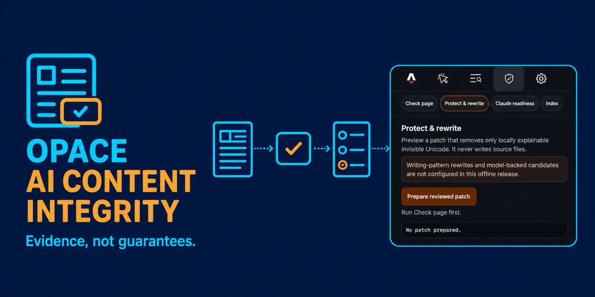

# Opace AI Content Integrity

One local-first engine for explainable content-integrity evidence: hidden-character forensics, writing-signal analysis, protected facts, watermark science and reproducible receipts. The same compiled engine powers every surface (web checker, WordPress plugin, Chrome extension, Astro integration, CLI and local service), so identical input produces identical findings everywhere.



The product never presents an AI score as proof of authorship. Every result names the method that ran, its version, its status and its limitations. A pass applies only to its named check.

[Try the browser checker](https://opace.agency/tools/ai/content-verification-integrity/checker/) · [Product page](https://opace.agency/tools/ai/content-verification-integrity/) · [Privacy notice](https://opace.agency/privacy-policy/) · [Support](https://opace.agency/get-in-touch/)

> **Status, 29 August 2026.** The browser checker is live and has been since 28 August 2026, serving the cycle-2 trained model. The WordPress plugin, Chrome extension, Astro integration, CLI and npm packages are built and tested but not yet published; no public repository or store listing exists yet. The hosted inference service described in `CLOUD-RUN-SETUP.md` was **deployed and verified on 29 August 2026**; see the roadmap section below for what was measured.

## One engine, many surfaces

The engine is `@opace/content-integrity-core` (TypeScript, MIT, local-only), compiled once and bundled into every shell. There are no parallel analysis implementations to drift apart: PHP and Python act as orchestration only. Two version constants, `UNICODE_RULES_VERSION` and `EN_SIGNALS_PATTERN_VERSION`, are stamped into every result and receipt, and a cross-surface test battery proves that the installed engine on the website is byte-identical to source on findings, methods, signals and versions.

| Surface | How it consumes the engine | Where |
|---|---|---|
| Web checker | Browser Worker via `@opace/content-integrity-browser`, with a main-thread watchdog fallback | [live checker](https://opace.agency/tools/ai/content-verification-integrity/checker/) |
| WordPress plugin | Same JS bundle in the admin Worker; PHP handles REST, persistence and receipts | [wordpress/](wordpress/opace-ai-content-integrity/readme.txt) |
| Chrome extension | Bundled MV3 Worker over selected or visible page text | [extensions/chrome/](extensions/chrome/README.md) |
| Astro integration | Dev Toolbar checks and hash-only build reports | [packages/astro/](packages/astro/README.md) |
| Node CLI | `opace-integrity` command over the identical core | [packages/cli/](packages/cli/README.md) |
| Local engine | Authenticated loopback API (`127.0.0.1:8741`) for heavier optional adapters | [services/local-engine/](services/local-engine/README.md) |
| Watermark lab | `@opace/watermark-lab` scores text against demo watermark keys, fully in-browser | [packages/watermark-lab/](packages/watermark-lab/README.md) |

## Capabilities by tier

The full technical register, with exact rule inventories and test evidence, is [docs/CAPABILITIES.md](docs/CAPABILITIES.md). Ready-to-copy listing descriptions for WordPress.org, the Chrome Web Store, npm and Astro live in [DESCRIPTIONS.md](DESCRIPTIONS.md).

### Tier A — deterministic evidence (exact, local, runs everywhere)

- **Invisible-character detection**: 38 carrier rules covering 415 code points (full Cf format set including the tag block, variation selectors including the supplementary range, the Zs space family, separators, unpaired surrogates), with context intelligence so emoji sequences, cursive and Indic scripts and French typography do not false-flag.
- **Homoglyph detection**: 60 Cyrillic and Greek Latin-lookalike confusables with a mixed-script gate, so pure Russian or Greek text never flags.
- **Protected content**: 12 span kinds (currency, number, date, time, unit, url, email, quote, code, name, organisation, citation) extracted precision-first, so facts survive any rewrite.
- **Provenance**: live C2PA Content Credentials reading for uploaded JPEG, PNG, WebP and PDF files on the browser checker, built on the official `@contentauth/c2pa-web` SDK, entirely local. Certificate trust lists are deliberately not consulted, and the UI says so; pasted text is never given a provenance verdict.
- **Receipts**: canonical, hash-only RFC 8785 receipts recording exactly which checks ran, at which versions, with which statuses.

### Tier B — writing-signal rules and stylometrics

- **116 named rules** at `en-signals:2026.08.6`: 113 weighted writing-signal categories plus 3 `en-gb:2026.08.1` rules, producing a 0–100 editorial-signals score. Since 28 August 2026 that score is presented as **writing suggestions** and nothing else. It is not an authorship reading and is not counted toward one.
- The 113 categories are: 51 from the v2 pack (46 adapted from avoid-ai-writing plus 5 Opace-original structural rules), 55 from the v3 merge (including a 7-rule artefact-forensics group with model attribution: exposed chatbot citation tokens, URL fingerprints, placeholders, reasoning leaks and character-set leakage, plus era and attribution metadata and 67 documented exclusions, and three chat-export furniture rules added in the 2026.08.6 calibration), and 7 v4 rhythm and stylometric rules (sentence-length spectral flatness, conditional compression, lexical register distance, punchline fragment density, mic-drop paragraphs, contrast density, rhetorical-to-procedural ratio) calibrated to fire on 0 of 44 verified human control texts.
- The tier still emits its internal three-way label and a raise-only escalation policy (artefact floor, citation co-occurrence, artefact-plus-score, formatting floor, formatting cluster, furniture gate, finding breadth). Both are now confined to the editorial axis: they change how many suggestions are shown, never what the engine says about authorship.
- This tier explains and improves writing and catches careless AI output. It is never presented as authorship detection.

**Why it was demoted, measured.** Re-tested on 5,558 long-form documents neither tier had seen (922 AI, 1,200 human in the rules comparison), the 113 rules detected **45.1% of AI writing while flagging 24.8% of human writing** — worse than the trained model on both axes at once, so mixing them into a verdict could only make it worse. The root cause was already documented: they detect chat-export formatting and promotional register rather than authorship, and the cliché-vocabulary rules fire on 40% of genuine human marketing copy. On 28 August 2026 the tier stopped contributing to the AI verdict and became editorial suggestions.

| tier, same fresh long-form corpus | AI detected | human false positives |
|---|---|---|
| 113 writing rules | 45.1% | **24.8%** |
| cycle-2 model | **90.3%** | **1.34%** |

Two earlier figures are **superseded and must not be quoted**: the 66.7% detection at "zero human false positives" on the 1,896-sample provider-eval corpus, and the `finding_breadth` message claiming human controls peaked at 2 categories. The first was an artefact of a human corpus that was 76% encyclopaedic and question-and-answer text; the second is falsified — real humans reach 5, 6 and once 11 categories, and that rule caused 135 of 139 rules-layer false positives. The full per-rule statistics are in [docs/CAPABILITIES.md](docs/CAPABILITIES.md) and the per-rule validation report.

### Tier C — trained local model (Named local signals) — the only AI reading

**This is the only check in the product that gives an authorship reading.** One e5-small
per-channel int8 ONNX classifier (33.36M parameters, 34.3 MB, 34.5 MB including its
vocabulary), downloaded once on explicit consent, cached, and run entirely in the browser.

Cycle 2 replaced the shipped model on 28 August 2026 after the original was measured at
AUROC 0.530 on published prose — barely better than a coin flip, and inverted on human
business-marketing copy, which it scored *higher* than AI writing. Retrained on a
15,514-document published-register corpus, then validated against **5,558 documents it had
never seen** (922 AI from 13 current models; 4,636 human from Europe PMC, GOV.UK, CRS, Global
Voices, Mongabay, SEC EDGAR and PERSUADE):

| | measured |
|---|---|
| AI detected | **90.3%** |
| human false positives | **1.34%** |
| operating point | 0.984, fitted through the shipped browser runtime |

Per register on the same fresh data: company updates 99.0%, white papers 98.1%, research
summaries 94.9%, academic discussion 93.8%, academic literature reviews 92.5%, long-form
journalism 86.1%, academic essays 84.1%, stories 79.8%. Every long-form category clears the
50% floor with margin. Held-out training evaluation moved AUROC from 0.530 to 0.9695 and
detection at a 1% false-positive budget from 6.7% to 76.9%.

**The threshold was fitted through the runtime that actually ships.** onnxruntime-web and
Python onnxruntime disagree by a median 0.113 on this quantised model, because Python applies
extended int8 fusions the web build does not. Quoting the Python figure would have produced
3.56% real-world false positives while the interface claimed 1.2%. Every number above is
browser-measured; the Python measurement on the same data is 90.6% at 1.22%, and both are
recorded rather than the flattering one being chosen.

**What it does and does not catch.** An AI draft that a person then tidies is detected 82.3%
of the time. An AI rewrite of a human original is 30–35%. Human text that a language model
merely polished is deliberately **not** flagged: in that band a median 93.5% of the words are
the human author's, and flagging it would mean accusing writers who use a model on their own
prose. Detection falls away on short text — 67% at 200 words, 50% at 150, 19% at 100 — and the
page says so; short human text is not falsely flagged (0 of 400 samples at 60–200 words).
A clean result is labelled "No strong AI-style signals", never "human".

**Cycle 3 was built, measured and rejected.** It improves AI-rewrites-of-human from 30% to
46–56% and rank correlation with the true AI share from 0.58 to 0.74, but int8 quantisation
costs it 5.2 points of recall so it cannot run in the browser at all, stories regress from
79.8% to 69.3% and journalism from 89.1% to 81.0%. The trade is not worth it for a browser
tool, and the negative result is published rather than buried.

### The verdict is three readings, never one

`packages/core/src/verdict/combine.ts` (`combined:2026.08.8`) publishes three independent
axes and never collapses them into a single label:

| axis | what it says | who may set it |
|---|---|---|
| `ai_probability` | how likely it is that a machine composed the text | **only** the trained model; `not_assessed` when none ran, and `not_assessed` does not mean human |
| `text_integrity` | `clean` / `attention` / `manipulated` — invisible carriers, homoglyph substitution, private-use clusters, watermark marks | the deterministic character forensics |
| `editorial` | `none` / `some` / `many` writing suggestions | the 113 named rules |

The distinction is the whole point. **A hidden zero-width character proves text manipulation,
not AI origin.** A CMS paste handler, a translation memory, a DTP export or a person editing a
wholly human document can all put one there. The integrity axis is allowed to say "this text
contains hidden characters"; it is never allowed to say, or imply, "this is AI". An assertion
in the module enforces that at runtime and throws rather than publish a collapsed verdict.

### Tier D — authorised external verification (planned)

Bring-your-own-key adapters to commercial detectors the user already pays for, with clearly attributed results, plus official Anthropic verification if and when a supported interface exists.

### Watermark lab

A real SynthID-Text demo detector: DeepMind's Apache-2.0 reference detection mathematics ported faithfully to TypeScript, a GPT-2 tokeniser, genuinely generated watermarked fixtures and a wrong-key collapse demonstration, all in-browser with public demo keys. The live lab's v2 release adds key rotation (pasted text is scored under every held demo key, so a lab-generated sample has its genuine key discovered rather than asserted) and desktop auto-load of the detection engine when the lab scrolls into view.

The same mathematics now also runs **inside the checker** on every assessment, as the named method `watermark.known_keys`: your text is scored under all three public demo keys and you get the per-key table, not a claim. It replaced a static "Anthropic watermark / Unsupported" row that asserted a boundary without running anything. The boundary is still stated, as its own line rather than as a fake check: Anthropic production keys are private, no public verifier exists, and that watermark is not assessed. See [packages/watermark-lab/](packages/watermark-lab/README.md).

## Quick starts

**No install:** paste text into the [browser checker](https://opace.agency/tools/ai/content-verification-integrity/checker/). Everything runs in your browser; nothing is uploaded.

**npm — core engine** (after owner-approved publication; verified against the built package):

```js
import { inspect, computeEditorialSignals } from "@opace/content-integrity-core";

const result = await inspect({
  schema_version: "1.0",
  contract_version: "1.0.0",
  request_id: "req_readme_demo",
  created_at: new Date().toISOString(),
  source: { content: "In today's rapidly evolving landscape, Opace quoted £1,250.​",
            content_type: "plain_text", language: "en-GB" },
  checks: ["unicode.invisible", "style.patterns", "watermark.anthropic"],
  privacy: { allowed_routes: ["browser"], save_receipt: false, retain_content: false }
});
console.log(result.summary);
// { pass: 0, attention: 2, fail: 0, inconclusive: 0, unsupported: 1, not_configured: 0, not_run: 0, error: 0 }

const signals = computeEditorialSignals(draftText);
// { score, classification, probabilities, confidence, categoriesHit, findingCount, wordCount, version, status, description }
```

**npm — watermark lab:**

```js
import { tokenise, score, DEMO_KEYS } from "@opace/watermark-lab";

const ids = tokenise(watermarkedFixtureText);
score(ids, DEMO_KEYS["opace-demo-alpha"]).meanG; // 0.643 (right key)
score(ids, DEMO_KEYS["opace-demo-beta"]).meanG;  // 0.513 (wrong key: collapses to the 0.5 null)
```

**CLI:**

```sh
opace-integrity inspect article.txt
opace-integrity inspect - --format json < article.txt
```

**Local engine** (optional, loopback only): see [services/local-engine/](services/local-engine/README.md). It binds only to `http://127.0.0.1:8741` with separate run and administration tokens.

To validate the monorepo itself (Node 20+, Python 3.10+, PHP 7.4+ for the full cross-language run):

```sh
npm ci
npm test                            # typecheck; contracts 13 schemas; Python 13 schemas + RFC 8785 vectors; PHP 22 fixtures, 3 hash vectors, 45 assertions
npm run test:battery                # 110 pass / 0 fail adversarial and cross-surface battery
npm --prefix packages/core test     # 123 pass / 0 fail
npm --prefix packages/watermark-lab test   # 30 pass / 0 fail
npm run test:gates                  # G2 core probe 24 passed / 0 failed, plus package and client gates
node tests/battery/calibrate.mjs    # "Calibration OK: 0/44 human samples fire any 2026.08.5 rule."
```

Totals verified on 29 August 2026. The cross-surface battery compares the engine built here
against the copy installed in the website's `node_modules` and fails if they diverge on
findings, methods, signals or versions, so it is also the check that the website is running
what this repository says it is. Every evidence artefact behind these totals is indexed in
[docs/EVIDENCE-INDEX.md](docs/EVIDENCE-INDEX.md).

## Honest limitations

- **The writing rules are editorial feedback, not detection.** On fresh long-form documents they reach 45.1% detection at a 24.8% human false-positive rate. They are shown as writing suggestions and are never counted toward the AI reading. Genuine human copy triggers them routinely and carefully prompted AI text often triggers none of them.
- **Detection falls away on short text.** 67% at 200 words, 50% at 150, 19% at 100. Below 200 words the model's reading is not reliable and the page says so. Short human text is not falsely flagged: 0 of 400 samples at 60–200 words.
- **Human text that a language model polished is deliberately not flagged.** In that band a median 93.5% of the words are the human author's. Not flagging it is correct behaviour, not a gap.
- **AI rewrites of a human original are the weakest real case**, at 30–35%. Paragraph-mixed documents remain the weakest case for every model tried, including the cycle-3 candidate that was rejected.
- **The business-report register is data-starved**: only 72 held-out rows, AUROC 0.69 against 0.93–0.99 elsewhere. It clears the floor and must not be quoted as settled.
- **Academic writing carries the highest human false-positive rate of any genre.**
- **The story register carries the highest residual human false-positive rate**, and the flagged samples come from the corpus pool its own author independently flagged as least trustworthy. That is likely a data-quality artefact rather than a model defect, and it is unproven either way.
- A clean result means no selected check fired. It is not evidence of human authorship, and the UI labels it "No strong AI-style signals".
- **Hidden characters are not an AI signal.** The integrity axis reports that text was manipulated; it says nothing about who or what composed it, and the engine will not let it.
- A carrier inserted mid-entity can defeat name and organisation extraction.
- The watermark lab uses public demo keys and cannot verify or rule out any provider's production watermark.
- No plagiarism checking, no detector-clearance claims, no guaranteed SEO outcomes. Unsupported and unrun checks are shown as exactly that, never collapsed into a pass.

## Methodology and versioning

Every analysis records the signal-set versions that produced it (`unicode:2026.08.2`, `en-signals:2026.08.6` at the time of writing) in results and receipts, so findings are reproducible and surfaces are provably in step. Statuses come from a fixed vocabulary (`pass`, `attention`, `fail`, `inconclusive`, `unsupported`, `not_configured`, `not_run`, `error`). Test methodology and evidence classes are documented in [docs/TEST-EVIDENCE.md](docs/TEST-EVIDENCE.md); the standing rule is that every new capability lands with a fixture-battery extension.

## Roadmap

- **Trained local model (Tier C)**: cycle 2 is live. Cycle 3 was built and rejected on measured evidence. The next useful purchase is roughly 300 genuinely model-tidied documents for a real held-out edit set, costed at about $2.10, and the technique that worked — a saturating soft target on the AI word share — should be combined with a quantisation-friendly architecture.
- **Hosted inference (deployed 29 August 2026, not yet wired to the checker)**: a Cloud Run endpoint that lets visitors avoid the 34.5 MB download. Verified on the day at `https://opace-detector-877422072168.europe-west1.run.app`, revision `opace-detector-00003-bfq`, europe-west1, scale to zero. `/v1/health` returns model `tier3-cycle2`, fp32, build `e313ab00de1fffd2`, `segmentation_contract: segments-v1`. Server-side segmentation matches the browser contract: a 1,200-word document returns 4 segments of 340/340/340/180 words with `aggregation: "max"`, exactly the published golden case. The daily cap is counted in **inferences, not requests** (12,000 a day; one four-segment request moved the remaining allowance 12,000 → 11,996), because a request is not a fixed unit of cost. Abuse gates and the kill switch were both exercised against the running service. **The £50 spend ceiling is delivered by that kill switch, not by any Cloud Run setting** — `--max-instances` bounds CPU and memory but nothing caps the request count, and a month-long flood is roughly £519 at two instances even with every request rejected. The switch failed twice in testing, once silently, before it worked; `docs/security/THREAT-MODEL.md` records both failures, and it must be re-fired after every redeploy and IAM change. The zero-retention claim was audited the same day by submitting a unique high-entropy marker through the real gated path and finding zero occurrences of it in any log entry in the project — on the scoring path only; refusal and error paths are unprobed, and that probe is re-run after every redeploy too. The URL and revision change on redeploy — re-run `GET /v1/health` rather than trusting either. **Still open:** the checker is not pointed at this route, and the site-wide "your text never leaves your browser" copy must change before it is.
- **Publication**: no public repository, npm/PyPI release, WordPress.org submission, Chrome Web Store listing or Astro catalogue entry exists yet. Those gates are genuinely open.
- **BYOK adapters (Tier D)**: Copyleaks and Originality first, rendering their attributed scores beside ours.
- **WordPress, Chrome and Astro sync**: next release, built from the same engine tarballs. Each will also need the model row and the rules demotion carried across; today they ship the deterministic tiers only.
- **Benchmark and Integrity Index**: reproducible, versioned corpus with published false-positive rates, including a hand-rewritten-AI category.

## Attribution and licences

This project deliberately reuses excellent prior work, with credit:

- **avoid-ai-writing** (MIT, Conor Bronsdon and contributors): writing-pattern rules, stylometric methods, weights and classifier logic, adapted to TypeScript.
- **watermarks-remover** (MIT, Guillaume Meyer): carrier and confusable table data, adapted.
- **google-deepmind/synthid-text** (Apache-2.0): the watermark detection mathematics ported in `@opace/watermark-lab`.
- **Unicode Consortium data**: the category-derived carrier inventory.
- **OpenAI GPT-2** (MIT): tokeniser algorithm and vocabulary assets.
- **c2pa-js** (Content Authenticity Initiative): the provenance adapter.

Full records: [THIRD_PARTY_NOTICES.md](THIRD_PARTY_NOTICES.md), [MODEL_AND_DATA_PROVENANCE.md](MODEL_AND_DATA_PROVENANCE.md), [docs/legal/DEPENDENCY-LEDGER.md](docs/legal/DEPENDENCY-LEDGER.md).

## Documentation

- [Capability register](docs/CAPABILITIES.md) — the exhaustive technical inventory
- [Evidence index](docs/EVIDENCE-INDEX.md) — every test result, evaluation report and research artefact, with paths
- [Listing descriptions](DESCRIPTIONS.md) — canonical copy for stores and registries
- [Test evidence](docs/TEST-EVIDENCE.md) · [Release state](docs/RELEASE-STATE.md)
- [Contributing](CONTRIBUTING.md) · [Security policy](SECURITY.md) · [Code of conduct](CODE_OF_CONDUCT.md)
- [Changelog](CHANGELOG.md) · [Citation](CITATION.cff)

## Privacy and security

Browser, extension and Astro inspection stays on the device: no telemetry, no remote fallback, no content sent to Opace or any detector provider by default. The hosted checker page itself carries the site-wide analytics that fire a standard form-interaction event; that event contains no text, file or result content, and the page discloses it. The loopback service requires bearer tokens and rejects non-loopback origins. Report vulnerabilities through [SECURITY.md](SECURITY.md), never a public issue.

Maintained by [Opace Digital Agency](https://opace.agency/). Opace-authored monorepo code is available under the [MIT Licence](LICENSE); the WordPress distribution retains its declared GPL-compatible licence.
