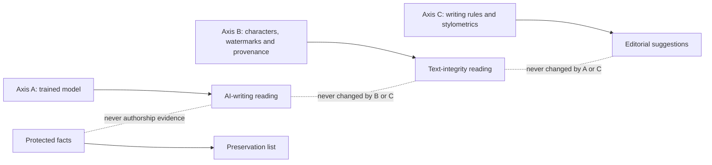
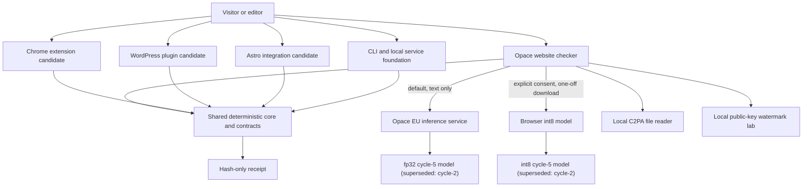
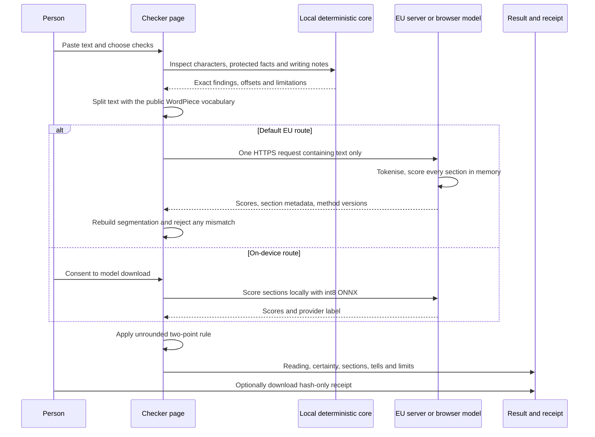
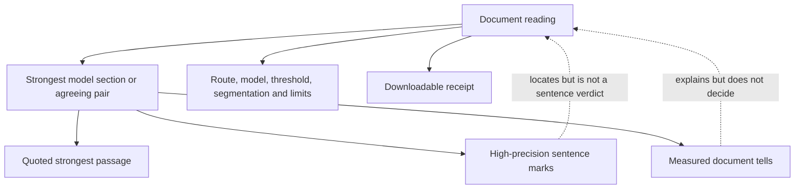
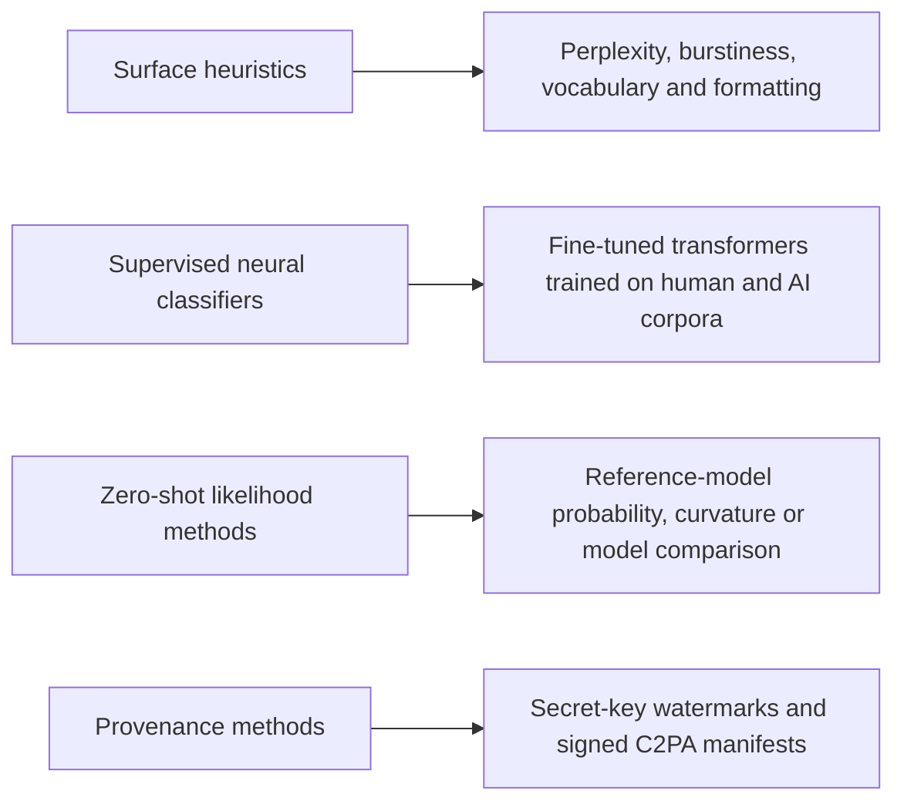
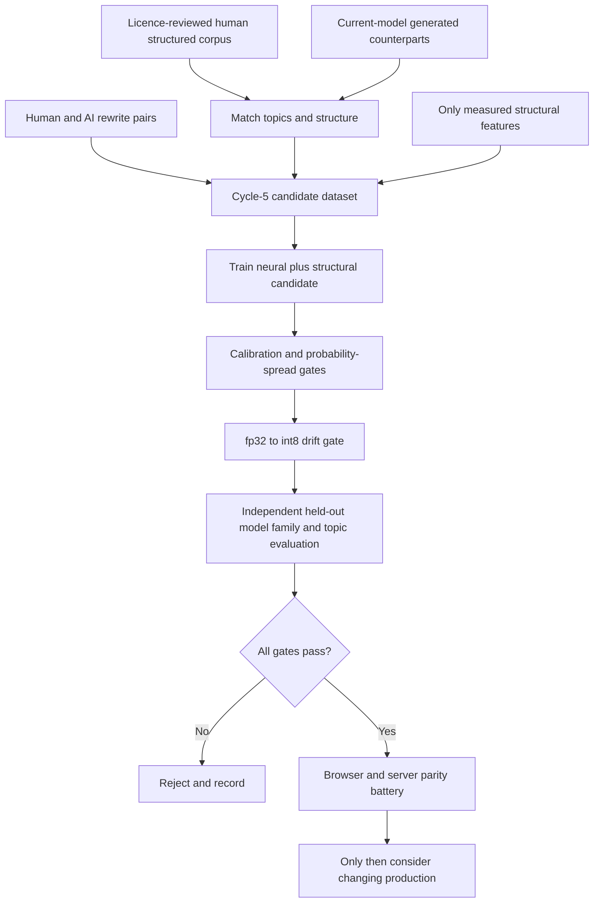

# Opace AI Content Checker & Detector: architecture, science, evidence and claim boundaries

**Changelog note, 1 September 2026 (added after the original write-up).** This document was written and evidence-cut-off on 31 August 2026, the day before cycle-5 replaced cycle-2 as the shipped classifier on Cloud Run revision `opace-detector-00010-4dt` (1 September 2026, owner-authorised). Every section below that described cycle-2 as "the version that ships", "the current deployed model" or "the shipped pair" was written against the model that was live at the time of writing, not the model live today. This pass updates those sections to state cycle-5 as the current shipped reality: the margin-space flag rule (`flag iff max(m1, m2 + 0.34) >= 3.571`, not the old probability-space `0.9855`/`0.9763` pair), `raw-v1` input normalisation (not the md-strip-v1 policy implied elsewhere in this document, which remains correct for cycle-2 only), the new `features-v1` structural-feature contract (8 features feeding the model alongside the e5-small pooler output), and the cycle-5 accuracy, matched-pairs and humaniser figures. **Every cycle-2 figure is retained in place and explicitly marked historical or superseded** — none has been deleted — following this programme's standing no-claim-without-measurement, mark-superseded-in-place discipline. Sources for this update: `services/local-engine/research/cycle5-train/CYCLE5-REPORT.md`, the shipped `opace-website/astro-latest/public/models/local-signals-v1/thresholds.json` (version `tier3-cycle5-v1`), `services/local-engine/research/cycle5-train/deploy-prep/THRESHOLDS-CYCLE5-DIFF-README.md`, and `PROJECT.md`.

**Document status:** primary technical and human-readable programme reference  
**Evidence cut-off:** 31 August 2026  
**Repository:** [Opace AI Content Checker & Detector](https://github.com/OpaceDigitalAgency/opace-ai-content-checker-detector)  
**Public research library:** [Opace AI Content Checker & Detector research](https://opace.agency/tools/ai/content-verification-integrity/research/)  
**GitHub research navigation:** [Complete first-party research index](RESEARCH-INDEX.md)
**Live checker:** [Opace AI Content Checker & Detector](https://opace.agency/tools/ai/content-verification-integrity/checker/)

This document consolidates the programme brief, source code, model manifests, measurements, research papers, decision records, security work, release records and current task board. It is intended to be the first document a person or an AI system reads before making a product, technical, scientific or marketing claim about this project.

Discrepancies found during consolidation are kept in a separate follow-up register (internal programme record, maintained privately, not in this repository). An unresolved entry is not silently resolved by this document.

The figures below belong to the exact corpus, operating point, segmentation contract and runtime named beside them. They must not be moved between those contexts. A newer model, runtime, threshold, corpus or deployment revision needs a new measurement.

## Contents

1. [The short version](#1-the-short-version)
2. [What the product can and cannot say](#2-what-the-product-can-and-cannot-say)
3. [System architecture](#3-system-architecture)
4. [What happens during a check](#4-what-happens-during-a-check)
5. [The model or brain](#5-the-model-or-brain)
6. [Segmentation, document aggregation and apparent contradictions](#6-segmentation-document-aggregation-and-apparent-contradictions)
7. [The signals and what the science found](#7-the-signals-and-what-the-science-found)
8. [Evidence shown with a score](#8-evidence-shown-with-a-score)
9. [Watermarks, hidden characters and provenance](#9-watermarks-hidden-characters-and-provenance)
10. [Privacy, security and the local-versus-hosted decision](#10-privacy-security-and-the-local-versus-hosted-decision)
11. [Measured performance and test results](#11-measured-performance-and-test-results)
12. [Rewrites, humanisers and evasion](#12-rewrites-humanisers-and-evasion)
13. [How other detectors work and how Opace differs](#13-how-other-detectors-work-and-how-opace-differs)
14. [Decisions, rejected approaches and known gaps](#14-decisions-rejected-approaches-and-known-gaps)
15. [What the remaining processes are intended to change](#15-what-the-remaining-processes-are-intended-to-change)
16. [Products, packages and release state](#16-products-packages-and-release-state)
17. [Operating and governance rules](#17-operating-and-governance-rules)
18. [Appendix A: the 21 public research papers](#appendix-a-the-21-public-research-papers)
19. [Appendix B: internal research and evidence map](#appendix-b-internal-research-and-evidence-map)
20. [Appendix C: exact model and service record](#appendix-c-exact-model-and-service-record)
21. [Appendix D: example result and receipt](#appendix-d-example-result-and-receipt)
22. [Appendix E: glossary](#appendix-e-glossary)

## 1. The short version

### 1.1 In layman's terms

The tool is more like a set of instruments than a lie detector.

One instrument is a trained language model. It has learned statistical differences between groups of human-written and machine-written documents. It reads the submitted draft in pieces and reports how closely the strongest pieces match the machine-written group. That is useful evidence, but it cannot identify an author, prove misconduct or guarantee that quiet text is human.

Other instruments inspect facts about the text itself. They find invisible characters, lookalike letters, protected facts, public demonstration watermarks and signed Content Credentials in supported files. A final set of checks points out repetitive phrasing and regular structure. Those checks can explain what is unusual, but they do not vote on authorship.

The distinction matters. A zero-width character proves that the character is present. A repeated heading shape proves that the shape is present. Neither proves that AI wrote the sentences. Only the trained classifier supplies the AI-writing reading, and even that reading is probabilistic evidence rather than proof.

### 1.2 Headline numbers for the version that ships

**Cycle-5 is now the version that ships (1 September 2026), superseding cycle-2 below.** Cycle-5 also changed the flag *rule*, not just the thresholds: the verdict is decided in margin space (`flag iff max(m1, m2 + 0.34) >= 3.571`, over raw per-segment logit margins, never passed through softmax for the verdict) rather than the old calibrated-probability `0.9855 OR 0.9763` comparison. The table below states the cycle-5 figures first, with the cycle-2 row retained beneath each and marked historical/superseded — exactly the "measured at the flag point named beside it" discipline this document sets out in the paragraph above the contents list.

| Measure | Cycle-5 result (shipped 1 Sep 2026) | Cycle-2 result (superseded 1 Sep 2026) | Scope and warning |
|---|---:|---:|---|
| **Long-form AI detection, EU server** | **902/922, 97.8%** | 883/922, 95.8% *(historical)* | fp32 runtime, 13 model families, cycle-5 margin rule `max(m1, m2+0.34) >= 3.571` (display equivalents 0.9679/0.9562), `segments-v3`, `raw-v1` input, `features-v1`. Eval view excluding training-touched documents: 658/675, 97.5% |
| **Long-form human false positives, EU server** | **46/4,636, 0.99%** | 45/4,636, 0.97% *(historical)* | Same corpus and operating point; eval view: 42/4,500, 0.93% |
| **Long-form AI detection, browser (onnxruntime-web WASM)** | **900/922, 97.6%** | 889/922, 96.4% *(historical)* | int8 browser artefact, cycle-5 margin rule, measured through onnxruntime-web (WASM) — the engine the site ships, not the native-onnxruntime proxy used elsewhere in cycle-5's own training report |
| **Long-form human false positives, browser (onnxruntime-web WASM)** | **73/4,636, 1.57%** | 90/4,636, 1.94% *(historical)* | Same corpus and operating point. A separate native-onnxruntime-CPU proxy measurement (not the shipped browser engine) reads 39/4,636, 0.84% — kept distinct because the two int8 runtimes do not agree closely enough to interchange |
| **Browser WebGPU result** | Not yet measured for cycle-5 | 885/922 AI; 92/4,636 human *(historical, cycle-2)* | One Chromium and Apple Metal configuration; 16 verdict changes versus WASM. Cycle-5 has no WebGPU-vs-WASM parity measurement yet — a stated known gap, see §14.3 |
| **Server/browser verdict disagreement** | **37/5,558, 0.67%** | 55/5,558, 0.99% *(historical)* | Cycle-5 figure measured 1 September 2026 between the fp32 server-runtime analogue and onnxruntime-web WASM at the fitted margin pair |
| **Worst measured human register** | **7/227, 3.1% server; 8/227, 3.5% browser** | 23/260, 8.8% server; 26/260, 10.0% browser *(historical, different denominator: full 260-document set vs cycle-5's 227-document eval view)* | Human fiction, at each model's own shipped pair |
| **Structured-human false positives (the "27% problem")** | **1/418, 0.2% fp32 / 0.24% browser WASM** | 114/418, 27.3% *(historical — the finding that motivated cycle 5)* | Matched-pairs held-out slice, structured GOV.UK-class human writing; see §12 and the "27% problem" research paper |
| **Naturally short AI, 100-word target** | **43/56, 76.8%** | 29/172, 16.9% *(historical — different corpus and banding, not cell-comparable)* | fp32 route; still the weakest length band under cycle-5 |
| **Naturally short AI, 300-word target** | **61/63, 96.8%** | 193/228, 84.6% *(historical — different corpus and banding)* | fp32 route; still not the long-form headline population |
| **Half-human, half-AI documents** | Not re-measured for cycle 5 | 604/700, 86.3% *(historical, cycle-2's minimum-evidence rule)* | fp32 route; synthetic splices. A known gap for cycle 5 — see §14.3 |
| **Heavy-rewrite-of-human false positives** | **39/137, 28.5%** | 21.2% (57/272 on a differently-scoped ladder) *(historical)* | Disclosed regression: cycle-5 correctly learns heavy LLM rewrites of human text as machine-written, which their words are — see §12 |
| **Writing-rule tier** | 45.1% AI; 24.8% human *(unchanged — not a model input on either cycle)* | 922 AI and 1,200 human long-form documents; therefore editorial only |
| **Signal-science corpus** | 25,723 documents; 5,935 matched pairs *(unchanged research corpus, not the deployed test corpus)* | 10,890 machine, 14,833 human; feature research, not the deployed test corpus |
| **Model corpus independence** | Cycle-5's matched-pairs slice (§12) is the first fully independent evasion measurement; the 654/922 vs 268/922 cycle-2 split-overlap figure below is retained for cycle-2 | **654/922 AI independent; 268/922 in a cycle-2 split** *(historical, cycle-2)* | The 1.1-point seen/unseen comparison was measured only at retired threshold 0.984 |
| **Current independent short marketing evidence** | **Not measured** | Same gap under cycle-5 | This is the most important evidence gap for the product's common use case |

The current long-form headline is strong within its measured setting. It is not a general accuracy percentage for every type of text. In particular, it must not be quoted for short marketing, SEO or social copy, for individual sentences, or for an edited-versus-unedited authorship distinction.

### 1.3 The five readings a user sees

The interface presents `Likely human`, `Unclear`, `Potentially AI`, `Likely AI` and `Strongly AI`, plus `Not enough text to read`. These are product labels mapped from the measured score bands. They are not percentages of authorship certainty.

There is also a stricter flag or certainty rule. The reading and the flag are related but separate:

- the reading describes the band containing the strongest section score;
- **as shipped from 1 September 2026 (cycle 5):** the flag fires if `max(m1, m2 + 0.34) >= 3.571`, where m1 and m2 are the top two segments' raw logit margins (AI-logit minus human-logit) — a margin-space comparison, never passed through the calibrated-probability softmax for the verdict decision. The display-equivalent probabilities are 0.9679 and 0.9562;
- **historical, cycle-2, superseded 1 September 2026:** the flag fired if the strongest section reached 0.9855, or if the second-highest section reached 0.9763, both compared as calibrated probabilities after softmax;
- the number shown remains the strongest section's calibrated display score in both cycles (the calibration temperature — 1.0479 for cycle 5, 0.8324 for cycle 2 — governs only that display score, not the cycle-5 verdict itself);
- a `Likely AI` reading can sit below the strict flag, by design;
- displayed rounding never changes the decision, which uses unrounded values.

## 2. What the product can and cannot say

### 2.1 Claims it can support

For a completed run, the product can report:

- how closely the draft's strongest model-sized sections match the patterns learned from the labelled training corpus;
- the exact route and model version that ran;
- each section's offsets, word count, token count, score band and model score;
- which section or pair of sections satisfied the strict flag rule;
- whether the result falls below the measured reliable length range;
- whether supported invisible characters or lookalike characters are present;
- which protected spans, such as names, organisations, citations, links, dates, numbers and quoted text, should survive an edit;
- which editorial rule categories fired, with a matching excerpt where the interface has one;
- whether one of the tool's three public demonstration watermark keys matches;
- whether a supported uploaded file carries a locally readable C2PA manifest, along with parser and validation status;
- a hash-only JSON receipt recording methods, versions, route, limitations and content hashes.

The right form of words is: **"This draft strongly matches patterns learned from machine-written documents under the named model and test conditions."**

### 2.2 Claims it cannot support

The product cannot truthfully say:

- "AI definitely wrote this";
- "this person cheated";
- "this text is certainly human";
- "this sentence is 87% AI";
- "the score is the percentage of the document written by AI";
- "a hidden character or watermark proves AI authorship";
- "this was human-written and then AI-edited", or the reverse;
- "all commercial detectors would agree";
- "95.8% accurate on all text";
- "short marketing copy has the same measured performance as long-form prose";
- "no watermark was used" when only public demonstration keys were checked;
- "a C2PA wrapper is valid provenance" when only the text wrapper was recognised;
- "Content Credentials prove that every statement in a file is true".

### 2.3 The three-axis contract

The core enforces three readings that must never be collapsed:



`assertAxisIndependence` checks this rule at runtime. A carrier, homoglyph or watermark cannot raise the AI-reading field. A writing suggestion cannot do so either. Protected spans are not a verdict input at all.

## 3. System architecture

### 3.1 Programme context



The repository holds shared JSON contracts, a TypeScript core, browser package, CLI, local service research, WordPress candidate, Chrome candidate and Astro candidate. The production website lives in a separate canonical repository and imports published model data plus the shared design contracts. The public GitHub repository is the evidence and implementation record. Store publication is a separate gate.

### 3.2 Shared deterministic core

The core accepts plain text, HTML or Markdown through contract version 1.0. It:

1. validates schema and size limits;
2. rejects unpaired Unicode surrogates;
3. hashes the source;
4. projects visible text while retaining source offsets;
5. runs Unicode and homoglyph inspection;
6. extracts protected spans;
7. runs selected editorial pattern packs;
8. records an unsupported state for unavailable methods rather than inventing a substitute;
9. returns method results, limitations and the three-axis result;
10. optionally builds an RFC 8785 canonical receipt.

The deterministic core does not itself run the trained model. The website's server or browser model route supplies the model reading alongside the core result.

### 3.3 Contracts and evidence objects

The versioned schemas cover requests, results, method results, protected spans, rewrite candidates, gates, jobs and receipts. Every method result carries:

- method id and category;
- method or provider name;
- exact version;
- status;
- score and threshold where those concepts apply;
- evidence rows;
- at least one limitation;
- start and completion times;
- privacy route.

The statuses distinguish `pass`, `attention`, `fail`, `inconclusive`, `unsupported`, `not_configured`, `not_run` and `error`. Missing is never silently converted into pass.

## 4. What happens during a check

### 4.1 Runtime flow



### 4.2 The default server path

The current default submits the whole draft in one HTTPS request to Opace's Cloud Run service in Europe. The application scores each token-bounded section in memory and returns section results. Its response says how many words were sent, processed and retained. Retained is zero.

The page does not blindly trust the response. It independently tokenises and segments the original text using the small public vocabulary. It rejects the server result if version, model build, segmentation contract, offsets, token counts, aggregation or flag-rule metadata disagree.

### 4.3 The on-device path

The user can choose the browser model before a run. Explicit consent downloads (cycle-5, shipped 1 September 2026):

- the WordPiece vocabulary (byte count unchanged from cycle-2 below unless re-measured);
- the cycle-5 int8 ONNX model, `tier3-cycle5-full-e5small-int8-perchannel.onnx`, approximately 34.3 MB per `CYCLE5-REPORT.md` (exact byte count not yet re-recorded in this document; see the cycle-2 figure below for the previous exact count);
- the model is now a three-input ONNX (`input_ids`, `attention_mask`, `feats[8]`), so the browser route must also compute the 8 `features-v1` structural features per segment before scoring, which cycle-2 did not require.

**Historical, cycle-2, superseded 1 September 2026:** the consent download was 231,508-byte WordPiece vocabulary plus a 34,279,909-byte int8 ONNX model, total declared model consent payload 34,511,417 bytes, two-input ONNX (`input_ids`, `attention_mask` only, no structural features).

The ONNX runtime binary is a separate runtime resource. Once the model is available, the text and scores remain on the device and the service's request and word limits do not apply. The browser route is free of service quotas, but its runtime and quantised weights differ from the server, which is why its own performance is published separately.

### 4.4 Local checks that always stay local

The hidden-character, homoglyph, protected-content, writing-note, public-key watermark and supported C2PA file checks run in the browser. Draft text, file names, receipt ids, hashes, findings and protected spans are not sent through site analytics.

## 5. The model or brain

**Cycle-5 is now the deployed classifier (shipped 1 September 2026), superseding cycle-2. This section states cycle-5 first; the cycle-2 architecture, recipe and corpus that follow it are retained and marked historical, since cycle-5 is a new head trained from base, not a continuation of cycle-2's weights.**

### 5.1 What it is

**Cycle-5 (shipped).** The deployed classifier is still built on `intfloat/e5-small`, but it is now a three-input ONNX model, not the earlier two-input one: `input_ids`, `attention_mask`, and `feats[8]`, an 8-element vector of z-normalised structural features (contract `features-v1`) concatenated with the e5-small pooler output (384) before a dropout-0.1, linear(392, 2) classification head. 33.36 million parameters, architecture-comparable to cycle-2 because the head grew by 8 inputs, not materially. The entire encoder was fine-tuned from base for cycle 5 — a new head, not continued from cycle 2's weights.

The 8 structural features (source: `CYCLE5-REPORT.md` §1) are:

| # | feature | what it measures |
|---|---|---|
| 0 | `wpp_cv` | words-per-paragraph coefficient of variation |
| 1 | `sec_within15` | body-section length uniformity |
| 2 | `pps_var` | paragraphs-per-section within-document variance |
| 3 | `body_mode_share` | section-shape mode share |
| 4 | `spp_cv` | sentence-length coefficient of variation |
| 5 | `adj_overlap` | adjacent-sentence content-word overlap |
| 6 | `cadence_rate` | paragraph cadence rate (≥4 per 1,000 words) |
| 7 | `has_structure` | missingness indicator, derived from block classification |

These are the same measured fingerprint components discussed as research signals in §7, now promoted to model inputs rather than editorial-only tells. Feature order and z-normalisation live in `features-v1.ts` and are copied verbatim from the shipped `thresholds.json`'s own `feature_norm` block. An ablation with the features zeroed out, identical architecture, was measured separately (§5.4) to confirm they are pulling real weight rather than being a spurious "markdown present" shortcut.

**Historical, cycle-2, superseded 1 September 2026.** The cycle-2 deployed classifier was `intfloat/e5-small` adapted for two labels, human and machine, as a plain two-input ONNX (`input_ids`, `attention_mask` only, no structural features) — the same 33.36 million parameter transformer, entire encoder fine-tuned, not a rules-based head over frozen embeddings.

The server runs fp32 weights for both cycles. The browser runs a dynamic per-channel int8 ONNX export for both cycles. Cycle-5's fp32 and int8 files are `tier3-cycle5-full-e5small-fp32.onnx` (SHA-256 prefix `45e00978b10d1df6`, matching Cloud Run's `model_build`) and `tier3-cycle5-full-e5small-int8-perchannel.onnx` respectively. Different numerical kernels and quantisation mean fp32 and int8 probabilities are not interchangeable within either cycle, and cycle-5 and cycle-2 scores are not interchangeable across cycles at all — cycle-5 is a new head trained from base.

### 5.1a Input normalisation: raw-v1 (cycle 5), not md-strip-v1

Cycle-5's `thresholds.json` manifest carries an explicit `input_normalisation` field, `"raw-v1"`, that cycle-2's manifest never needed to state. Cycle-5's encoder and structural features were both trained on raw text with Markdown syntax intact — verified against `train.py` and the training data itself (the human-structured-GOV.UK source and all 418 rows of the matched-eval-humans held-out set are 100% markdown-formatted in the raw text field). **Feeding cycle-5 md-strip-v1 input would strip the structure its own `features-v1` inputs exist to detect, and would be a contract violation, not a harmless simplification.**

Where the rest of this document describes Markdown stripping as a general or universal input-cleaning policy (for example the general text-projection step in §3.2), that description is cycle-2-specific and does not apply to the cycle-5 model. Cycle-2's md-strip-v1 behaviour was never itself an explicit manifest field — it was implied by the site's fixed input contract — which is part of why the change needed calling out explicitly rather than assumed unchanged.

### 5.2 What it learned from

**Cycle-5 (shipped).** 31,800 rows: train 18,682 / calibration 3,859 / test 9,259 (the base cycle-2/3/4 test split is preserved inside it). The training file is built from the cycle-4 base (28,295 rows, minus 8 battery near-duplicates found by a normalised-hash sweep), plus owner-approved humaniser pairs (399 AI-rewrite variants at all intensities, 135 heavy rewrites of human originals labelled AI; light/medium rewrites of human text excluded from training because their words are part-human), plus the structured-human corpus GREEN bucket (2,361 documents trained; 418 held-out-topic documents reserved for evaluation — this is the slice behind the matched-pairs finding in §12), plus 618 matched-generation rows grouped by topic slug with their human partners. The 5,558-document long-form corpus, both battery human-corpus sets, the held-out short-form slices and the matched-pairs eval set are enforced never-trained-on by a per-set hash guard that aborts the build on any hit. Full provenance: `CYCLE5-REPORT.md` §2.

**Historical, cycle-2, superseded 1 September 2026.** The cycle-2 source corpus contained 15,514 documents, split across 5,655 AI and 9,859 human documents before the final training assembly. The final cycle-2 training file held 17,295 rows:

| Split | Rows |
|---|---:|
| **Training** | 8,944 |
| **Calibration** | 1,829 |
| **Test** | 6,522 |
| **Total human** | 9,586 |
| **Total AI** | 7,709 |
| **Hard negatives** | 6,730 |

The corpus was designed around published-register prose rather than only chat answers. Registers include articles, essays, academic material, white papers, stories, company updates and marketing-like prose. Source licences and provenance are recorded in corpus manifests.

The later 5,558-document headline evaluation corpus is not wholly independent on its AI side, under either cycle. Of 922 AI documents, 654 are independent of every cycle-2 split and 268 occur in a cycle-2 split, including 168 in training. Only 11 of 4,636 human documents occur in a cycle-2 split. This was corrected publicly after an earlier held-out claim was found to be false, and it describes overlap against cycle-2's training split specifically; cycle-5's own overlap accounting is the eval-view exclusion in §11 (675/922 AI, 4,500/4,636 human remain after excluding documents cycle-5 training touched).

At the retired 0.984 rule, detection was 620/654, or 94.80%, on independent AI documents and 257/268, or 95.90%, on seen AI documents. That 1.1-point difference has not been remeasured at any current threshold pair (cycle-2's shipped pair or cycle-5's), so it cannot be used to adjust the cycle-5 97.8%/97.6% headline or the historical cycle-2 95.8%/96.4% headline either.

### 5.3 Training recipe

**Cycle-5 (shipped).** e5-small trained from base — a new head, not continued from cycle 2's weights. 3 epochs, learning rate `2e-5`, batch size 16, `max_len` 512, label smoothing 0.05, seed `20260831`, (register, axis) loss-cell equalisation with a hard-negative boost of 1.6. Two cycle-4 lessons were built into the optimiser and epoch-selection loop itself, not checked afterwards: **calibration spread as a training objective** (an epoch with fitted temperature > 1.30, calibrated score standard deviation < 0.25, or more than 25% of scores in the 0.80–0.90 band cannot be selected), and **an int8 drift gate at every epoch** (per-channel int8 export plus a 1,200-row stratified calibration scoring after each epoch; flips over 1% or a TPR-at-2%-FP drop over 2 points fails that epoch). Epoch 2 failed the int8 gate at 1.08% flips and was rejected in-run; epoch 1 was selected (fitted temperature 1.0479, calibrated standard deviation 0.4394, TPR@2%FP 84.8%). Selected cycle-5 test-set AUROC (eval view, document-level, doc-max margins): 0.9983.

**Historical, cycle-2, superseded 1 September 2026.** The cycle-2 run used:

- a two-class sequence-classification objective;
- cross-entropy loss;
- weighting by register and side, with a 1.6 hard-negative boost;
- AdamW with learning rate `2e-5` and weight decay `0.01`;
- one-cycle scheduling;
- batch size 16;
- four candidate epochs;
- seed `20260828`;
- selection on calibration long-form true-positive rate at a 2% false-positive budget;
- post-training temperature calibration;
- dynamic per-channel int8 export for the browser.

Selected cycle-2 test performance was AUROC 0.9695. At training-study operating budgets it reached 76.9% detection at 1% human false positives and 81.2% at 2%. Those study points are not the cycle-2 deployed `0.9855/0.9763` pair (itself now superseded by cycle-5's margin-space pair) and must not be presented as live-checker results.

### 5.4 What the model appears to use

Feature and ablation research suggests that the classifier relies heavily on discourse continuity and the amount of usable context. It is not a direct counter for individual fashionable words or punctuation marks.

On the 25,723-document signal-science corpus:

- adjacent-sentence content-word overlap was lower in machine text, median 2.1%, than human text, median 6.3%;
- moving-average type-token ratio reached AUROC 0.911 on the matched-pair study;
- popular sentence-length burstiness reached only 0.521, close to chance;
- the AI-vocabulary feature reached 0.578;
- repeating content words more strongly in machine text reduced classifier detection by 33 percentage points in a 400-AI, 400-human ablation;
- truncating to 100 words reduced detection by 81.5 percentage points in the same ablation;
- removing the AI-vocabulary list moved detection by only 0.8 points.

These are interventions on a defined study, not causal proof about the internal state of every transformer layer. They do support the practical conclusion that context and local cohesion matter much more than folk vocabulary lists.

**Cycle-5 addition: a structural-feature ablation.** With the 8 `features-v1` inputs zeroed but the identical architecture and parameter count retrained, cycle-5's features-included arm gains 50.0 points at the 100-word target (76.8% versus 26.8%), 9.6 points on the independent matched-pairs slice (86.9% versus 77.3%) and improves fiction false positives (3.1% versus 5.7%), at a cost of 1.2 points on long-form alone (97.5% versus 98.7%). A stated risk before the result — that `has_structure` could become a "Markdown present" shortcut correlated with side in the legacy corpus — was checked directly: the 418 fully-structured held-out human documents flag at 0.2% under the features arm, against the shipped cycle-2 model's 27.3% on the same population, so the feature is not merely rediscovering formatting as a proxy for the label. Source: `CYCLE5-REPORT.md` gate 8.

### 5.5 Calibration and why the score is not authorship probability

**Cycle-5 (shipped).** Temperature 1.0479 calibrates the *displayed* probability and score bands (`sigmoid(margin / temperature)`), but it no longer gates the flag decision — the verdict is decided in margin space, on raw logit margins, before any softmax or temperature is applied. This is the cycle-4 lesson built into cycle 5: a secondary flag arm must never be pinned to a probability ratio, only to a margin gap (see §6.4).

**Historical, cycle-2, superseded 1 September 2026.** Temperature 0.8324 was applied to logits before softmax, and that calibrated probability was itself compared directly against the 0.9855/0.9763 flag thresholds — calibration and the verdict decision used the same number.

In both cycles, the displayed score is a calibrated model score under the calibration population, not a universal probability that AI wrote the document. The real-world proportion of AI and human text, model drift, content register, editing and length all change what the number means.

The interface therefore foregrounds named bands and measured limitations. It retains section numbers as inspectable technical evidence, not as a percentage-of-text claim.

## 6. Segmentation, document aggregation and apparent contradictions

### 6.1 Why segmentation exists

The transformer window is 512 WordPiece tokens including special tokens, leaving 510 for text. Long documents cannot be passed through as a single sequence.

The original segmentation used a word-count proxy. Measurement found 1,348 of 23,318 sections at or beyond the actual 512-token window, affecting 684 of 5,558 documents. Across the corpus, 276,466 of 9,287,413 tokens were silently dropped. The worst section contained 3,406 tokens, of which 2,894 could not reach the model.

`segments-v3` uses the real WordPiece count. It creates the fewest consecutive, non-overlapping sections that all fit, makes them as close in token length as possible, retains UTF-16 character offsets, and has a deterministic fallback for a single oversized word. Every character is covered exactly once.

### 6.2 Score order and display order

Sections remain displayed in source order. For faster feedback, a multi-section document may be scored middle, end, start, then the remaining sections. This changes when useful evidence appears, not the final result.

### 6.3 Why the maximum is used

The document score is the maximum section score. Averaging was measured to hide mixed documents:

| Method | AI documents detected |
|---|---:|
| **Opening only** | 40/45, 88.9% |
| **Strongest section** | 42/45, 93.3% |
| **Average of sections** | 26/45, 57.8% |

On 40 documents with a 300-word human opening followed by an AI body, opening-only scoring caught 14, or 35.0%. Whole-document strongest-section scoring caught 39, or 97.5%.

On 700 purpose-built half-human, half-AI documents, the document mean caught 11, or 1.6%. The strongest-section family of rules exists to avoid that dilution.

### 6.4 The two-section rule

**As shipped from 1 September 2026 (cycle 5), a document is strictly flagged when, in raw logit-margin space (never softmaxed for this decision):**

```text
max(highest section margin, second-highest section margin + 0.34) >= 3.571
```

This is a rule change, not just a number change: the secondary arm is now an *additive margin gap* (0.34, in logit units) rather than a separately-fitted probability cutoff. The display-equivalent probabilities of this same pair are 0.9679 (primary) and 0.9562 (secondary), for score-band copy only — the flag decision itself never passes through the softmax/temperature step. Split-half gap stability was measured at 0.34/0.26.

**Historical, cycle-2, superseded 1 September 2026.** A document was strictly flagged when, in calibrated-probability space:

```text
highest section >= 0.9855
OR
second-highest section >= 0.9763
```

Both cycles keep the same underlying finding that motivates a two-section rule at all: two independent sections agreeing just below the primary point are stronger evidence than one section at the same value. On 37 two-section AI documents under cycle-2, the rule improved detection from 30/37 to 34/37 on both measured runtimes; cycle-5's own two-section gain is retained at 30/37 to 34/37 on both routes per the operating-point fitting note in `thresholds.json`.

The mixed-document trade-off under cycle-2 is real and retained for the record: compared with the retired single 0.984 rule, cycle-2's shipped pair caught 604/700 rather than 612/700 mixed documents. Nine were lost and one gained, McNemar exact `p = 0.027`. The higher primary point was accepted because the lower alternative wrongly flagged 16 more browser users in 4,636 human documents and disproportionately harmed academic discussion. **Cycle-5's own mixed-document cost has not been re-measured** — a stated known gap, see §14.3 — so the 604/700 figure describes cycle-2's rule only and must not be quoted for cycle-5.

### 6.5 Why a whole page and its visible subsections can disagree

This is usually not a contradiction. Several different boundaries and decisions are involved:

1. **Model sections are token-balanced, not heading-based.** A model section can cross two visible HTML sections, or divide one long visible section.
2. **The whole page uses every model section.** Testing visible subsections one at a time changes the surrounding context, tokenisation, number of sections and sometimes the reliable-length status.
3. **The whole page takes a maximum.** One strong passage can set the document reading even when most visible sections are quiet.
4. **Two sections can jointly flag.** Under cycle-5's shipped margin rule, neither section may reach the primary margin alone, but the second-highest may still push the pair over via the additive gap. Testing sections separately removes that joint arm. (Historical, cycle-2: neither may reach 0.9855, but both may exceed 0.9763.)
5. **Short subsections lose context.** A 100-word-target extract sits in the range where cycle-5 measured AI detection is 76.8% (43/56) — much improved on cycle-2's naturally-short-passage 16.9%, but still the weakest length band; see §11.3.
6. **The displayed number is rounded.** The unrounded value decides the rule.
7. **Sentence highlighting is not sentence classification.** Sentence marks are within-document evidence ranks and do not add up to the document score.
8. **Editorial and integrity findings are separate axes.** A subsection can contain a repeated phrase, watermark demo match or hidden character while the model's authorship reading remains quiet. The reverse is also possible.

Example (illustrative only, kept in its original cycle-2 probability-space form — under cycle-5 the same shape of disagreement occurs, but the comparison is against the margin pair 3.571/+0.34, not these probability thresholds):

```text
Visible page sections:        Intro | Features | FAQ
Model sections:               [Intro + part Features] [rest Features + part FAQ] [rest FAQ]
Unrounded model scores:       0.9801                  0.9780                    0.9300
Primary threshold:            0.9855  (historical, cycle-2)
Second-highest threshold:     0.9763  (historical, cycle-2)
Result:                       strict flag, because two sections agree above 0.9763
Displayed strongest score:    98.0%, rounded for display
```

Pasting `Intro`, `Features` and `FAQ` separately can produce three different segmentations and no two-section agreement. Neither run is necessarily faulty. They answer different, explicitly bounded questions.

## 7. The signals and what the science found

### 7.1 Signal families

The programme examined five broad signal families:

| Family | Examples | Product role |
|---|---|---|
| **Statistical language features** | lexical diversity, sentence overlap, repetition, sentence length, cadence | Research inputs; only learned use inside the trained model may decide authorship |
| **Surface and structure features** | headings, lists, paragraph regularity, template shapes, Markdown furniture | Editorial explanation only unless trained and independently validated |
| **Model artefacts** | leaked citation tokens, placeholders, provider-specific formatting | Exact or high-value editorial evidence, never sole authorship proof |
| **Character forensics** | zero-width carriers, tag characters, homoglyphs | Text-integrity axis |
| **Provenance or watermark evidence** | C2PA manifests, public watermark keys | Separate provenance/integrity axis |

### 7.2 The 116 named writing rules

The shipped pattern inventory contains 116 named rules across 113 weighted categories:

- 3 early English rules;
- 51 v2 categories;
- 55 v3 categories;
- 7 v4 rhythm categories.

The pack includes formulaic openings, stock vocabulary, chatbot artefacts, vague attribution, promotional inflation, placeholders, citation leaks, punctuation distributions, function-word patterns, paragraph regularity and cadence. Rule versions are stamped into results.

The rules were demoted after direct measurement on 922 AI and 1,200 human long-form documents. They flagged 45.1% of AI and 24.8% of human documents. Rule validation found many dormant, human-leaning or chance-level categories. The current liveness manifest records one structurally inactive rule and 20 dormant but probe-reachable rules. Tests ensure that the code's rule count and liveness register remain aligned.

Their current job is useful but narrower: point to wording and structural habits an editor may want to inspect. They do not contribute to the model reading or strict flag.

### 7.3 Folk heuristics

The research tested 19 familiar claims rather than repeating them:

- burstiness performed close to chance, AUROC 0.521;
- em-dash frequency did not form a reliable authorship test;
- vocabulary lists were weak and register-sensitive;
- Markdown signals often detected the interface used to produce or copy text;
- GPT-2 perplexity ran in the wrong direction on the project's corpus;
- lower adjacent-sentence overlap and higher lexical regularity were more informative, but still not standalone proof.

This also corrects a common competitor description. GPTZero's current documentation says that it stopped using perplexity and burstiness as detector inputs in autumn 2023 and now uses a deep-learning system. Opace's burstiness paper tests the continuing popular and historical claim, not GPTZero's current architecture.

### 7.4 Transparent scorecard versus neural classifier

A transparent 24-feature scorecard reached 72.1% detection at a 1% human false-positive budget. The neural classifier reached 89.8% in that matched study, a 17.7-point gain. The scorecard reproduced 62% of cross-class decisions but only 19% of confidence variation.

The decision was to retain transparent features for explanation and research, not pretend that they reconstruct the model.

### 7.5 Open zero-shot baselines

The programme reimplemented or approximated public likelihood-based ideas where their licences and compute allowed it. Results included:

| Method family | Study AUROC | Important qualification |
|---|---:|---|
| **DivEye-like divergence** | 0.766 | Project approximation, not the vendor implementation |
| **GLTR-like ranks** | 0.735 | Open feature family |
| **Log perplexity** | 0.715 after inversion | Direction was opposite to the simple public intuition |
| **Fast-DetectGPT browser-scale approximation** | 0.545 | Reduced reference implementation, not the paper's full setting |
| **Self-Binoculars experiment** | 0.502 | Not Binoculars, because the required paired model setup was not reproduced |

These names must be accompanied by the qualification. The project does not claim to have reproduced every paper's published result.

### 7.6 Document tells now shown as explanations

The live evidence layer can show measured phrase, rhythm and structure observations from `Potentially AI` upwards. Examples include:

- curated phrase matches from a 21-phrase display lexicon;
- strongest passage;
- under-repetition relative to the human tail;
- repeating scaffold shape;
- compressed paragraph cadence;
- unusually regular words per paragraph;
- unusually high share of 15-word paragraphs.

Several candidate tells were explicitly declined or demoted after measurement. The current baselines include:

- composite scaffold: 4.8% AI versus 0.72% on the later 2,513-document structured-human baseline;
- compressed cadence: 266/921 AI, 28.9%, versus 483/3,451 human, 14.0%;
- words-per-paragraph coefficient of variation at or below 0.2: 13.2% AI versus 0.8% human in the measured structured study;
- at least 90% of paragraphs exactly 15 words: 10.5% AI versus 0.76% human in that study.

These rates describe named measurement sets and gates. They are illustrative context, not a posterior probability and not extra votes for the verdict.

### 7.7 Sentence evidence

The project measured 2,174 sentence deletions across 57 documents and found sentence-level attribution too unstable for public percentages. Removing one sentence changes the context for the others, and short sentences sit far below the classifier's reliable document range.

The UI therefore underlines only unusually strong sentences within a scored document. At the browser WASM evidence floor of 0.945, 25 of 200,890 human sentences, 0.012%, and 1,292 of 68,916 AI sentences, 1.875%, were marked in the measurement. This is a high-precision locator for review, not a sentence verdict.

## 8. Evidence shown with a score

### 8.1 Evidence hierarchy



### 8.2 What can back up the score

A careful review can use:

1. **The section table.** It supplies exact source offsets, words, tokens, unrounded internal values, bands and the section that set the maximum.
2. **The flag arm.** It states whether one section cleared the primary point or two cleared the lower point.
3. **The strongest passage.** It links the headline reading back to the source text.
4. **Sentence marks.** They help locate high-ranking sentences without printing false sentence probabilities.
5. **Measured tells.** Each tell names the condition, excerpt, corpus rates and limitations.
6. **Exact character evidence.** Code point, Unicode name, location, context and safe-fix status can establish the presence of a carrier or homoglyph.
7. **Method provenance.** Model version, hashes, route, execution provider, segmentation contract and threshold make the run reproducible in principle.
8. **Research references.** The public paper library exposes denominators, intervals, negative findings and source files.
9. **Receipt hash.** The receipt can show that the method record has not changed after export.

None of these turns a statistical reading into proof of a named author's behaviour. Their purpose is auditability: another reviewer can see why the tool spoke, which evidence decided the result, and what did not.

### 8.3 Protected facts and safe editing

The extractor recognises currency, numbers, dates, times, units, URLs, emails, quotations, code, citations, people, organisations and explicit user selections. It favours precision. Extracted spans remain connected to source offsets and are marked inconclusive for preservation purposes, not passed or failed as authorship evidence.

Safe-fix previews must leave every protected span byte-identical. Any future rewrite flow records source and candidate hashes, generator route and parameters, preservation gates, approval scope and selected candidate in the receipt.

### 8.4 Receipts

Receipts use RFC 8785 JSON canonicalisation and SHA-256. By default they contain hashes, not the draft. Content is permitted only when `retain_content` and `contains_content` agree explicitly. Verification recomputes the canonical payload hash and checks shape, version, timestamps, method limitations and content-consent consistency.

The receipt proves the integrity of the exported record. It does not prove that the original input was honest, that the model was correct, or that a human approved the interpretation.

## 9. Watermarks, hidden characters and provenance

### 9.1 Three concepts that must stay separate

| Concept | What it can establish | What it cannot establish |
|---|---|---|
| **Statistical detector** | Similarity to learned machine and human distributions | Certain authorship or provenance |
| **Watermark** | A secret-key statistical signal if the genuine key and method are available | Meaning, factual truth or universal AI origin |
| **C2PA Content Credential** | Signed assertions and edit history in a supported manifest | Truth of the content or an unbroken history outside the signed chain |

### 9.2 Known watermark scan

The live checker runs the published SynthID-Text detection mathematics against three Opace public demonstration keys. It reports each key separately. A positive result proves only that the text matches that demonstration configuration strongly enough under its public threshold.

The lab requires enough scored token positions. Under 40 positions is reported as too short. A result near the null mean is inconclusive, not evidence of human origin.

Production provider keys remain private. The tool cannot verify Google's or Anthropic's production text marks and says so. Anthropic announced in August 2026 that future Claude models would contain a hidden token-choice watermark, but that announcement is not a public verification key and does not make all Claude text verifiable today.

Primary references:

- [Google DeepMind SynthID](https://deepmind.google/models/synthid/)
- [Google DeepMind on watermarking text and video](https://deepmind.google/blog/watermarking-ai-generated-text-and-video-with-synthid/)
- [Anthropic: Claude text watermark](https://www.anthropic.com/news/claude-text-watermark)
- [Opace watermark study](https://opace.agency/tools/ai/content-verification-integrity/research/claude-synthid-text-watermark/)

### 9.3 Paraphrase resilience study

The project applied 40 paraphrases to 12 demonstration-watermarked passages. Median mean-g moved from 0.6722 to 0.5088 and none of the 40 paraphrases remained detected. Semantic cosine similarity had median 0.979 and minimum 0.949; none of 24 meaning-preservation judgements found destroyed meaning; four-gram retention fell to 9%.

This is evidence that the public demonstration configuration was fragile under the tested paraphrases. It is not evidence about a private provider's production key or undisclosed hardening.

### 9.4 Invisible carriers and homoglyphs

The Unicode table contains 38 carrier rules covering 415 code points, including format controls, variation selectors, tag characters and unusual spaces. Context exemptions protect legitimate emoji, Indic, cursive, Mongolian, CJK and typography use. The homoglyph table contains 60 Greek or Cyrillic Latin-lookalikes and uses a mixed-script token gate so ordinary Greek or Cyrillic words do not become accusations.

Findings are graded:

- **deliberate:** near-zero ordinary authoring explanation after context exemptions;
- **supporting:** unusual but with a documented legitimate path;
- **excluded:** context makes the character legitimate for the integrity status.

Only the text-integrity axis can change. The AI-writing axis remains untouched.

### 9.5 C2PA files and text wrappers

The checker uses the official Content Authenticity Initiative WebAssembly SDK locally for uploaded JPEG, PNG, WebP and PDF files. It distinguishes no manifest from a parser error and from a manifest carrying validation assertions. It does not consult a certificate trust list, so it must not claim organisational trust.

Pasted text receives no C2PA provenance verdict. The deterministic core recognises the C2PA text wrapper sentinel and header only so that safe-fix code does not delete its variation-selector bytes. It does not parse the embedded manifest, validate its signature or establish trust. Recognising a wrapper is not validating a credential.

Primary references:

- [C2PA 2.4 specification](https://spec.c2pa.org/specifications/specifications/2.4/specs/C2PA_Specification.html)
- [OpenAI on advancing content provenance](https://openai.com/index/advancing-content-provenance/)
- [OpenAI C2PA guidance for generated images](https://help.openai.com/en/articles/8912793-c2pa-in-dall-e-3%23.otf)

## 10. Privacy, security and the local-versus-hosted decision

### 10.1 Why the server is the default

The fp32 server avoids a large first-use browser download, works on devices without enough browser memory, provides predictable compute and lets a visitor get a result quickly. It also makes model updates operationally simpler.

The cost is that the text crosses the network. The chosen mitigation is a narrowly scoped Opace-controlled EU service, one request per document, in-memory processing, no content field in application logs, no cookies, no credentialed cross-origin request and a visible route record in every result.

### 10.2 Why the browser route exists

Some drafts cannot leave the device. The browser route gives those users the same model family without submitting text. It also acts as the fallback if the server is unavailable, over quota or refuses an over-length document.

The costs are the consent payload (approximately 34.3 MB for the cycle-5 int8 model, historical cycle-2 figure 34.5 MB — see §4.3), ONNX runtime resources, device-dependent execution and a measured increase in human false positives between routes. **Cycle-5 (shipped):** 0.99% on the server versus 1.57% in browser onnxruntime-web WASM on the headline corpus. **Historical, cycle-2, superseded 1 September 2026:** 0.97% on the server versus 1.94% in browser WASM.

This is a user choice between data locality, download and runtime behaviour. It is not a "private mode" label hiding a different detector.

### 10.3 Live service controls observed on 31 August 2026 (historical — superseded by the 1 September 2026 cycle-5 deployment below)

The service status endpoint and Cloud Run control plane were checked directly for this document on 31 August 2026, before cycle-5 shipped. The observed state was:

| Control | Observed value |
|---|---:|
| **Serving revision** | `opace-detector-00008-wsf`, 100% traffic |
| **Model health** | `tier3-cycle2`, fp32, build `e313ab00de1fffd2`, `segments-v3` |
| **Maximum instances** | 1 |
| **Container concurrency** | 3 |
| **Timeout** | 60 seconds |
| **Daily service inference cap** | 12,000 |
| **Per-network requests** | 5/minute, 30/hour, 100/day |
| **Per-network inferences** | 20/minute, 150/hour, 500/day |
| **Maximum request** | 100,000 characters, 8,000 words, 197 inference sections |
| **Proof of work** | 14 bits before signed-token issue |
| **Signed token** | required |
| **Allowed web origin** | `https://opace.agency` |
| **Quota backend** | Firestore |

The earlier ten-path zero-body-logging and kill-switch drill passed on revision `opace-detector-00027-yuq`, not the then-current `00008-wsf`. Project policy says a new revision invalidates revision-specific deployment proof. This document therefore did **not** claim, as of 31 August, that those two drills were proven on `00008-wsf`.

#### 10.3a Current live service, 1 September 2026 (cycle 5)

Per `PROJECT.md`, revision `opace-detector-00010-4dt` now serves 100% of traffic, running cycle-5 (`tier3-cycle5-full` fp32, three-input text plus 8 structural features), owner-authorised. The revision counter restarted its series on 31 August 2026, so the `000xx`-numbered revisions from `00010-4dt` are newer than the earlier `00027-yuq`, not rollbacks. `/v1/health` advertises `model_build 45e00978b10d1df6, input_normalisation raw-v1, features_contract features-v1, scoring margin-v1` — the exact tuple named in `PROJECT.md`; this document does not extend that quote with a health-endpoint `model` field name beyond what `PROJECT.md` itself states, to avoid inventing an unverified string. Per-request limits are now 8,000 words / 100,000 characters, `segments-v3` unchanged. Both deploy-time drills — the kill switch fired from a real Cloud Monitoring alert policy (delivery range 32–88 seconds across seven fires) and the ten-path zero-body-logging probe — are proven on `00010-4dt` as of 1 September 2026, with end-to-end verification including a 160-word short-form AI document flagged. The other control-plane fields in the table above (instance/concurrency/timeout/quota settings) have not been independently re-observed for this update and should be treated as needing re-verification against the current revision before being restated as current; only the revision, model identity and drill status are updated here from `PROJECT.md`. The next redeploy voids these drills again, per the change-control rule in §17.2.

### 10.4 Logging and data minimisation design

The reference server:

- accepts a body shaped as `{ "text": "..." }`;
- does not echo invalid input in validation responses;
- replaces exception details with non-content errors;
- reports only counts and method metadata;
- does not retain the submitted text;
- uses a quota record for request and inference control, not a draft record;
- is intended to exclude Cloud Run request logs from retention through the project logging configuration.

These are source and configuration claims. Log exclusion and kill-switch delivery must be re-proven on the serving deployment according to the revision rule above.

## 11. Measured performance and test results

### 11.1 Current long-form operating point

**As shipped from 1 September 2026 (cycle 5):** `segments-v3`, `raw-v1` input, `features-v1`, margin rule `max(m1, m2+0.34) >= 3.571` (display equivalents 0.9679/0.9562). Same corpus: 922 AI documents from 13 models and 4,636 human documents from Europe PMC, GOV.UK, CRS, Global Voices, Mongabay, SEC EDGAR and PERSUADE 2.0.

| Runtime | AI detected | Human wrongly flagged |
|---|---:|---:|
| **Server fp32, full corpus** | **902/922, 97.8%** | **46/4,636, 0.99%** |
| **Server fp32, eval view (training-touched excluded)** | **658/675, 97.5%** | **42/4,500, 0.93%** |
| **Browser int8 (onnxruntime-web WASM), full corpus** | **900/922, 97.6%** | **73/4,636, 1.57%** |
| **Browser int8, native-onnxruntime proxy, full corpus** | 900/922, 97.6% | 39/4,636, 0.84% *(a different, non-shipped-engine measurement, kept distinct — see note below)* |
| **Browser WebGPU** | Not yet measured for cycle 5 | Not yet measured for cycle 5 |

Two int8 measurements exist for cycle 5 and must not be conflated: `onnxruntime-web` (WASM execution provider) is the engine build the site actually ships, and is the figure this document treats as the browser route's headline (73/4,636, 1.57%); a separate native-onnxruntime-CPU measurement was used as a training-time proxy during `CYCLE5-REPORT.md`'s own development and reads a lower 39/4,636 (0.84%) because the two engines do not agree closely enough on per-channel int8 files to substitute for one another. Both are dated 1 September 2026. Source: `thresholds.json` `browser_int8_segmented` and its nested `native_int8_reference` block.

**Historical, cycle-2, superseded 1 September 2026.** The cycle-2 shipped rule used `segments-v3`, primary 0.9855 and second-highest 0.9763, on the same corpus:

| Runtime | AI detected | Human wrongly flagged |
|---|---:|---:|
| **Server fp32** | **883/922, 95.8%** | **45/4,636, 0.97%** |
| **Browser int8 WASM** | **889/922, 96.4%** | **90/4,636, 1.94%** |
| **Browser int8 WebGPU** | **885/922, 96.0%** | **92/4,636, 1.98%** |

WASM and WebGPU differed on 16/5,558 documents, 0.288%, on one Apple Metal and Chromium setup. AI movement was four lost and none gained, McNemar exact `p = 0.125`. Human movement was seven newly flagged and five cleared, `p = 0.774`. Other GPU and browser combinations remain unproven, and this WebGPU parity work has no cycle-5 equivalent yet — see §14.3.

**Server/browser verdict disagreement, cycle-5:** 37/5,558 documents disagree (0.67%), measured 1 September 2026 between the fp32 server-runtime analogue and onnxruntime-web WASM at the fitted margin pair. **Historical, cycle-2:** 55/5,558 disagree (0.99%), a small regression from 0.86% under the retired single-threshold rule at the time it was measured.

### 11.2 Performance by register

Register changes the result materially under both cycles.

**Cycle-5 (shipped), eval view, at the fitted margin pair:** human fiction remains the worst measured human population, now 7/227 (3.1%) on the server and 8/227 (3.5%) in browser WASM — down from cycle-2's 8.8%/10.0% below, though on a different denominator (227 eval-view documents versus cycle-2's full 260), so the two are not cell-comparable. Academic human false positives are 15/1,992 (0.8%), unchanged from cycle-2's own academic figure since this axis was not separately re-broken-out for cycle 5 beyond fiction. Per-register AI detection at the fitted pair, eval view: white papers 82/82 (100.0%), company updates 65/65 (100.0%), research summaries 80/80 (100.0%), academic discussion 78/80 (97.5%), academic literature reviews 77/79 (97.5%), stories 86/89 (96.6%), long-form journalism 97/101 (96.0%), academic essays 93/99 (93.9%). No register regresses against the superseded model at matched false positives. Source: `thresholds.json` `per_register_ai_detected`.

**Historical, cycle-2, superseded 1 September 2026.** At the shipped pair on the server, human fiction was the worst measured human population at 23/260, 8.8%. Browser fiction was 26/260, 10.0%. This was too high for a fiction-specific accusation workflow. The published register tables also showed weaker AI detection for academic essays than company updates. Some older per-register tables were measured at retired 0.984 under `segments-v2`; this document does not mix those cells into either shipped-pair table.

### 11.3 Length

The reliable headline population remains long-form, roughly 600 words and above, under both cycles. Cycle-5 additionally used a target-length-banded short-form study (generation length ±20%, a different corpus and banding convention from cycle-2's naturally-short-passage study below, so the two must not be compared cell to cell):

| Cycle-5 target length band | AI detected (fp32 server-runtime analogue) | Human FP |
|---|---:|---:|
| **100-word target** | 43/56, 76.8% (Wilson interval 64.2–85.9%; small sample) | 1/1,120, 0.09% |
| **300-word target** | 61/63, 96.8% | 0/1,120, 0.0% |
| **400-word target** | 67/68, 98.5% | 2/1,108, 0.18% |
| **600-word target** | 74/77, 96.1% | 5/1,020, 0.49% |

Short passages remain the weakest ground under cycle 5: 76.8% at the 100-word target against 97.8% on long-form. The browser runtime's short-form curve is unmeasured for cycle 5.

**Historical, cycle-2, superseded 1 September 2026.** The naturally-short-passage study at the cycle-2 shipped pair found:

| Natural passage length | AI detected | Interpretation |
|---|---:|---|
| **Under 100 words** | fewer than 30 AI passages | No rate published |
| **100 to 199 words** | 29/172, 16.9% | Very weak |
| **200 to 299 words** | fewer than 30 AI passages | No rate published |
| **300 to 399 words** | 193/228, 84.6% | Much better, still a separate population |

The public guidance is to treat a draft under about 300 words as unreliable. A no-flag result on a short draft is usually lack of evidence, not evidence of human authorship.

### 11.4 Mixed text

**Cycle-5's own mixed-document cost has not been re-measured** and no figure is claimed for it under the margin rule — a stated known gap, see §14.3.

**Historical, cycle-2, superseded 1 September 2026, retained as the method's justification (the same maximum-over-sections aggregation is inherited unchanged by cycle 5).** The cycle-2 shipped pair caught 604/700, 86.3%, purpose-built half-human, half-AI documents. This demonstrated why the maximum is used and also recorded the cost of the stricter primary point. The study uses synthetic splices of matched halves, not naturally co-authored documents.

### 11.5 Tests run for this consolidation

On 31 August 2026, against repository `main` at `62b8e11` plus the unrelated in-progress working-tree changes listed by Git:

- `npm test` passed;
- TypeScript type checking passed;
- 13 JSON schemas, valid and invalid fixtures, and OpenAPI validation passed;
- Python passed 13 schemas, all fixtures and RFC 8785 vectors;
- PHP passed 22 contract fixtures, 3 hash vectors and 45 assertions;
- the repository battery passed **129/129** tests in about 1.65 seconds on the final documentation pass.
- all 20 research-paper routes present at the 31 August evidence cut-off returned HTTP 200; the twenty-first paper, [The 27% problem](https://opace.agency/tools/ai/content-verification-integrity/research/the-27-percent-problem/), was added and separately verified on 1 September 2026;
- the architecture document, follow-up register, README and evidence index had zero missing relative links.

The battery covers carrier enumeration, context exemptions, all evidence tiers, axis independence, homoglyphs, a 40-text human integrity control, cross-surface parity, all 12 protected-span kinds, byte-identical protected spans after safe fixes, rhythm controls, rule liveness, banned-claim scanning, artefact rules and structural negative controls.

This does not replace the separate browser, package, store and live deployment gates recorded in [TEST-EVIDENCE.md](TEST-EVIDENCE.md) and [RELEASE-STATE.md](RELEASE-STATE.md). This test run pre-dates the 1 September 2026 cycle-5 deployment and describes the cycle-2 code and model state as of 31 August 2026; it has not been re-run against cycle-5 for this update.

## 12. Rewrites, humanisers and evasion

### 12.0 The matched-pairs finding that motivated cycle 5

Before the ordinary-rewrite and humaniser-challenge findings below (both cycle-2-era studies, retained as historical), the single strongest weakness finding against the shipped cycle-2 model — and the reason cycle 5 was built — was the matched-pairs held-out slice reported in `CYCLE5-REPORT.md` §4 and the ["27% problem" research paper](https://opace.agency/tools/ai/content-verification-integrity/research/the-27-percent-problem/): on 418 held-out, fully independent, structured modern human documents (GOV.UK-class business and technical writing with headings and lists intact — exactly the register the product's own users paste), **the shipped cycle-2 model false-positived 27.3% (114/418)**. That number was not measurable before this corpus existed, and it is the strongest evidence in the programme's own record for replacing cycle-2.

**As shipped from 1 September 2026 (cycle 5), this is resolved, not merely mitigated:** the same 418-document slice false-positives at 0.2% (1/418) on the fp32 server route and 0.24% (1/418) on browser onnxruntime-web WASM. On the AI side of the same evaluation — brief-matched generations from unseen model families and topics, the first fully independent evasion measurement in the programme — cycle-5 detects the topic-bucket AI slice (176 documents) at 86.9% (153/176) on fp32, up from cycle-2's 83.5% (147/176) on the same slice; the browser WASM route, scored over the full 192-document matched slice (topic-bucket plus the thinner 16-document google-family cell), reads 83.9% (161/192). The risk that the new `has_structure` feature might have become a "Markdown present" shortcut, rather than genuine structural learning, was checked directly and did not materialise (§5.4).

Matched-pairs (gate 2) has no int8 measurement in `CYCLE5-REPORT.md`'s own training pass — only fp32 scores exist there. The 161/192 and 1/418 browser figures above were measured separately, after training, directly into the shipped `thresholds.json`, and are not to be confused with the (non-existent) in-training int8 matched-pairs measurement; `thresholds.json`'s own `native_int8_reference` block explicitly records this axis as `null` — "NOT MEASURED", not fabricated as identical to fp32.

### 12.1 Ordinary LLM rewriting (historical, cycle-2-era study; retained for the record)

The paired rewrite corpus contains 2,302 rows from 600 sources, three rewrite strengths and five rewriting models. This is a separate, larger-denominator study from the 137-row held-out humaniser-pairs axis cycle-5 was measured against below; the two must not be conflated.

For human originals rewritten by an LLM, the cycle-2 server flag rate rose with intervention:

| Rewrite strength | Flagged |
|---|---:|
| **Copy edit** | 4/290, 1.4% |
| **Structural paraphrase** | 33/299, 11.0% |
| **Full rewrite** | 57/272, 21.0% |

That ladder does not support a human-edited-versus-AI-edited verdict. A copy edit stays near the untouched-human rate, while stronger intervention increasingly moves human material into the model's AI-like region.

For AI originals already caught by the cycle-2 detector, 526/550, 95.6%, of their LLM rewrites were still caught. After a full rewrite, 172/187, 92.0%, survived. Ordinary prompting of another LLM is therefore not the same as a dedicated humaniser in this study.

### 12.1a Cycle-5 humaniser-pairs held-out axis (1,199 rows the training file never saw)

`CYCLE5-REPORT.md` §5 measured cycle-5 at its fitted margin pair against 1,199 held-out humaniser-pairs rows, a different and smaller-denominator corpus from the 12.1 ladder above (137 heavy-edit rows here versus 272 there), so the two tables are not cell-comparable:

| Slice | n | Cycle-2 (historical) | Cycle-5 (shipped) |
|---|---:|---:|---:|
| Human original, untouched (FP) | 156 | 0.6% | 0.0% |
| Human + light AI edit (FP) | 153 | 0.7% | 0.7% |
| Human + medium AI edit (FP) | 155 | 11.6% | 14.8% |
| **Human + heavy AI edit (FP)** | **137** | **21.2%** | **28.5% (39/137)** |
| AI originals, unrewritten (detected) | 156 | 67.3% | 71.8% |
| AI + heavy neural rewrite (detected) | 150 | 80.0% | 86.7% |
| AI + medium neural rewrite (detected) | 154 | 76.0% | 79.2% |
| AI + light neural rewrite (detected) | 138 | 68.8% | 70.3% |

**The heavy-AI-edit false-positive rate is a disclosed regression, stated plainly, not hidden:** cycle-5 flags 28.5% (39/137) of human documents that received a heavy AI rewrite, up from cycle-2's 21.2% on the same rows. This is a direct, understood consequence of training heavy LLM rewrites of human text as machine-written, which their words are — the same design choice that produced the matched-pairs fix in §12.0. Light edits stay clear (0.7%, unchanged). Separately, rewriting AI text with another LLM does not hide it from cycle 5 either: of the held-out AI sources the model catches, 301 of 315 of their rewrites are still caught (95.6%), all strengths pooled, paired by lineage.

### 12.2 Dedicated humaniser challenge

The production-build challenge used 33 source documents. The baseline detector caught 28. Among eligible outputs:

- Undetectable AI produced 27 escapes from 28, 96.4%;
- StealthGPT produced 24 escapes from 25, 96.0%;
- QuillBot free was tried directly once and did not evade;
- JustDone remains unmeasured because its terms prohibit automation; a 12-document manual pack is prepared.

These are conditional escape rates on a small, selected challenge, not product-quality scores and not population estimates. An escape says that the detector did not flag the output. It does not say that the output is good, truthful, natural or undetectable by every other system.

There is no measured universal humaniser. Results depend on source, product, settings, length, date and target detector. This challenge was run against the cycle-2 baseline and has not been repeated against cycle 5; `CYCLE5-REPORT.md` states plainly that commercial humanisers remain untested against the cycle-5 candidate and stays a phase-2 open item, so these escape rates must not be presented as describing the currently shipped model.

### 12.3 What can be done now

The tool can:

- warn that dedicated humanisers are a serious measured weakness;
- retain separate text-integrity and provenance evidence that a rewrite cannot automatically erase from the audit record;
- show strong and weak passages rather than pretending one score explains every edit;
- publish escape denominators and conditions;
- decline an edited-authorship label that the four-way study could not separate.

It cannot currently identify which humaniser was used or guarantee detection after a dedicated evasion service.

## 13. How other detectors work and how Opace differs

### 13.1 Four broad detector classes



Many free tools expose short text boxes and a single percentage while revealing little about model, data, threshold or false positives. Current paid products more often use proprietary neural classifiers, sometimes with sentence highlighting, plagiarism checks, dashboards, API access and model-family tuning. Open research methods use one or two language models without task-specific detector training. Provenance methods answer a different question: whether a valid mark or signed assertion is present.

### 13.2 Named products, based on their own published descriptions

| Product | Published approach | Reading boundary |
|---|---|---|
| **GPTZero** | Current support material says deep learning; it stopped using perplexity and burstiness as detector inputs in autumn 2023 | Do not describe the current product as a simple burstiness detector |
| **Turnitin** | Transformer-based AI-writing report on qualifying long-form prose; minimum 300 words; results from 1% to 19% are hidden behind an asterisk because of false-positive risk | Turnitin says the report should not be the sole basis for adverse action |
| **Copyleaks** | Proprietary supervised detector with published methodology, sensitivity settings and internal benchmark tables | Accuracy statements are vendor-reported unless reproduced on a shared external corpus |
| **Originality.ai** | Proprietary fine-tuned language-model classifiers with selectable models and allowances | Its published accuracy tables are vendor-reported and not directly comparable to Opace corpora |
| **Pangram** | Transformer classifier with hard-negative mining and prompt mirroring, according to its research pages | Vendor results and independent audits need their exact population and threshold |

Primary product references:

- [GPTZero: interpreting burstiness and perplexity](https://support.gptzero.me/articles/9585228410-how-do-i-interpret-burstiness-or-perplexity)
- [Turnitin: using the AI Writing Report](https://guides.turnitin.com/hc/en-us/articles/22774058814093-Using-the-AI-Writing-Report)
- [Copyleaks detector testing methodology](https://copyleaks.com/ai-detector/testing-methodology)
- [Originality.ai accuracy study](https://originality.ai/blog/ai-accuracy)
- [Pangram: how it works](https://www.pangram.com/research/how-it-works)
- [Pangram research papers](https://www.pangram.com/research/papers)

### 13.3 Open research methods

Useful reference points include:

- [Binoculars](https://arxiv.org/abs/2401.12070), which compares perplexity-related behaviour under two language models;
- [Fast-DetectGPT](https://arxiv.org/abs/2310.05130), a sampling-free curvature method;
- [RAID](https://arxiv.org/abs/2405.07940), a broad benchmark for detectors under domains, models and attacks.

Opace keeps snapshots or references to these and other projects for study. A snapshot is not a shipped dependency and does not mean that Opace reproduced the paper's exact result.

### 13.4 What is different about Opace

Opace's deployed model is in the same broad family as modern paid neural detectors: a supervised fine-tuned transformer. Its distinctive choices are product and evidence choices, not a claim of a unique scientific species:

1. **Three independent axes.** Statistical authorship reading, text integrity and editorial suggestions are separate.
2. **Published denominators and failures.** Negative results, retired thresholds, route disagreement, fiction false positives and humaniser escapes are visible.
3. **Exact route disclosure.** Server fp32 and browser int8 have separate figures.
4. **Local choice.** Users can keep text on-device after an explicit model download.
5. **Whole-document token-bounded scoring.** No opening-only shortcut or silent truncation.
6. **False-positive-first operating point.** The project accepted a measured mixed-text detection loss to avoid 16 additional browser false accusations.
7. **Evidence without contamination.** Tells and sentence marks explain where to look but do not alter the model verdict.
8. **Receipts and versions.** Hashes, methods, route and limitations can travel with the result.
9. **Public research and code.** The methodology, implementation and 20 research papers can be challenged externally.
10. **Honest unavailable states.** Private provider watermark keys, unmeasured registers and unshipped integrations remain visibly unavailable.

The project has not run a current, same-corpus, same-threshold independent comparison against every paid detector. It therefore cannot support "more accurate than GPTZero, Turnitin, Copyleaks, Originality or Pangram". Any future head-to-head needs the same documents, date, product modes, accounts, thresholds and adverse-action standard.

## 14. Decisions, rejected approaches and known gaps

### 14.1 Major accepted decisions

| Decision | Evidence and reason |
|---|---|
| **Only the trained model decides the AI reading** | Rules produced 45.1% AI detection and 24.8% human false positives |
| **Use strongest section, not average** | 93.3% versus 57.8% on the 45-document whole-document study; 87.4% versus 1.6% on 700 mixed documents under the retired comparison |
| **Use real token counts** | v1 silently exceeded the window in 1,348 sections and affected 684 documents |
| **Use a two-point flag rule** | Improved two-section documents from 30/37 to 34/37 while holding runtime-specific human false-positive ceilings |
| **Prefer fewer false accusations** | The chosen pair avoids 16 extra browser human flags at a cost of eight net mixed-document detections |
| **Server default, browser option** | Fast default plus an explicit no-network path; performance is published per route |
| **Do not publish sentence percentages** | Occlusion study showed unstable local attribution |
| **Do not publish four-way edited authorship** | Required separability was only AUROC 0.448 on a key contrast |
| **Do not enable GPT-2 Tier 2** | Added 204 MB and performed poorly or inverted on the project corpus |
| **Protect C2PA wrapper bytes** | Variation-selector removal could destroy the credential before validation |

### 14.2 Built, measured and declined

The programme deliberately declined or retired:

- cycle-1 classifier after 2.5% detection on the fresh long-form test;
- the GPT-2 surprisal head;
- a transparent feature scorecard as the primary classifier;
- simple burstiness and vocabulary heuristics as verdict inputs;
- sentence-level percentages;
- mean-over-sections aggregation;
- the original word-proxy segmentation;
- cycle 3 because edited-AI gains came with a 5.2-point int8 loss and weaker stories and journalism;
- cycle 4 variants because calibration spread and quantisation gates failed;
- a separate "Likely AI but human edited" verdict;
- several structure tells that did not survive the better human baseline;
- a production-provider watermark claim without private keys.

Recording a decline is part of the evidence system. It prevents a future agent from rediscovering a weak method and presenting it as new.

### 14.3 Known gaps

1. **Short marketing, SEO and social copy:** no independent accuracy population at the shipped operating point, under either cycle.
2. **Fiction:** false positives improved under cycle 5 (7/227, 3.1%, eval view, versus cycle-2's historical 23/260, 8.8%) but remain the worst measured human register and are still too high for a high-stakes accusation workflow.
3. **Dedicated humanisers:** two paid systems escaped on roughly 96% of eligible challenge outputs against the cycle-2 baseline; this has not been re-run against cycle 5, which remains untested against commercial humanisers (§12.2).
4. **Current frontier register mix:** public licence-clear corpora remain thin for recent long-form business and marketing prose.
5. **Training overlap:** 268/922 AI headline documents occur in a cycle-2 split (historical, cycle-2 accounting); cycle-5's own overlap accounting is the eval-view exclusion described in §11.1/§5.2.
6. **Browser diversity:** WebGPU parity was proven for cycle-2 on one GPU and browser setup only, and has no cycle-5 equivalent measurement at all yet.
7. **Provider watermarks:** production keys are private.
8. **C2PA text provenance:** wrapper recognition is not signature validation.
9. **Commercial detector comparison:** no current shared-corpus external head-to-head, under either cycle.
10. **Build reproducibility and store publication:** still open for the package candidates.
11. **Legal review:** the DPIA and lawful-basis notice need qualified legal review.
12. **Operational re-verification:** the zero-logging and kill-switch drills that pre-dated the then-current serving revision as of 31 August 2026 have since been re-proven on the cycle-5 serving revision `opace-detector-00010-4dt`, 1 September 2026 — see §10.3a. The general rule that any redeployment voids revision-specific proof still stands (§17.2).
13. **New for cycle 5 — browser-runtime int8 provenance.** The int8 figures in this section's browser-WASM row are `onnxruntime-web` (the shipped engine); a separate native-onnxruntime-CPU proxy exists and reads differently (§11.1) and must never be substituted for the WASM figure.
14. **New for cycle 5 — matched-pairs int8 gap.** Matched-pairs (gate 2) has no int8 measurement in `CYCLE5-REPORT.md`'s own training pass; the browser figures quoted in §12.0 were measured separately, after training, directly against the shipped `thresholds.json`.
15. **New for cycle 5 — mixed-content cost unmeasured.** Half-AI/half-human spliced-document detection has not been re-measured for cycle 5; the 604/700 figure in §11.4 describes cycle-2's rule only.
16. **New for cycle 5 — route agreement, register/genre breakdowns beyond fiction, and WebGPU-vs-WASM parity** are all either unmeasured or not yet broken out for cycle 5, per `thresholds.json`'s own `known_gaps` array, the authoritative list for this axis.

## 15. What the remaining processes are intended to change

### 15.1 The data lane

The current work is designed to close structural and evasion gaps rather than tune a threshold to catch one sample:



The structured-human corpus is intended to reduce the risk that the tool mistakes headings, lists and regular public-sector writing for AI. Matched generation asks current models to write to the same briefs and shapes. Whole topic buckets and the Google model family were assigned to evaluation before generation to reduce leakage.

The generation lane has an owner-authorised $20 hard cap from the available OpenRouter balance. Model mix is weighted towards measured evaders and current flagships. Outputs with gross length deviation are discarded.

### 15.2 Cycle 5 is not a result yet (historical — written 31 August 2026, one day before cycle 5 shipped; superseded below)

**Update, 1 September 2026: every precondition this subsection lists was subsequently satisfied, and cycle 5 shipped the following day.** The subsection is kept below in its original words as the record of what was still open at evidence cut-off, because it shows the exact bar cycle-5 had to clear before deployment was authorised — none of it should be read as still describing today's state.

The working tree contained active, uncommitted cycle-5 artefacts as of 31 August 2026. Files, hashes, row counts and preliminary reports changed while this document was being written, including replacement of the live matched-generation input with a frozen snapshot and removal of an early small-sample report. No interim row count or score was therefore a stable cycle-5 finding at that time. The separate follow-up register records the naming and freeze checks that the completed lane needed.

As of 31 August 2026, no cycle-5 model was deployed and cycle 2 remained the production brain. The listed preconditions for a cycle-5 candidate to replace it, and their resolution as verified in this update:

- input files and hashes are frozen — **done**, 31,800-row cycle-5 dataset manifest, `CYCLE5-REPORT.md` §2;
- train, calibration and test populations are final — **done**, train 18,682 / cal 3,859 / test 9,259;
- evaluation exclusions are proven — **done**, eval view 675/922 AI and 4,500/4,636 human, hash-quarantine enforced;
- probability spread passes — **done**, calibrated standard deviation 0.4394 at the selected epoch, gate 4 passed;
- int8 verdict flips and true-positive loss pass the gate — **done**, epoch-1 selected at 0.58% flips after epoch 2 was rejected in-run at 1.08%, gate 6 passed;
- short, long, fiction, current-model, rewrite, humaniser and matched-pair batteries are reported — **done**, `CYCLE5-REPORT.md` gates 1, 2, 3, 5 and §5;
- server, WASM and WebGPU behaviour is compared — **partially done**: server fp32 versus browser onnxruntime-web WASM is measured (§11.1); WebGPU has no cycle-5 measurement yet (§14.3, item 6);
- a new operating point is fitted without exceeding the human harm budget — **done**, margin pair a=3.570935, gap 0.34, fitted to match the shipped cycle-2 model's false-positive count on the eval view;
- the claim register, manifest, public pages and this document are updated — **manifest (`thresholds.json`) updated and live; this document is being updated by this pass; public research pages and the claim register were not independently re-verified as part of this update and should be checked separately**;
- owner acceptance and deployment safety checks are complete — **done**, owner-authorised deployment to Cloud Run revision `opace-detector-00010-4dt`, 1 September 2026, with both deploy-time drills re-proven (§10.3a).

### 15.3 Other remaining measurements

- Manual JustDone evaluation, because automation is prohibited by its terms.
- A Grammarly-class rung between untouched human prose and full LLM rewriting.
- Better ordinary business-blog human data, which is currently licence-constrained.
- Genuine commercial-humaniser outputs if subscriptions are authorised.
- Re-verification of kill switch and zero-body logging on the current revision — **done for the cycle-5 revision `opace-detector-00010-4dt`**, 1 September 2026 (§10.3a); this list item is otherwise retained from the 31 August evidence cut-off.

## 16. Products, packages and release state

| Surface | Code state | Publication state |
|---|---|---|
| **Public website checker and research library** | Live, cycle-5 server (`opace-detector-00010-4dt`) and browser routes as of 1 September 2026, superseding the cycle-2 routes live at this document's 31 August evidence cut-off | Published at `opace.agency` |
| **GitHub implementation and evidence** | Public repository; tags `v0.1.0`, `v0.1.1`, `v0.1.2` exist | Published on GitHub |
| **Shared core** | Private workspace package version `0.0.0-private` | Not published to npm |
| **WordPress plugin** | Candidate code; plugin header/readme 1.0.7, package metadata has lagged at 1.0.6 | Not submitted to WordPress.org |
| **Chrome extension** | Candidate 1.0.0 | Not submitted to Chrome Web Store |
| **Astro integration** | Candidate 0.1.0 | Not published to npm or Astro catalogue |
| **CLI and local service** | Foundation and research implementation | Not a public package release |
| **Watermark lab spin-out** | Parked | No repository or release |
| **AI-Scribe and AI Hub integration** | Designed and deferred | Not shipped |

Written, committed, pushed, tagged, packaged, submitted, approved and deployed are separate states. This document does not collapse them.

## 17. Operating and governance rules

### 17.1 Claim ladder

Every public number must state, or link immediately to:

1. date;
2. exact corpus and denominator;
3. document register and length;
4. model and artefact hash;
5. runtime and execution provider;
6. segmentation and aggregation;
7. operating point;
8. independence or overlap status;
9. confidence interval or small-sample warning where useful;
10. known failure modes.

### 17.2 Change control

Any change to model weights, tokenizer, quantisation, ONNX Runtime, browser execution provider, section boundaries, aggregation, threshold, route, input cleaning or corpus invalidates the relevant comparison until remeasured.

Any Cloud Run redeployment invalidates revision-specific kill-switch and logging proof until repeated.

### 17.3 High-stakes use

The result is review evidence. It should never be the sole basis for an employment, education, legal, disciplinary, publishing or payment decision. A human reviewer should inspect the source, provenance, drafting history, references, protected facts, score route and limitations. The person affected needs a route to challenge the evidence.

### 17.4 Source order when records conflict

For current product claims, prefer:

1. live runtime and control-plane observation;
2. deployed model manifest and thresholds;
3. dated current measurement note;
4. current task board and release state;
5. code and tests;
6. older capability, handover and root research documents;
7. conversation dumps and source briefs.

Older records remain useful history. They do not override a newer measured contract merely because they use more confident language.

## Appendix A: the 21 public research papers

All pages sit under `/tools/ai/content-verification-integrity/research/`. The list below provides the minimum coverage map required before changing the library.

| Paper | What it establishes | Main evidence source |
|---|---|---|
| [Burstiness, em dashes and folk signals](https://opace.agency/tools/ai/content-verification-integrity/research/ai-writing-myths-measured/) | Measures 19 popular heuristics; burstiness AUROC 0.521 on the matched study | `signal-science` and `burstiness-does-not-work.md` |
| [Claude and SynthID text watermark](https://opace.agency/tools/ai/content-verification-integrity/research/claude-synthid-text-watermark/) | Explains public watermark maths, demo keys, nulls and paraphrase failure | watermark lab and paraphrase-resilience studies |
| [Detection and document length](https://opace.agency/tools/ai/content-verification-integrity/research/detection-and-document-length/) | Separates length, register and model effects | `DETECTION-BY-LENGTH-AND-MODEL.md` |
| [Detection rates in full](https://opace.agency/tools/ai/content-verification-integrity/research/detection-rates/) | Publishes denominators and intervals by length, model, provider and content type | current model measurement tables |
| [The 27% problem](https://opace.agency/tools/ai/content-verification-integrity/research/the-27-percent-problem/) | Records 114/418 structured-human false positives on the cycle-2 model (now historical), the input-surface confound, and the 1/418 cycle-5 result. **Written when cycle-5 was still a candidate; as of 1 September 2026 cycle-5 is the shipped model, not a candidate, so this paper's own framing needs a pass to match — flagged here rather than silently assumed unchanged** | cycle-5 report, structured-human corpus and `INPUT-SURFACE-2026-08-31.md` |
| [Eighteen phrases](https://opace.agency/tools/ai/content-verification-integrity/research/eighteen-phrases/) | Shows measured phrase ratios without making them verdict inputs | `AI-PHRASE-RATIOS.md` and shipped JSON |
| [How the verdict is combined](https://opace.agency/tools/ai/content-verification-integrity/research/how-the-verdict-is-combined/) | Documents maximum aggregation and the two-point rule | aggregation, mixed-content and operating-point studies |
| [How the corpus was built](https://opace.agency/tools/ai/content-verification-integrity/research/how-we-built-the-corpus/) | Gives sources, licences, splits and corrected overlap status | corpus manifests and reconciliation |
| [Measured and declined](https://opace.agency/tools/ai/content-verification-integrity/research/measured-and-declined/) | Records rejected rules, Tier 2 and open baselines | rule validation, stripped evaluation and open-method work |
| [Methodology](https://opace.agency/tools/ai/content-verification-integrity/research/methodology/) | Central method, limitations and terminology | manifests, measurements and claim register |
| [Server and browser parity](https://opace.agency/tools/ai/content-verification-integrity/research/server-and-browser-parity/) | Separates fp32, WASM and WebGPU results | route parity and WebGPU measurement |
| [The humaniser weakness](https://opace.agency/tools/ai/content-verification-integrity/research/the-humaniser-weakness/) | Publishes conditional escape results and caveats | humaniser detection study |
| [The price of strictness](https://opace.agency/tools/ai/content-verification-integrity/research/the-price-of-strictness/) | Shows threshold sensitivity and the human-harm trade-off | `SENSITIVITY-CURVE.md` |
| [The rhythm you can hear](https://opace.agency/tools/ai/content-verification-integrity/research/the-rhythm-you-can-hear/) | Measures cadence intuition and records refused claims | `SYNTHETIC-CADENCE.md` |
| [The segmentation bug](https://opace.agency/tools/ai/content-verification-integrity/research/the-segmentation-bug/) | Documents silent token loss and the token-bounded fix | `SEGMENT-TOKEN-FIX.md` |
| [The tells we tested](https://opace.agency/tools/ai/content-verification-integrity/research/the-tells-we-tested/) | Records document-level shape candidates, promotions and declines | `DOCUMENT-TELLS-2026-08-31.md` |
| [The verdict we refuse to give](https://opace.agency/tools/ai/content-verification-integrity/research/the-verdict-we-refuse-to-give/) | Explains why four-way edited authorship is unsupported | four-way separability study |
| [What the model keys on](https://opace.agency/tools/ai/content-verification-integrity/research/what-the-model-keys-on/) | Ablation evidence for context, repetition and vocabulary | signal-science ablations |
| [Why no sentence gets a number](https://opace.agency/tools/ai/content-verification-integrity/research/why-no-sentence-gets-a-number/) | Explains unstable sentence attribution and the evidence floor | `PER-SENTENCE-RELIABILITY.md` |
| [Write like a human](https://opace.agency/tools/ai/content-verification-integrity/research/write-like-a-human/) | Measures prompt-style evasion and historical detector collapse | independent prompt-style subset and retired cycle-1 comparison |
| [Writing rules are not detection](https://opace.agency/tools/ai/content-verification-integrity/research/writing-rules-are-not-detection/) | Establishes the rule-tier demotion | fresh rule validation and false-positive measurement |

## Appendix B: internal research and evidence map

### B.1 Root research briefs

These historical and planning sources are now published as dated snapshots under [`research/`](../research/README.md):

| File | Contribution to this document | Authority warning |
|---|---|---|
| [`AI-SCRIBE-INTEGRATION.md`](../research/AI-SCRIBE-INTEGRATION.md) | Integration and shared-service direction | Deferred product plan |
| [`AI-TELLS-MEGA-PACK.md`](../research/AI-TELLS-MEGA-PACK.md) | Original broad tell inventory, reduced and measured later | Raw ideas, not current capabilities |
| [`CLEAN-PROSE-DETECTION-PLAN.md`](../research/CLEAN-PROSE-DETECTION-PLAN.md) | Clean-prose and hard-negative strategy | Planning record |
| [`FACT-CHECK-AND-CONFIDENCE.md`](../research/FACT-CHECK-AND-CONFIDENCE.md) | Fact-checking and confidence separation | Future-scope research |
| [`GOOGLE-PREFERRED-SOURCES-LESSONS.md`](../research/GOOGLE-PREFERRED-SOURCES-LESSONS.md) | Source preference and evidence presentation lessons | Adjacent product research |
| [`HUMANIZER-AND-DETECTOR-COMPETITOR-STUDY.md`](../research/HUMANIZER-AND-DETECTOR-COMPETITOR-STUDY.md) | Commercial product and humaniser research | Dated, vendor details can drift |
| [`HUMANIZER.md`](../research/HUMANIZER.md) | Humanisation threats and countermeasures | Superseded by measured challenge where they conflict |
| [`HUMANIZERBENCH-AUGUST-2026.md`](../research/HUMANIZERBENCH-AUGUST-2026.md) | Dated benchmark extract and Opace re-score | Small, conditional corpus; paid calls are not publicly replayable |
| [`OPEN-SOURCE-LANDSCAPE.md`](../research/OPEN-SOURCE-LANDSCAPE.md) | Method and repository landscape | Discovery record, not reproduction proof |
| [`OWNER-DOCS-TELLS.md`](../research/OWNER-DOCS-TELLS.md) | Owner-observed document shapes | Hypotheses until measured |
| [`OWNER-RHYTHM-NOTES.md`](../research/OWNER-RHYTHM-NOTES.md) | Cadence hypotheses and examples | Hypotheses until measured |
| [`REAL-WORLD-EVAL-2026-08.md`](../research/REAL-WORLD-EVAL-2026-08.md) | Early detector comparison and hard sample | Historical operating points |
| [`SYNTHID-AND-ORIGINALITY-DEEP-DIVE.md`](../research/SYNTHID-AND-ORIGINALITY-DEEP-DIVE.md) | Watermark and paid-detector background | Use primary sources for current claims |
| [`WORDPRESS-ASTRO-MARKET.md`](../research/WORDPRESS-ASTRO-MARKET.md) | Packaging and market context | Dated release landscape |

The root conversation transcript and source-material briefs are discovery history. They are not authoritative evidence unless their claims are rechecked against primary sources or repository measurements.

### B.2 Repository research workstreams

The first-party research directories at the evidence cut-off are listed below. The [research index](RESEARCH-INDEX.md#local-engine-model-corpus-and-signal-research) provides direct links to every meaningful Markdown report inside them.

```text
browser-perf                         corpus
corpus-reconciliation-2026-08-29    current-models
cycle2-corpus                        cycle2-train
cycle3-edited                        cycle3-shortform
cycle4-fiction                       cycle4-humaniser-pairs
cycle4-operating-point               cycle4-separability
cycle5-train                         document-tells-2026-08-31
escalation-arm-2026-08-31            eval
fourway-separability-2026-08-31      generated-corpus
human-structured-corpus-2026-08-31   humaniser-detection-2026-08-31
justdone-eval-2026-08-31             longform-corpus
model-shrink                         models
paraphrase-resilience                phrase-ratios
provider-eval                        rule-validation
sensitivity-curve                    sentence-reliability
shortform-corpus                     signal-science
stripped-eval                        tier2
tier3                                workbench
```

Together they cover corpus construction and reconciliation; long-form, short-form and generated populations; cycles 2 to 5; current-model and provider behaviour; sentence, phrase, cadence, structure and general signal science; threshold sensitivity; open baselines; rewrite and humaniser challenges; paraphrase and watermark work; browser performance; model size; fp32 serving; and route parity.

The programme-level source snapshots are listed here so that consultation is not mistaken for use:

```text
ai-detector-bench        ai-text-detectors       avoid-ai-writing
binoculars               bira                    c2pa-js
dipper                   fast-detect-gpt         humanizerbench
llm-detector-eval        markllm                 radar
sira                     synthid-text-bypass     synthid-text-reference
text-watermark-remover   unsynth                 untell
watermarks-remover
```

They are study copies or references. Unless the dependency ledger states otherwise, they are not shipped dependencies and do not establish that Opace reproduced the originating paper or product.

### B.3 Decision, legal, design and operational records

The consolidated conclusions above also trace to:

- architecture decision records 0001 to 0007;
- `DECISION-REGISTER.md` and `OWNER-DECISIONS.md`;
- dependency ledger, DPIA, lawful-basis analysis and user notice;
- threat model, Cloud Run setup, cost ceilings, availability and safety drills;
- claim corrections, corpus reconciliation and documentation reconciliation;
- design failure, redesign, plain-language, provider-status and live-UX audits;
- route parity, submission readiness and package audit records;
- programme objective, brief, status, handovers and `TASK-BOARD.md`.

Where these documents conflict, section 17.4 gives the source order. In particular, dated handovers and capability registers contain retired thresholds and release states that must not be revived.

## Appendix C: exact model and service record

### C.1 Deployed model

**As shipped from 1 September 2026 (cycle 5):**

| Field | Value |
|---|---|
| **Manifest version** | `tier3-cycle5-v1` |
| **Base model** | `intfloat/e5-small` |
| **Parameters** | 33.36 million |
| **Maximum sequence** | 512 WordPiece tokens, 510 text tokens |
| **Inputs** | three-input ONNX: `input_ids`, `attention_mask`, `feats[8]` (`features_contract features-v1`) |
| **Input normalisation** | `raw-v1` (markdown-intact; NOT md-strip-v1 — see §5.1a) |
| **Scoring rule** | `margin-v1` — `flag iff max(m1, m2 + secondary_gap) >= threshold` over raw per-segment logit margins |
| **Margin threshold `a`** | 3.570935 (display equivalent 0.9679444972866822, "quote as 3.571") |
| **Secondary gap (additive, margin space)** | 0.34 |
| **Temperature (display-only calibration)** | 1.0479 |
| **Segmentation** | `segments-v3` (unchanged) |
| **Aggregation** | displayed maximum; strict margin rule over first and second segment margins |
| **Cloud Run revision** | `opace-detector-00010-4dt`, 100% traffic, since 1 September 2026 |
| **Model build (health endpoint)** | `45e00978b10d1df6` |
| **fp32 model file** | `tier3-cycle5-full-e5small-fp32.onnx` |
| **fp32 model SHA-256** | `45e00978b10d1df6b24db3770a228701f6c5d63e99d96aa1c0458e5932566057` |
| **int8 model file** | `tier3-cycle5-full-e5small-int8-perchannel.onnx` |
| **int8 model SHA-256** | `9f57d6a8fe48a329170c5272f4f09a08ed383f9f461e7900fecd70f9fb15ef1b` |
| **int8 quantisation** | dynamic, per-channel |
| **Per-request limit** | 8,000 words / 100,000 characters |
| **`/v1/health` advertised tuple** | `model_build 45e00978b10d1df6, input_normalisation raw-v1, features_contract features-v1, scoring margin-v1` — quoted exactly as `PROJECT.md` states it; no health-endpoint `model` field name is asserted beyond this, since it was not independently verified for this update |
| **Tier 2 status** | disabled; would add 204,263,072 bytes and needs recalibration (unchanged from cycle-2) |

**Historical, cycle-2, superseded 1 September 2026:**

| Field | Value |
|---|---|
| **Manifest version** | `tier3-cycle2-v1` |
| **Base model** | `intfloat/e5-small` |
| **Parameters** | 33.36 million |
| **Maximum sequence** | 512 WordPiece tokens, 510 text tokens |
| **Inputs** | two-input ONNX: `input_ids`, `attention_mask` (no structural features) |
| **Input normalisation** | md-strip-v1, implied by the site's fixed input contract, never itself an explicit manifest field |
| **Temperature** | 0.8324, applied before the verdict threshold |
| **Primary flag point** | 0.9855 (calibrated probability) |
| **Second-highest flag point** | 0.9763 (calibrated probability) |
| **Segmentation** | `segments-v3` |
| **Aggregation** | displayed maximum; strict OR rule over first and second scores |
| **Server build SHA-256** | `e313ab00de1fffd28d6157f014065b50bca8b59a8842746e54fe8b1504d2788d` |
| **Server health build prefix** | `e313ab00de1fffd2` |
| **Browser model file** | `tier3-cycle2-e5small-int8-perchannel.onnx` |
| **Browser model SHA-256** | `b0b985cdabdc61ce05fae5568e69911c2e5b49680477f81e5e8f1a48afa30459` |
| **Browser model bytes** | 34,279,909 |
| **Vocabulary SHA-256** | `07eced375cec144d27c900241f3e339478dec958f92fddbc551f295c992038a3` |
| **Vocabulary bytes** | 231,508 |
| **Consent payload** | 34,511,417 bytes |
| **Tier 2 status** | disabled; would add 204,263,072 bytes and needs recalibration |

### C.2 Version stamps

| Component | Version |
|---|---|
| **Unicode rules** | `unicode:2026.08.2` |
| **English writing signals** | `en-signals:2026.08.6` |
| **Combined three-axis verdict** | `combined:2026.08.8` |
| **Contract** | `1.0.0` |

These version stamps were recorded at the 31 August 2026 evidence cut-off and were not independently re-verified against the current deployment for this update; they cover the deterministic core and editorial layer, which the cycle-5 model swap does not itself touch.

### C.3 Status freshness

**Updated 1 September 2026.** Cycle-5 model hashes and the margin-space operating point come from the shipped website manifest (`thresholds.json`, version `tier3-cycle5-v1`) and `PROJECT.md`'s record of Cloud Run revision `opace-detector-00010-4dt`. The cycle-2 table above is retained from the deployed website manifest as observed on 31 August 2026 and is now historical. Service revision and limits are intentionally separated from model identity because model identity can remain stable across service revisions, while security proof does not — see §10.3a and §17.2.

## Appendix D: example result and receipt

### D.1 Simplified result

The exact schema has more fields. This example shows the semantics and uses invented content hashes and scores, so it must not be presented as a measured run. **It is kept in its original cycle-2 field shape (`primary_threshold`/`secondary_threshold` as calibrated probabilities) as an illustration of the older probability-space contract.** Under cycle 5, `version` would read `tier3-cycle5-v1`, `primary_threshold`/`secondary_threshold` would not apply unchanged — per `THRESHOLDS-CYCLE5-DIFF-README.md`, runtime code that reads those two fields as directly-comparable probabilities cannot consume the cycle-5 manifest without a margin-space comparison path — and the model block would instead need fields for the raw segment margins, the margin threshold (3.570935), the additive secondary gap (0.34) and the `input_normalisation`/`features_contract` values (`raw-v1`/`features-v1`). This document does not assert an exact cycle-5 JSON shape, since that is an implementation detail not sourced from any of the documents this update was checked against:

```json
{
  "model": {
    "version": "tier3-cycle2-v1",
    "route": "server_fp32",
    "segmentation": "segments-v3",
    "primary_threshold": 0.9855,
    "secondary_threshold": 0.9763,
    "displayed_probability": 0.9801,
    "reading": "Likely AI",
    "strict_flag": true,
    "flag_arm": "second_highest"
  },
  "sections": [
    {"index": 0, "start": 0, "end": 1812, "tokens": 506, "probability": 0.9801},
    {"index": 1, "start": 1812, "end": 3650, "tokens": 504, "probability": 0.9780},
    {"index": 2, "start": 3650, "end": 4702, "tokens": 291, "probability": 0.9300}
  ],
  "text_integrity": {"status": "clean"},
  "editorial": {"suggestion_level": "some"},
  "limitations": [
    "This is a model reading, not proof of authorship.",
    "Writing suggestions do not contribute to the AI reading."
  ]
}
```

Under the cycle-2 rule this example illustrates, the document is strictly flagged even though the maximum is below 0.9855 because two sections exceed 0.9763. The displayed probability is still 0.9801. Editorial suggestions do not cause the flag. The same qualitative behaviour (two moderate sections can jointly flag) still holds under cycle 5's margin rule, but the comparison values shown here (0.9855/0.9763) are cycle-2-specific.

### D.2 Simplified hash-only receipt

```json
{
  "schema_version": "1.0",
  "contract_version": "1.0.0",
  "product_version": "website-checker",
  "receipt_id": "receipt_example",
  "created_at": "2026-08-31T12:00:00Z",
  "source": {
    "content_hash": "sha256:0000000000000000000000000000000000000000000000000000000000000000",
    "normalised_hash": "sha256:1111111111111111111111111111111111111111111111111111111111111111",
    "content_type": "plain_text",
    "language": "en-GB",
    "word_count": 812
  },
  "contains_content": false,
  "methods": [
    {
      "id": "model.tier3-cycle2",
      "version": "tier3-cycle2-v1",
      "status": "attention",
      "privacy_route": "local_service",
      "limitations": ["A classifier reading cannot prove authorship."]
    }
  ],
  "integrity": {
    "canonicalisation": "RFC8785",
    "payload_hash": "sha256:2222222222222222222222222222222222222222222222222222222222222222"
  }
}
```

The zeros, ones and twos are placeholders. A real receipt's hash is calculated over its canonical payload and will not use these values.

## Appendix E: glossary

| Term | Meaning in this programme |
|---|---|
| **AI detection rate or recall** | Share of labelled AI documents flagged at a named operating point |
| **False-positive rate** | Share of labelled human documents wrongly flagged |
| **AUROC** | Ranking performance across every possible threshold; it does not choose an operating point |
| **Calibration** | Mapping raw model logits to a score using a held-out calibration population |
| **Operating point** | The exact decision rule applied to scores |
| **Primary threshold** | Required strongest-section score when only one section supplies the evidence |
| **Secondary threshold** | Lower point that the second-highest section must reach for two-section agreement |
| **Segment or section** | Consecutive token-bounded slice presented to the model; not necessarily an HTML section |
| **Maximum aggregation** | Document score equals the highest section score |
| **Register** | Type and purpose of prose, such as fiction, academic discussion or company update |
| **Hard negative** | Human example selected because it resembles machine text or is otherwise difficult |
| **Quantisation** | Reduced numerical precision used to make the browser model smaller and faster |
| **fp32** | 32-bit floating-point server weights and arithmetic path |
| **int8** | 8-bit quantised browser model weights |
| **WASM** | WebAssembly execution provider in the browser |
| **WebGPU** | GPU-backed browser execution provider |
| **Watermark** | Secret-key statistical signal embedded during generation |
| **C2PA** | Standard for signed Content Credentials and provenance assertions |
| **Carrier** | Invisible or unusual character that can carry hidden information |
| **Homoglyph** | Character from one script that resembles another script's character |
| **Protected span** | Fact or exact text that an edit should preserve |
| **Receipt** | Versioned, hash-protected method record, hash-only by default |
| **Unsupported** | Method is not available; it is not a pass |
| **Inconclusive** | Method ran or evidence exists but cannot support a directional conclusion |
