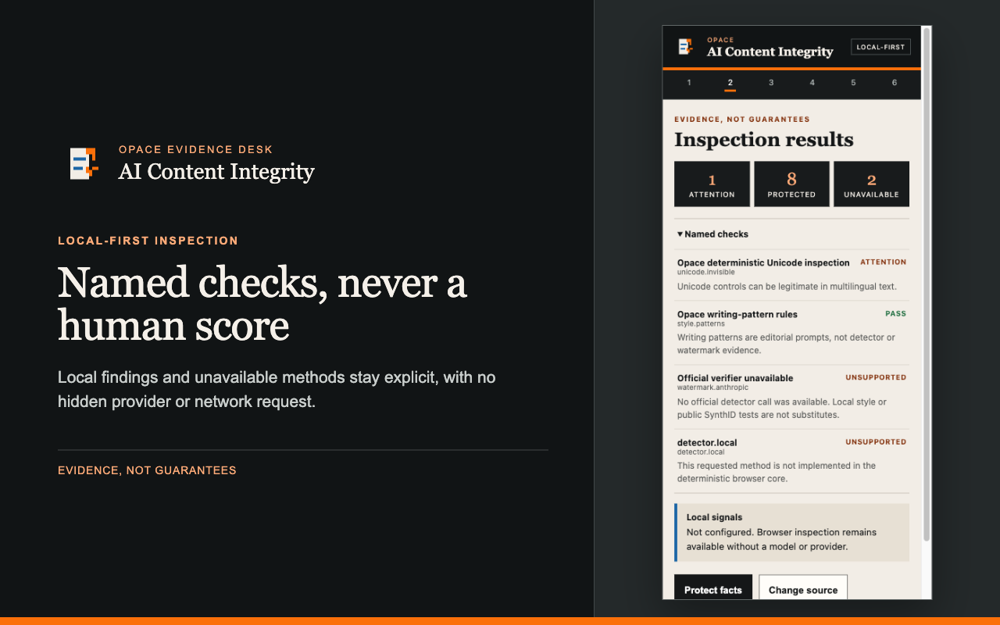

# Opace AI Content Integrity for Chrome

Chrome-first Manifest V3 submission candidate. Version `1.0.0` inspects explicitly selected, visible-article or pasted text in the packaged browser Worker. It never writes to the page, sends telemetry or retains text by default.



_Review named checks, evidence and limitations in the genuine packaged side panel._

> Release state: the exact local package has passed automated browser and moderation checks. It has not been submitted to the Chrome Web Store or accepted by the owner.

[Explore the Chrome extension](https://opace.agency/tools/ai/content-verification-integrity/chrome-extension/) · [Read the privacy notice](https://opace.agency/privacy-policy/) · [Get support](https://opace.agency/get-in-touch/)

## What it does

- checks selected text, visible article text or pasted text only after a user action;
- reports invisible characters, mixed scripts, writing-pattern evidence and protected spans;
- compares a reviewed candidate before copying it;
- exports a hash-only receipt without source text or page URL;
- preserves explicit unsupported, not configured, inconclusive and error states.

A passing named check is evidence about that check only. The extension does not prove human authorship, clear a commercial AI detector or verify an official Anthropic watermark.

## Install the local candidate

1. Build and package the extension with the commands below.
2. Open `chrome://extensions`, enable Developer mode and choose **Load unpacked**.
3. Select this component's generated `dist/` folder.
4. Pin **Opace AI Content Integrity**, choose a supported capture mode and review the side-panel evidence.

Use the exact ZIP under `artifacts/` for release-candidate testing. Store installation becomes available only after owner-approved publication.

## Build and verify

```sh
npm ci --ignore-scripts
npm run build
npm test
npm run audit
npm run package
```

Load `dist/` as an unpacked extension for development, or extract the 1.0.0 ZIP under `artifacts/` and load that exact tree. Copy-ready listing fields, permissions, privacy answers, reviewer instructions and verified store assets are under `../submission/chrome-web-store/`. Nothing in this folder authorises a Chrome Web Store submission.

The manifest deliberately declares no host or optional-host permissions. The frozen local-engine OpenAPI contract has no pairing-code exchange operation, so **Connect local engine** is visibly unavailable instead of accepting a token or requesting loopback access.

## Privacy defaults

- capture and results live only in memory;
- local storage contains settings only;
- receipt history is fixed off;
- exports are hash-only and omit source URL, input and candidate text;
- clearing data removes local settings and session interruption markers;
- all inspection runs through the `browser` privacy route with no network request.

See `../EXT-30-EVIDENCE.md` for the exact candidate hash, browser matrix, rendered evidence and remaining release holds.

## Compatibility and accessibility

The candidate targets Chrome 145 or newer with Manifest V3, side-panel and module Worker support. It uses no host permissions and has no optional host-permission prompt. Keyboard navigation, visible focus, text status, high contrast, reduced motion, 375 px layout and 400%-equivalent reflow are covered by automated candidate checks; owner-environment screen-reader acceptance remains separate.

## Troubleshooting

### No text was captured

Choose **Selected text** after selecting content, use **Visible article** on an ordinary page, or paste text directly. Browser-owned pages and restricted contexts can prevent page capture.

### Connect local engine is unavailable

This is intentional in version 1.0.0. The frozen loopback API has no pairing-code exchange, so the extension does not request loopback access or accept a raw token.

### A check is unsupported

Keep the reported state. The extension does not substitute another detector or turn an unavailable method into a pass.

## Support, security and licence

Use the [Content Integrity support page](https://opace.agency/get-in-touch/) for non-sensitive help. Report vulnerabilities through the repository [security policy](https://github.com/OpaceDigitalAgency/opace-content-integrity/blob/main/SECURITY.md) and do not include captured text or credentials. Opace-authored extension code is available under the [MIT Licence](https://github.com/OpaceDigitalAgency/opace-content-integrity/blob/main/LICENSE).

Changes should follow the repository [contribution guide](../../CONTRIBUTING.md) and [changelog](../../CHANGELOG.md).

## More content-integrity tools by Opace

- [Opace AI Content Integrity product hub](https://opace.agency/tools/ai/content-verification-integrity/)
- [Browser-based Content Integrity Checker](https://opace.agency/tools/ai/content-verification-integrity/checker/)
- [Opace AI Content Integrity for WordPress](https://opace.agency/tools/ai/content-verification-integrity/wordpress-plugin/)
- [Opace AI Content Integrity for Astro](https://opace.agency/tools/ai/content-verification-integrity/astro-integration/)
- [Opace artificial intelligence services](https://opace.agency/services/artificial-intelligence/)
- [Opace Digital Agency on GitHub](https://github.com/OpaceDigitalAgency)
- [Opace](https://opace.agency/)
