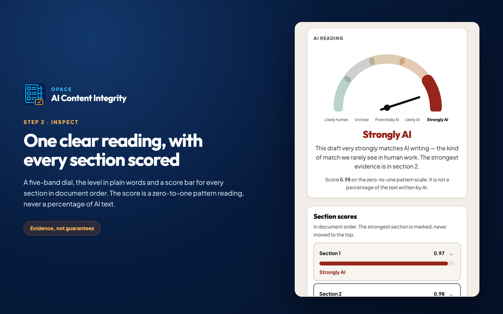

# Opace AI Content Integrity for Chrome

Chrome-first Manifest V3 development candidate. Version `1.1.0` inspects explicitly selected, visible-article or pasted text. Deterministic checks stay in the packaged Worker; the full Cycle-5 route can run on-device after a verified model download. A separate Opace EU-service choice requests only the exact service-origin permission after consent, but that channel is disabled until the service is deployed and the production Store ID is allowlisted. The extension never writes to the page or sends telemetry.



_The five-band reading, the level in plain words and a score for every section, in the genuine packaged side panel._

> Release state: the current source has new on-device and held EU-route work that invalidates the earlier packaged-candidate acceptance. It is not owner-accepted, packaged for submission, submitted or published.

[Explore the Chrome extension](https://opace.agency/tools/ai/content-verification-integrity/chrome-extension/) · [Read the privacy notice](https://opace.agency/privacy-policy/) · [Get support](https://opace.agency/get-in-touch/)

## What it does

- checks selected text, visible article text or pasted text only after a user action;
- reports invisible characters, mixed scripts, writing-pattern evidence and protected spans;
- runs the pinned Cycle-5 model on-device after explicit download consent, with every section score and three separate evidence axes;
- offers a separately consented EU-service route with an exact optional permission and an honest on-device fallback; the live channel is not enabled yet;
- compares a reviewed candidate before copying it;
- exports a branded PDF report, the complete HTML report, two content-free JSON receipts and a content-free one-line share summary;
- inspects a local JPEG, PNG, WebP or PDF for Content Credentials, with present, absent, invalid, untrusted, unsupported and error states and its own content-free PDF/JSON record;
- preserves explicit unsupported, not configured, inconclusive and error states.

A passing named check is evidence about that check only. The extension does not prove human authorship, clear a commercial AI detector or verify an official Anthropic watermark.

## Install the local candidate

1. Build and package the extension with the commands below.
2. Open `chrome://extensions`, enable Developer mode and choose **Load unpacked**.
3. Select this component's generated `dist/` folder.
4. Pin **Opace AI Content Integrity**, choose a supported capture mode and review the side-panel evidence.

Use the exact ZIP under `artifacts/` for release-candidate testing. Store installation becomes available only after owner-approved publication.

## Build and verify

```sh
npm ci --ignore-scripts
npm run build
npm test
npm run audit
npm run package
```

Load `dist/` as an unpacked extension for development, or extract the 1.1.0 ZIP under `artifacts/` and load that exact tree. Copy-ready listing fields, permissions, privacy answers, reviewer instructions and verified store assets are under `../submission/chrome-web-store/`. Nothing in this folder authorises a Chrome Web Store submission.

The manifest declares no standing host permission. It declares one optional origin, `https://opace-detector-877422072168.europe-west1.run.app/*`, which Chrome requests only after the user chooses and consents to the EU route. Deterministic and on-device checks do not need it. The frozen local-engine OpenAPI contract has no pairing-code exchange operation, so **Connect local engine** remains visibly unavailable instead of accepting a raw token or requesting loopback access.

## Limits, and why each one exists

| Limit | Value | Where it is enforced |
|---|---|---|
| Text per check | 50,000 characters | In the panel, before anything runs. Longer text is refused with the exact count, never silently truncated. |
| On-device checks | No limit | Nothing leaves the browser, so there is nothing to pace. |
| EU checks from this installation | 3 a minute, 20 an hour | In the extension, in settings storage, so it survives a service-worker restart. Reaching a limit shows what happened, when you can try again and that on-device has no limit. Nothing is sent. |
| EU service, across every caller | 12,000 section readings a day | On the service, alongside per-network, per-IP, per-install and per-connection limits. |
| EU request authenticity | Exact origin, extension-ID allowlist, proof of work, one-use body-bound token | On the service. A request that does not come from this exact extension, or that has not done the small piece of local work first, is refused. |

`Clear everything stored` resets the pace record with the rest of the extension's storage. The
pace record holds timestamps only: no text, no page address and nothing about what was checked.

The on-device download is 34.5 MB of model weights and a word list. They are data files, not a
program: the software that reads them already ships inside the extension. They come from
`https://opace.agency/models/local-signals-v1/`, their exact size and SHA-256 fingerprint are
verified before anything is loaded, they are cached after the first download, and one click
removes them.

## Where this extension is weakest

The source candidate includes deterministic checks and an explicitly downloaded int8 Cycle-5
on-device model. It also contains a body-bound fp32 EU-service client, but the service channel is
disabled and unproved live. A failed or withheld model route leaves the AI axis **Not assessed**.

**The writing rules are editorial feedback, not detection.** Measured on 922 machine and 1,200
human long-form documents the engine had never seen, they detect 45.1% of machine writing while
flagging **24.8% of human writing** — one human document in four. That is why the score is shown
as writing suggestions and never counted toward an AI reading.

**The Cycle-5 trained model**, measured on a 5,558-document long-form
corpus (922 machine, 4,636 human) **at the operating point that ships today (cycle-5,
`tier3-cycle5-v1`, margin-space rule `max(m1, m2+0.34) >= 3.571`)**.
Detection is 902/922 = 97.8% on the EU server route and 900/922 = 97.6% in the browser, at
46/4,636 = 0.99% and 73/4,636 = 1.57% human false positives respectively. The corpus is not wholly
independent: 268 machine documents and 11 human documents overlap the recorded training regime.
The separate topic-matched held-out slice is reported alongside it. Where it is weakest:

| weakness | measured | denominator |
|---|---|---|
| human fiction and stories wrongly flagged | **3.1% server / 3.5% browser** | 7/227 fp32; 8/227 int8, eval view |
| 100-word AI passages detected | **76.8% server / 69.6% browser** | 43/56 fp32; 39/56 int8, held-out test |
| heavily AI-edited human originals flagged | **28.5%** | 39/137, current policy boundary |
| topic-matched machine documents detected | **86.9%** | 153/176 fp32; browser int8 not measured |
| topic-matched human partners wrongly flagged | **0.2%** | 1/418 fp32; browser int8 not measured |

Every measured rate, by document length, by the model that wrote the text and by content type,
each with its denominator and a 95% confidence interval:
<https://opace.agency/tools/ai/content-verification-integrity/research/detection-rates/>

A fiction writer faces a higher false-positive risk than the overall human set. Treat any flag as
review evidence beside the exact passage, never a decision. The model was deliberately never trained on human fiction, because no matched
human fiction corpus was available and training on unmatched machine fiction would have taught it
that fiction equals AI.

Use extra caution for fiction and short text, and never use one result as the basis for an academic
misconduct decision.

The complete list, with sources for every figure:
[Honest limitations](https://github.com/OpaceDigitalAgency/opace-ai-content-verification-integrity-checker#honest-limitations).

## Credit

This extension was built on existing open-source work by deliberate choice. The rule tiers and
character forensics come chiefly from
[avoid-ai-writing](https://github.com/conorbronsdon/avoid-ai-writing) (MIT, Conor Bronsdon and
contributors) and [watermarks-remover](https://github.com/guillaumemeyer/watermarks-remover)
(MIT, Guillaume Meyer), over
[Unicode Consortium character data](https://www.unicode.org/Public/UCD/latest/). Phrase and
structural rule data is adapted from
[antislop-sampler](https://github.com/sam-paech/antislop-sampler) (Apache-2.0),
[slop-forensics](https://github.com/sam-paech/slop-forensics) (MIT),
[SLOP_Detector](https://github.com/SicariusSicariiStuff/SLOP_Detector) (Apache-2.0),
[slop-gate](https://github.com/hwajongpark/slop-gate) (MIT),
[anti-ai-writing](https://github.com/avectats7/anti-ai-writing) (MIT),
[anti-slop](https://github.com/kjmagnan1s/anti-slop) (MIT),
[claude-slop-detector](https://github.com/aplaceforallmystuff/claude-slop-detector) (MIT) and
[Wikipedia's *Signs of AI writing*](https://en.wikipedia.org/wiki/Wikipedia:Signs_of_AI_writing)
(CC BY-SA 4.0, credited as its licence requires). The watermark mathematics is a TypeScript port
of [google-deepmind/synthid-text](https://github.com/google-deepmind/synthid-text) (Apache-2.0)
with the [OpenAI GPT-2](https://github.com/openai/gpt-2) tokeniser (MIT).

Several well-known detector repositories were cloned and read during research and are credited as
exactly that — read, not used. Nothing in this extension is derived from `fast-detect-gpt`,
`Binoculars`, `RADAR`, `DIPPER`, `ai-detector-bench`, `BIRA`, `SIRA` or `MarkLLM`.

Full records, with versions, snapshot commits and what was taken from each:
[THIRD_PARTY_NOTICES.md](https://github.com/OpaceDigitalAgency/opace-ai-content-verification-integrity-checker/blob/main/THIRD_PARTY_NOTICES.md).

## Privacy defaults

- capture and results live only in memory;
- local storage contains settings and a random `cx_…` install identifier used only for EU-channel abuse controls;
- receipt history is fixed off;
- exports are hash-only and omit source URL, input and candidate text;
- clearing data removes local settings and session interruption markers;
- deterministic checks make no network request; the on-device route downloads pinned model assets after consent but does not upload draft text;
- the optional EU route transfers the chosen draft after consent and exact-origin permission, processes it once in `europe-west1` and does not retain it; the live route is not enabled yet.

See `../EXT-30-EVIDENCE.md` for the exact candidate hash, browser matrix, rendered evidence and remaining release holds.

## Compatibility and accessibility

The candidate targets Chrome 145 or newer with Manifest V3, side-panel and module Worker support. It has no standing host permissions. The exact EU service origin is optional and requested only after that route is chosen. Keyboard navigation, visible focus, text status, high contrast, reduced motion and 375px reflow have source-level evidence; the changed package and owner-environment screen-reader acceptance remain separate.

## Troubleshooting

### No text was captured

Choose **Selected text** after selecting content, use **Visible article** on an ordinary page, or paste text directly. Browser-owned pages and restricted contexts can prevent page capture.

### Connect local engine is unavailable

This is intentional in version 1.0.0. The frozen loopback API has no pairing-code exchange, so the extension does not request loopback access or accept a raw token.

### A check is unsupported

Keep the reported state. The extension does not substitute another detector or turn an unavailable method into a pass.

## Support, security and licence

Use the [Content Integrity support page](https://opace.agency/get-in-touch/) for non-sensitive help. Report vulnerabilities through the repository [security policy](https://github.com/OpaceDigitalAgency/opace-ai-content-verification-integrity-checker/blob/main/SECURITY.md) and do not include captured text or credentials. Opace-authored extension code is available under the [MIT Licence](https://github.com/OpaceDigitalAgency/opace-ai-content-verification-integrity-checker/blob/main/LICENSE).

Changes should follow the repository [contribution guide](../../CONTRIBUTING.md) and [changelog](../../CHANGELOG.md).

## Evidence

Every accuracy figure this project publishes is measured, carries its denominator and names its
source report. The six result charts, the per-register detection and false-positive tables and the
complete weakness list are on the [repository front page](https://github.com/OpaceDigitalAgency/opace-ai-content-verification-integrity-checker#what-it-measures-and-where-it-fails).

- [Capability register](https://github.com/OpaceDigitalAgency/opace-ai-content-verification-integrity-checker/blob/main/docs/CAPABILITIES.md) — the exhaustive technical inventory
- [Evidence index](https://github.com/OpaceDigitalAgency/opace-ai-content-verification-integrity-checker/blob/main/docs/EVIDENCE-INDEX.md) — every test result and research artefact, with paths
- [Test evidence](https://github.com/OpaceDigitalAgency/opace-ai-content-verification-integrity-checker/blob/main/docs/TEST-EVIDENCE.md) — verbatim suite totals and the current-model appendix
- [Route parity](https://github.com/OpaceDigitalAgency/opace-ai-content-verification-integrity-checker/blob/main/docs/measurements/ROUTE-PARITY.md) — browser int8 against server fp32, all disagreements written out
- [Honest limitations](https://github.com/OpaceDigitalAgency/opace-ai-content-verification-integrity-checker#honest-limitations) — where the tool is weakest, ranked, with denominators

## More content-integrity tools by Opace

- [Opace AI Content Integrity product hub](https://opace.agency/tools/ai/content-verification-integrity/)
- [Browser-based Content Integrity Checker](https://opace.agency/tools/ai/content-verification-integrity/checker/)
- [Opace AI Content Integrity for WordPress](https://opace.agency/tools/ai/content-verification-integrity/wordpress-plugin/)
- [Opace AI Content Integrity for Astro](https://opace.agency/tools/ai/content-verification-integrity/astro-integration/)
- [Opace artificial intelligence services](https://opace.agency/services/artificial-intelligence/)
- [Opace Digital Agency on GitHub](https://github.com/OpaceDigitalAgency)
- [Opace](https://opace.agency/)
