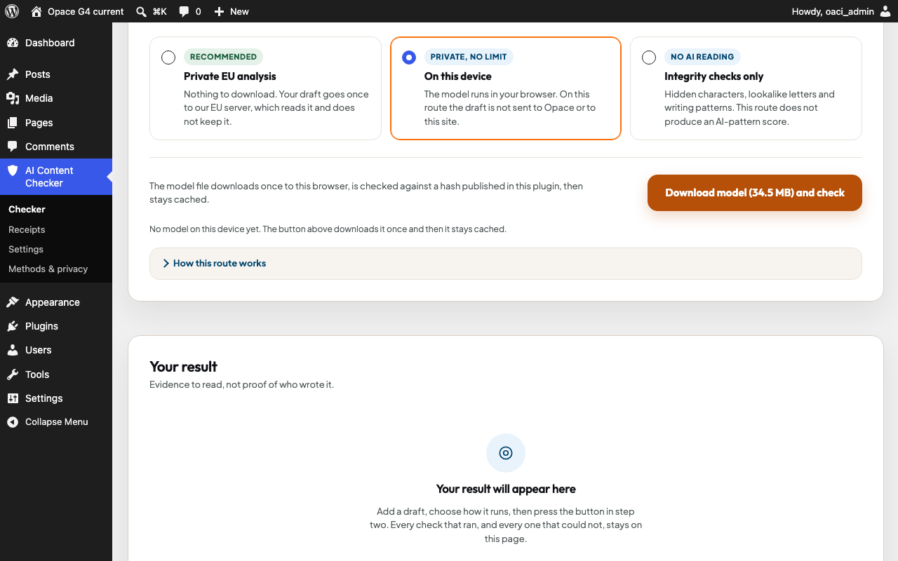

# Opace AI Content Checker & Detector for WordPress

Opace AI Content Checker & Detector gives WordPress editors explicit local, on-device and optional EU-server analysis routes. It protects facts and citations, supports Block and Classic Editor working copies, and can save a hash-only evidence receipt without storing the draft text.

Version 1.1.1 is an in-development WordPress parity update, not a release candidate. It requires WordPress 6.5 or newer and PHP 7.4 or newer. Generated rewrites, commercial detector calls and an official Anthropic watermark verifier are not included; unavailable methods remain explicitly labelled rather than inferred.



_Inspect a WordPress working copy and review named checks, evidence and limitations before making changes._

> Release state: 1.1.1 remains a development line. It has not been installed into the shared local WordPress sites, submitted to WordPress.org or accepted by the owner; installed-byte, current/minimum WordPress, Plugin Check, owner Safari and VoiceOver acceptance remain separate gates.

> Development state: the source tree consumes the shared Cycle-5 browser runtime and canonical checker-result contract, renders the five-band result with every evidence layer, and builds complete same-result exports. The on-device route downloads only hash-pinned model data after consent. The fixed EU challenge/token/check client is fail-closed because the current service capability response does not enable a WordPress channel. Local JPEG, PNG, WebP and PDF Content Credentials inspection uses the official packaged C2PA web/WASM runtime; certificate trust lists and remote manifests are not fetched. See the [C2PA runtime record](docs/C2PA-RUNTIME.md) and [server-analysis handoff](docs/SERVER-ANALYSIS-HANDOFF.md).

[Explore the WordPress plugin](https://opace.agency/tools/ai/content-verification-integrity/wordpress-plugin/) · [Read the privacy notice](https://opace.agency/privacy-policy/) · [Get support](https://opace.agency/get-in-touch/)

## Install locally

Build the deterministic plugin ZIP from the implementation repository:

```bash
bash wordpress/opace-ai-content-checker-detector/bin/build-plugin.sh dist
```

Upload the resulting ZIP through Plugins > Add New > Upload Plugin, activate it per site, then open AI Content Checker > Checker.

## Five-minute start

1. Open **AI Content Checker > Checker** and choose on-device Cycle-5, the available EU route, or integrity checks only.
2. Paste text or load the current Block or Classic Editor working copy.
3. Run the local checks and review each method's status, evidence and limitations.
4. Preview any safe character fix before applying it to the Lab working copy.
5. Save a hash-only receipt only when an evidence record is useful.

## What ships

- browser-only deterministic inspection with no external request;
- on-device Cycle-5 for up to 100,000 UTF-16 characters, with a consented and hash-verified model download;
- a fixed Opace EU challenge/token/check client gated by administrator opt-in, live capability and per-run consent;
- protected numbers, dates, links, quotations, citations and code;
- opt-in safe character fixes in the Lab working copy;
- hash-only receipts stored on the same WordPress site;
- Block Editor and Classic Editor unsaved-copy checks;
- local JPEG, PNG, WebP and PDF Content Credentials inspection, with present, absent, invalid and untrusted kept distinct;
- per-site Multisite storage, Site Health diagnostics and explicit uninstall retention controls;
- honest unsupported, not configured and not run states.

The EU client is code-ready but the live service does not yet advertise an enabled WordPress channel. It therefore remains unavailable and the on-device route is selected instead.

TXT, Markdown and HTML open in the local text workspace. JPEG, PNG, WebP and PDF up to 20 MB run the separate local C2PA method. The C2PA runtime is lazy-loaded from this plugin only; file bytes, names, hashes, manifests and findings do not enter receipts, shares, URLs, analytics or logs. A completed file check can export a content-free provenance JSON/PDF; a valid full text result can export the complete checker PDF. Neither export re-scores content.

The plugin does not add public-page assets or credit links, save or publish posts, include telemetry or claim authorship detection. Network use is limited to the route the editor explicitly chooses: pinned model assets for on-device analysis, or one confirmed draft transmission through the fixed EU service when that channel is enabled.

## Privacy and security

Deterministic and C2PA inspection stay in the browser. On-device Cycle-5 downloads model data but keeps the draft local. Saving a receipt sends text only to the site's authenticated REST API, processes it in memory and stores hashes plus method evidence. Mutations require WordPress permissions and nonces. Ownership, idempotency, hostile-storage and uninstall behaviour are covered by the G4 test plan.

The EU adapter requires an authenticated same-site REST request, administrator opt-in, explicit per-run confirmation, a valid idempotency key, conservative per-user pacing and bounded text/response sizes. Its destination is the fixed Opace EU service; an old or unavailable capability response keeps the route disabled. It never spoofs a browser Origin or user agent.

See the packaged `readme.txt`, `third-party-notices.txt`, `LICENSE` and `CITATION.cff` for directory copy, attribution and citation details. Security reports should follow the programme's [security policy](../../SECURITY.md); do not include draft content or credentials.

For non-sensitive help, use [Opace support](https://opace.agency/get-in-touch/). Changes should follow the repository [contribution guide](../../CONTRIBUTING.md) and [changelog](../../CHANGELOG.md).

## Accessibility and compatibility

The plugin supports WordPress 6.5 or newer, PHP 7.4 or newer, Block Editor, Classic Editor and per-site Multisite operation. Plugin-owned controls use semantic labels, visible focus and text status; candidate QA covers keyboard use, reduced motion, 320/375 px reflow and 400%-equivalent layouts. Owner-environment Safari and VoiceOver acceptance remains a separate release gate.

## Development checks

```bash
npm ci
npm run lint
npm test
npm run test:e2e
vendor/bin/phpunit
vendor/bin/phpcs
```

The release gate also requires deterministic ZIP hashes, exact installed-byte parity, PHP 7.4 lint, current/minimum WordPress, Multisite, Plugin Check, responsive browser and accessibility evidence.

## Troubleshooting

### The editor text is not available

Open a supported Block or Classic Editor screen and retry the unsaved working-copy check. The plugin does not read or alter unrelated admin screens.

### A method says unsupported or not configured

That is an evidence state, not a plugin error. Version 1.1.1 never substitutes a different detector or reports a pass for an unavailable method. For C2PA files, absent is inconclusive and untrusted means trust was not established without fetching a certificate trust list; neither is silently converted to pass.

### A receipt does not contain the draft

This is intentional. Receipts store hashes, versions, statuses and method evidence, not the original text or candidate rewrite.

## Links

- [Opace AI Content Checker & Detector for WordPress](https://opace.agency/tools/ai/content-verification-integrity/wordpress-plugin/)
- [Opace privacy notice](https://opace.agency/privacy-policy/)
- [Opace support](https://opace.agency/get-in-touch/)
- [Opace artificial intelligence services](https://opace.agency/services/artificial-intelligence/)
- [Opace](https://opace.agency/)
- [Opace Digital Agency on GitHub](https://github.com/OpaceDigitalAgency)

## More content-integrity tools by Opace

- [Browser-based Content Integrity Checker](https://opace.agency/tools/ai/content-verification-integrity/checker/)
- [Opace AI Content Integrity for Chrome](https://opace.agency/tools/ai/content-verification-integrity/chrome-extension/)
- [Opace AI Content Integrity for Astro](https://opace.agency/tools/ai/content-verification-integrity/astro-integration/)
- [Content Integrity CLI and local API](https://opace.agency/tools/ai/content-verification-integrity/cli-local-service/)

## Licence

GPL-2.0-or-later. Bundled dependencies retain their own compatible notices.
