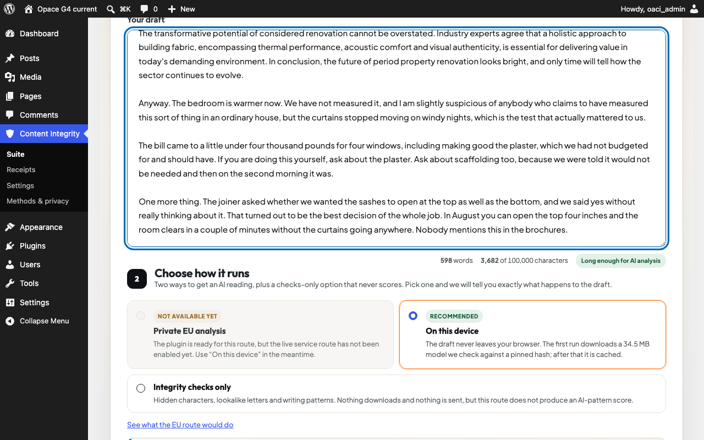

# Opace AI Content Integrity for WordPress

Opace AI Content Integrity gives WordPress editors local, explainable checks for invisible characters, mixed scripts and writing patterns. It protects facts and citations, supports Block and Classic Editor working copies, and can save a hash-only evidence receipt without storing the draft text.

Version 1.0.6 is the WordPress.org submission candidate. It requires WordPress 6.5 or newer and PHP 7.4 or newer. Generated rewrites, commercial detector calls and an official Anthropic watermark verifier are not included; unavailable methods remain explicitly labelled rather than inferred.



_Inspect a WordPress working copy and review named checks, evidence and limitations before making changes._

> Release state: 1.0.6 rebuilds the bundled engine from the current core and has not yet been through the local package, WordPress, Multisite, responsive and automated accessibility gates that 1.0.4 passed. Those gates must be re-run against the 1.0.6 ZIP before submission. It has not been submitted to WordPress.org or accepted by the owner.

[Explore the WordPress plugin](https://opace.agency/tools/ai/content-verification-integrity/wordpress-plugin/) · [Read the privacy notice](https://opace.agency/privacy-policy/) · [Get support](https://opace.agency/get-in-touch/)

## Install locally

Build the deterministic plugin ZIP from the implementation repository:

```bash
bash wordpress/opace-ai-content-integrity/bin/build-plugin.sh dist
```

Upload the resulting ZIP through Plugins > Add New > Upload Plugin, activate it per site, then open Content Integrity > Suite.

## Five-minute start

1. Open **Content Integrity > Suite** and choose the browser-only privacy route.
2. Paste text or load the current Block or Classic Editor working copy.
3. Run the local checks and review each method's status, evidence and limitations.
4. Preview any safe character fix before applying it to the Lab working copy.
5. Save a hash-only receipt only when an evidence record is useful.

## What ships

- browser-only deterministic inspection with no external request;
- protected numbers, dates, links, quotations, citations and code;
- opt-in safe character fixes in the Lab working copy;
- hash-only receipts stored on the same WordPress site;
- Block Editor and Classic Editor unsaved-copy checks;
- per-site Multisite storage, Site Health diagnostics and explicit uninstall retention controls;
- honest unsupported, not configured and not run states.

The plugin does not add public-page assets or credit links, save or publish posts, include telemetry, call an external service or claim authorship detection.

## Privacy and security

Local inspection stays in the browser. Saving a receipt sends text only to the site's authenticated REST API, processes it in memory and stores hashes plus method evidence. Mutations require WordPress permissions and nonces. Ownership, idempotency, hostile-storage and uninstall behaviour are covered by the G4 test plan.

See the packaged `readme.txt`, `third-party-notices.txt`, `LICENSE` and `CITATION.cff` for directory copy, attribution and citation details. Security reports should follow the programme's [security policy](../../SECURITY.md); do not include draft content or credentials.

For non-sensitive help, use [Content Integrity support](https://opace.agency/get-in-touch/). Changes should follow the repository [contribution guide](../../CONTRIBUTING.md) and [changelog](../../CHANGELOG.md).

## Accessibility and compatibility

The plugin supports WordPress 6.5 or newer, PHP 7.4 or newer, Block Editor, Classic Editor and per-site Multisite operation. Plugin-owned controls use semantic labels, visible focus and text status; candidate QA covers keyboard use, reduced motion, 320/375 px reflow and 400%-equivalent layouts. Owner-environment Safari and VoiceOver acceptance remains a separate release gate.

## Development checks

```bash
npm ci
npm run lint
npm test
npm run test:e2e
vendor/bin/phpunit
vendor/bin/phpcs
```

The release gate also requires deterministic ZIP hashes, exact installed-byte parity, PHP 7.4 lint, current/minimum WordPress, Multisite, Plugin Check, responsive browser and accessibility evidence.

## Troubleshooting

### The editor text is not available

Open a supported Block or Classic Editor screen and retry the unsaved working-copy check. The plugin does not read or alter unrelated admin screens.

### A method says unsupported or not configured

That is an evidence state, not a plugin error. Version 1.0.6 includes deterministic local checks only and never substitutes a different detector or reports a pass for an unavailable method.

### A receipt does not contain the draft

This is intentional. Receipts store hashes, versions, statuses and method evidence, not the original text or candidate rewrite.

## Links

- [Opace AI Content Integrity for WordPress](https://opace.agency/tools/ai/content-verification-integrity/wordpress-plugin/)
- [Content Integrity privacy notice](https://opace.agency/privacy-policy/)
- [Content Integrity support](https://opace.agency/get-in-touch/)
- [Opace artificial intelligence services](https://opace.agency/services/artificial-intelligence/)
- [Opace](https://opace.agency/)
- [Opace Digital Agency on GitHub](https://github.com/OpaceDigitalAgency)

## More content-integrity tools by Opace

- [Browser-based Content Integrity Checker](https://opace.agency/tools/ai/content-verification-integrity/checker/)
- [Opace AI Content Integrity for Chrome](https://opace.agency/tools/ai/content-verification-integrity/chrome-extension/)
- [Opace AI Content Integrity for Astro](https://opace.agency/tools/ai/content-verification-integrity/astro-integration/)
- [Content Integrity CLI and local API](https://opace.agency/tools/ai/content-verification-integrity/cli-local-service/)

## Licence

GPL-2.0-or-later. Bundled dependencies retain their own compatible notices.
